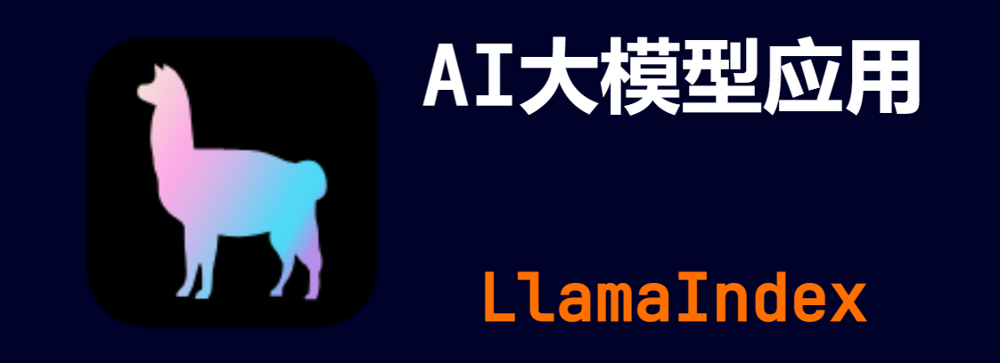

> **大家好，我是 <font color=blue>同学小张</font>，持续学习<font color=red>C++进阶、OpenGL、WebGL知识技能</font>和<font color=red>AI大模型应用实战案例</font>，持续分享，欢迎大家<font color=red>点赞+关注</font>，+v: <font color=blue>**jasper_8017**</font> 一起交流，共同学习和进步。**
---

[前面文章](https://blog.csdn.net/Attitude93/article/details/139110882) 两行代码就实现了文档的切分和向量化存储以及持久化存储。如果我们想用自定义的向量化数据库呢？

@[toc]

# 0. 背景

[前面文章](https://blog.csdn.net/Attitude93/article/details/139110882) 两行代码就实现了文档的切分和向量化存储以及持久化存储。

```python
index = VectorStoreIndex.from_documents(documents)
# store it for later
index.storage_context.persist(persist_dir=PERSIST_DIR)
```

但是有时候我们更希望使用自己常用的向量数据库和向量化方式。下面以 chromadb 为例，介绍如何使用。


# 1. 在 LlamaIndex 中使用自定义的向量数据库

（1）环境准备

写代码之前，需要首先安装 LlamaIndex 中的 chromadb。

```bash
pip install -U llama-index-vector-stores-chroma -i https://pypi.tuna.tsinghua.edu.cn/simple
```

（2）创建一个chromadb 数据库的实例

```python
db = chromadb.PersistentClient(path="D:\\GitHub\\LEARN_LLM\\LlamaIndex\\vector_store\\chroma_db")
```

（3）创建 chroma 数据库的 collection

```python
chroma_collection = db.get_or_create_collection("quickstart")
```

（4）将 chroma_collection 使用 LlamaIndex 的 ChromaVectorStore 进行以下类型转换和封装，转换成 LlamaIndex 的 VectorStore。

```python
vector_store = ChromaVectorStore(chroma_collection=chroma_collection)
```

（5）将 VectorStore 封装到 StorageContext 中

```python
storage_context = StorageContext.from_defaults(vector_store=vector_store)
```

（6）创建 VectorStoreIndex 时，使用 from_documents 函数中的 storage_context 参数，将上面自定义的 storage_context 传入。

```python
index = VectorStoreIndex.from_documents(
    documents, storage_context=storage_context
)
```

完整代码如下：


```python
import chromadb
from llama_index.core import VectorStoreIndex, SimpleDirectoryReader
from llama_index.vector_stores.chroma import ChromaVectorStore
from llama_index.core import StorageContext

# load some documents
documents = SimpleDirectoryReader("D:\\GitHub\\LEARN_LLM\\LlamaIndex\\data").load_data()

# initialize client, setting path to save data
db = chromadb.PersistentClient(path="D:\\GitHub\\LEARN_LLM\\LlamaIndex\\vector_store\\chroma_db")

# create collection
chroma_collection = db.get_or_create_collection("quickstart")

# assign chroma as the vector_store to the context
vector_store = ChromaVectorStore(chroma_collection=chroma_collection)
storage_context = StorageContext.from_defaults(vector_store=vector_store)

# create your index
index = VectorStoreIndex.from_documents(
    documents, storage_context=storage_context
)

# create a query engine and query
query_engine = index.as_query_engine()
response = query_engine.query("什么是角色提示?")
print(response)
```

# 2. 总结

本文我们学习了如何在 LlamaIndex 中使用自定义的向量数据库，并详细介绍了其实现步骤。再总结一下，在 LlamaIndex 中使用自定义的向量数据库，最主要的是创建 LlamaIndex 的 VectorStore，然后将 VectorStore 封装到 StorageContext 中，最后将 StorageContext 传入 VectorStoreIndex 的 from_documents 函数中。

# 3. 参考

- https://docs.llamaindex.ai/en/stable/understanding/storing/storing/


> **如果觉得本文对你有帮助，麻烦点个赞和关注呗 ~~~**

---

> - 大家好，我是 <font color=blue>**同学小张**</font>，持续学习<font color=red>**C++进阶、OpenGL、WebGL知识技能**</font>和<font color=red>**AI大模型应用实战案例**</font>
> - 欢迎 <font color=red>**点赞 + 关注**</font> 👏，**持续学习**，**持续干货输出**。
> - +v: <font color=blue>**jasper_8017**</font> 一起交流💬，一起进步💪。
> - 微信公众号搜<font color=blue>【**同学小张**】</font> 🙏

**==本站文章一览：==**




