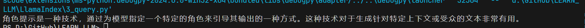
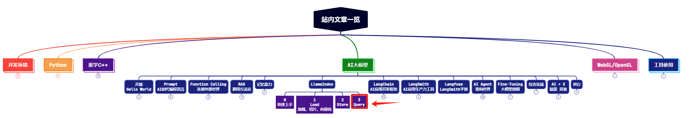

> **大家好，我是 <font color=blue>同学小张</font>，持续学习<font color=red>C++进阶、OpenGL、WebGL知识技能</font>和<font color=red>AI大模型应用实战案例</font>，持续分享，欢迎大家<font color=red>点赞+关注</font>，+v: <font color=blue>**jasper_8017**</font> 一起交流，共同学习和进步。**
---


前面我们系统学习了 LlamaIndex 的文本加载、文本存储方式，本文我们继续来学习 LlamaIndex 中的 query 模块。

@[toc]

# 0. 背景

[前面文章](https://blog.csdn.net/Attitude93/article/details/139110882) 两行代码就实现了数据的查询。

```python
query_engine = index.as_query_engine()
response = query_engine.query("什么是角色提示?")
```

只需要一个 as_query_engine 就可以得到一个检索器，然后通过检索器的 query 方法就可以得到查询结果。

其实，这里面包含了一些隐藏步骤：

（1）**检索**：从Index中找到与查询最相关的文档。最常见的是“top-k”语义检索，还有其他检索策略。
（2）**后处理**：可选地对检索到的节点进行重新排序、转换或过滤，例如要求附带特定元数据等。
（3）**响应合成**：将查询、最相关数据与提示结合，发送给LLM以返回响应。

下面，我们自定义一个检索器以使用不同的top_k数字，并添加一个后处理步骤，要求检索到的节点达到要包含的最小相似性得分。当查询到相似性得分满足要求的文档时，才返回数据，否则返回空数据。

# 1. 自定义检索代码

（1）利用 VectorIndexRetriever 类自定义一个 retriever

使用 VectorIndexRetriever 的两个参数可自定义一个 retriever：

- index：VectorStoreIndex 对象，即前面我们定义的 VectorStoreIndex

- similarity_top_k：查找最相关的文档的个数，默认为 10 个

```python
retriever = VectorIndexRetriever(
    index=index,
    similarity_top_k=10,
)
```

> 这里只是使用了其中一个 VectorIndexRetriever 作为示例，更多的内置 retriver 可参考：https://docs.llamaindex.ai/en/stable/module_guides/querying/retriever/

（2）获取一个 response_synthesizer

```python
response_synthesizer = get_response_synthesizer()
```

（3）自定义检索器

使用 RetrieverQueryEngine 自定义一个检索器，传入上面自定义的 retriever 和 response_synthesizer即可。另外下面代码中还有一个额外参数：node_postprocessors，它是对检索到的结果进行后处理的一些步骤，这里传入的是 SimilarityPostprocessor，它对检索到的结果进行相似性过滤，只有相似性高于0.7的才会保留，否则被过滤掉，不会输出出来，也不会传给大模型。

```python
query_engine = RetrieverQueryEngine(
    retriever=retriever,
    response_synthesizer=response_synthesizer,
    node_postprocessors=[SimilarityPostprocessor(similarity_cutoff=0.7)],
)
```

> 更多后处理步骤，可参考：https://docs.llamaindex.ai/en/stable/api_reference/postprocessor/

（4）另一种自定义检索器的方式：from_args

```python
node_postprocessors = [
    KeywordNodePostprocessor(
        required_keywords=["角色"], exclude_keywords=["扮演"]
    )
]
query_engine = RetrieverQueryEngine.from_args(
    retriever, node_postprocessors=node_postprocessors
)
```

# 2. 完整代码

完整代码如下：

```python
import chromadb
from llama_index.core import VectorStoreIndex, SimpleDirectoryReader
from llama_index.vector_stores.chroma import ChromaVectorStore
from llama_index.core import StorageContext
from llama_index.core import VectorStoreIndex, get_response_synthesizer
from llama_index.core.retrievers import VectorIndexRetriever
from llama_index.core.query_engine import RetrieverQueryEngine
from llama_index.core.postprocessor import SimilarityPostprocessor

# load some documents
# documents = SimpleDirectoryReader("D:\\GitHub\\LEARN_LLM\\LlamaIndex\\data").load_data()

# initialize client, setting path to save data
db = chromadb.PersistentClient(path="D:\\GitHub\\LEARN_LLM\\LlamaIndex\\vector_store\\chroma_db")

# create collection
chroma_collection = db.get_or_create_collection("quickstart")

# assign chroma as the vector_store to the context
vector_store = ChromaVectorStore(chroma_collection=chroma_collection)
storage_context = StorageContext.from_defaults(vector_store=vector_store)

# # create your index
# index = VectorStoreIndex.from_documents(
#     documents, storage_context=storage_context
# )

# load your index from stored vectors
index = VectorStoreIndex.from_vector_store(
    vector_store, storage_context=storage_context
)

# configure retriever
retriever = VectorIndexRetriever(
    index=index,
    similarity_top_k=10,
)

# configure response synthesizer
response_synthesizer = get_response_synthesizer()

# assemble query engine
query_engine = RetrieverQueryEngine(
    retriever=retriever,
    response_synthesizer=response_synthesizer,
    node_postprocessors=[SimilarityPostprocessor(similarity_cutoff=0.7)],
)

response = query_engine.query("什么是角色提示?")
print(response)
```

运行结果：




# 3. 补充知识 - 使用已有的向量数据库

细心的小伙伴可能发现，上面代码中我们其实没有创建向量数据库，也没有加载任何文档。这是因为，上一篇文章中，我们已经创建过了。这里可以直接加载已有的向量数据库。

重点代码如下：创建时使用的是 from_documents 函数，使用已有的时，使用 from_vector_store 函数。

```python
# load your index from stored vectors
index = VectorStoreIndex.from_vector_store(
    vector_store, storage_context=storage_context
)
```

# 4. 参考

- https://docs.llamaindex.ai/en/stable/understanding/querying/querying/


> **如果觉得本文对你有帮助，麻烦点个赞和关注呗 ~~~**

---

> - 大家好，我是 <font color=blue>**同学小张**</font>，持续学习<font color=red>**C++进阶、OpenGL、WebGL知识技能**</font>和<font color=red>**AI大模型应用实战案例**</font>
> - 欢迎 <font color=red>**点赞 + 关注**</font> 👏，**持续学习**，**持续干货输出**。
> - +v: <font color=blue>**jasper_8017**</font> 一起交流💬，一起进步💪。
> - 微信公众号搜<font color=blue>【**同学小张**】</font> 🙏

**==本站文章一览：==**




