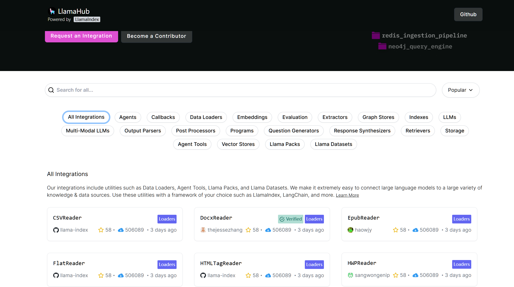
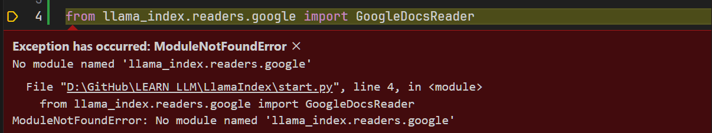
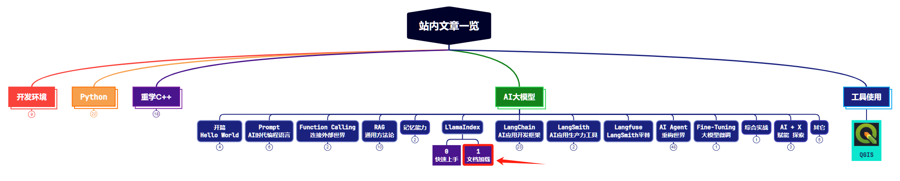

> **大家好，我是 <font color=blue>同学小张</font>，持续学习<font color=red>C++进阶知识</font>和<font color=red>AI大模型应用实战案例</font>，持续分享，欢迎大家<font color=red>点赞+关注</font>，共同学习和进步。**

---

上篇文章我们通过一个简单的例子，学习了LlamaIndex的安装和基本使用，使用 LlamaIndex 构建了一个简单的RAG问答系统。今天我们开始系统化学习，首先看一下LlamaIndex的Load部分。Load部分负责加载文件数据。


@[toc]

# 0. 文件类型加载器：SimpleDirectoryReader

上篇文章代码的一开始，我们就使用了这个Reader：

```python
from llama_index.core import VectorStoreIndex, SimpleDirectoryReader

# 使用SimpleDirectoryReader从指定路径加载数据
documents = SimpleDirectoryReader("D:\GitHub\LEARN_LLM\LlamaIndex\data").load_data()
```

这是 LlamaIndex 中最容易使用的一个文件夹加载器。它会读取传入的文件夹路径中的所有文件，可以读取各种格式，包括Markdown、PDF、Word、PowerPoint、图像、音频和视频等。

来看下其具体集成的类型：

> 参考：https://llamahub.ai/l/readers/llama-index-readers-file?from=

```python
from llama_index.core import SimpleDirectoryReader
from llama_index.readers.file import (
    DocxReader,
    HWPReader,
    PDFReader,
    EpubReader,
    FlatReader,
    HTMLTagReader,
    ImageCaptionReader,
    ImageReader,
    ImageVisionLLMReader,
    IPYNBReader,
    MarkdownReader,
    MboxReader,
    PptxReader,
    PandasCSVReader,
    VideoAudioReader,
    UnstructuredReader,
    PyMuPDFReader,
    ImageTabularChartReader,
    XMLReader,
    PagedCSVReader,
    CSVReader,
    RTFReader,
)

# PDF Reader with `SimpleDirectoryReader`
parser = PDFReader()
file_extractor = {".pdf": parser}
documents = SimpleDirectoryReader(
    "./data", file_extractor=file_extractor
).load_data()

# Docx Reader example
parser = DocxReader()
file_extractor = {".docx": parser}
documents = SimpleDirectoryReader(
    "./data", file_extractor=file_extractor
).load_data()

# HWP Reader example
parser = HWPReader()
file_extractor = {".hwp": parser}
documents = SimpleDirectoryReader(
    "./data", file_extractor=file_extractor
).load_data()

# Epub Reader example
parser = EpubReader()
file_extractor = {".epub": parser}
documents = SimpleDirectoryReader(
    "./data", file_extractor=file_extractor
).load_data()

# Flat Reader example
parser = FlatReader()
file_extractor = {".txt": parser}
documents = SimpleDirectoryReader(
    "./data", file_extractor=file_extractor
).load_data()

# HTML Tag Reader example
parser = HTMLTagReader()
file_extractor = {".html": parser}
documents = SimpleDirectoryReader(
    "./data", file_extractor=file_extractor
).load_data()

# Image Reader example
parser = ImageReader()
file_extractor = {
    ".jpg": parser,
    ".jpeg": parser,
    ".png": parser,
}  # Add other image formats as needed
documents = SimpleDirectoryReader(
    "./data", file_extractor=file_extractor
).load_data()

# IPYNB Reader example
parser = IPYNBReader()
file_extractor = {".ipynb": parser}
documents = SimpleDirectoryReader(
    "./data", file_extractor=file_extractor
).load_data()

# Markdown Reader example
parser = MarkdownReader()
file_extractor = {".md": parser}
documents = SimpleDirectoryReader(
    "./data", file_extractor=file_extractor
).load_data()

# Mbox Reader example
parser = MboxReader()
file_extractor = {".mbox": parser}
documents = SimpleDirectoryReader(
    "./data", file_extractor=file_extractor
).load_data()

# Pptx Reader example
parser = PptxReader()
file_extractor = {".pptx": parser}
documents = SimpleDirectoryReader(
    "./data", file_extractor=file_extractor
).load_data()


# Pandas CSV Reader example
parser = PandasCSVReader()
file_extractor = {".csv": parser}  # Add other CSV formats as needed
documents = SimpleDirectoryReader(
    "./data", file_extractor=file_extractor
).load_data()

# PyMuPDF Reader example
parser = PyMuPDFReader()
file_extractor = {".pdf": parser}
documents = SimpleDirectoryReader(
    "./data", file_extractor=file_extractor
).load_data()

# XML Reader example
parser = XMLReader()
file_extractor = {".xml": parser}
documents = SimpleDirectoryReader(
    "./data", file_extractor=file_extractor
).load_data()

# Paged CSV Reader example
parser = PagedCSVReader()
file_extractor = {".csv": parser}  # Add other CSV formats as needed
documents = SimpleDirectoryReader(
    "./data", file_extractor=file_extractor
).load_data()

# CSV Reader example
parser = CSVReader()
file_extractor = {".csv": parser}  # Add other CSV formats as needed
documents = SimpleDirectoryReader(
    "./data", file_extractor=file_extractor
).load_data()
```


# 1. LlamaHub 中的加载器

除了上面的读取文件之外，实际生活中还有很多地方可以获取数据，例如GitHub，网页，数据库等。这些数据加载器在 LlamaHub 中实现，可以按需使用。下图是 LlamaHub 中加载器列表：



## 1.1 使用方式

首先得安装相应的包，例如使用DatabaseReader：


```python
pip install llama-index-readers-google

# 或者在使用之前加下面这一行应该也行：
# from llama_index.core import download_loader
```
否则会报错：



然后就可以正常使用了：

```python
from llama_index.core import download_loader

from llama_index.readers.database import DatabaseReader

reader = DatabaseReader(
    scheme=os.getenv("DB_SCHEME"),
    host=os.getenv("DB_HOST"),
    port=os.getenv("DB_PORT"),
    user=os.getenv("DB_USER"),
    password=os.getenv("DB_PASS"),
    dbname=os.getenv("DB_NAME"),
)

query = "SELECT * FROM users"
documents = reader.load_data(query=query)
```

# 2. 可以直接将文字转换成 LlamaIndex 需要的 Document 结构

```python
from llama_index.core import Document

doc = Document(text="text")
```

# 3. 文档内容转换

加载数据后，下一步是将数据进行处理和转换。这些转换包括分块、提取元数据和对每个块进行向量化，从而确保大模型能够检索数据。

## 3.1 一步到位的简单方法

其中最简单的转换做法，是上篇文章中我们使用的：```from_documents```方法。

```python
from llama_index.core import VectorStoreIndex

vector_index = VectorStoreIndex.from_documents(documents)
vector_index.as_query_engine()
```

from_documents（）方法，接受一个Document对象数组，并自动解析和拆分它们。

## 3.2 自定义转换

有时候我们需要自己控制分块等这些转换的逻辑。有以下两种方式：

（1）使用 from_documents 的 transformations 参数，传入一个自定义的分块器。

```python
from llama_index.core.node_parser import SentenceSplitter

text_splitter = SentenceSplitter(chunk_size=512, chunk_overlap=10)

# per-index
index = VectorStoreIndex.from_documents(
    documents, transformations=[text_splitter]
)
```

（2）使用全局设置，设置默认的分块器。

```python
from llama_index.core.node_parser import SentenceSplitter

text_splitter = SentenceSplitter(chunk_size=512, chunk_overlap=10)

# global
from llama_index.core import Settings

Settings.text_splitter = text_splitter

# per-index
index = VectorStoreIndex.from_documents(documents)
```

# 4. 总结

本文我们介绍了 LlamaIndex 中加载器，以及如何使用它们。LlamaIndex提供了内置的文件加载器，同时也支持 LlamHub 中提供的各种其它类型加载器。

文章最后，简单介绍了下 LlamaIndex 中如何将加载到的文档数据转换成索引。

# 5. 参考

- https://docs.llamaindex.ai/en/stable/understanding/loading/loading/
- https://docs.llamaindex.ai/en/stable/understanding/loading/llamahub/


> **如果觉得本文对你有帮助，麻烦点个赞和关注呗 ~~~**

---

> - 大家好，我是 <font color=blue>**同学小张**</font>，持续学习<font color=red>**C++进阶知识**</font>和<font color=red>**AI大模型应用实战案例**</font>
> - 欢迎 <font color=red>**点赞 + 关注**</font> 👏，**持续学习**，**持续干货输出**。
> - +v: <font color=blue>**jasper_8017**</font> 一起交流💬，一起进步💪。
> - 微信公众号也可搜<font color=blue>【**同学小张**】</font> 🙏

**==本站文章一览：==**




