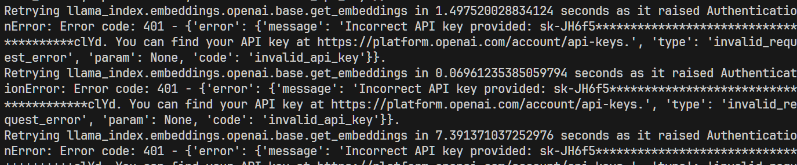

> **大家好，我是 <font color=blue>同学小张</font>，持续学习<font color=red>C++进阶知识</font>和<font color=red>AI大模型应用实战案例</font>，持续分享，欢迎大家<font color=red>点赞+关注</font>，共同学习和进步。**

---

今天我们一起来开始学习LlamaIndex的使用。

LlamaIndex是一个数据框架，专注于LLM应用程序的私有或领域特定数据的摄取、结构化和访问。它提供了一套数据连接器和索引，帮助开发者准备知识库，并在查询阶段检索相关上下文以帮助LLM回答问题。LlamaIndex支持各种索引，包括列表索引、向量索引、树索引和关键字索引

@[toc]

# 0. 环境准备

安装 LlamaIndex 命令：

```python
pip install llama-index
```

# 1. 第一个 LlamaIndex 程序

```python
from llama_index.core import VectorStoreIndex, SimpleDirectoryReader

# 使用SimpleDirectoryReader从指定路径加载数据
documents = SimpleDirectoryReader("D:\GitHub\LEARN_LLM\LlamaIndex\data").load_data()

# 使用加载的数据创建VectorStoreIndex索引
index = VectorStoreIndex.from_documents(documents)

# 将索引转换为查询引擎
query_engine = index.as_query_engine()

# 使用查询引擎查询问题"什么是角色提示?"
response = query_engine.query("什么是角色提示?")
print(response)
```

执行结果：


# 2. 代码解析及注意事项

## 2.1 代码解析

代码很简单，就4行主要代码：首先从llama_index.core模块导入了VectorStoreIndex和SimpleDirectoryReader两个类。然后，使用SimpleDirectoryReader从指定路径（这里是D:\GitHub\LEARN_LLM\LlamaIndex\data）加载数据，加载完数据后，使用这些数据创建了VectorStoreIndex索引。

然后，将这个索引转换为一个查询引擎，以便能够执行查询操作。最后，使用查询引擎查询了问题"什么是角色提示?"，并打印出了查询结果。

## 2.2 注意事项

（1）注意传入的文件夹路径是对的，否则会报错：


（2）在运行程序前，请确保已经在环境变量中设置了 API Key。

```bash
export OPENAI_API_KEY=XXXXX
```

（3）如果你的OpenAI是通过的代理访问，需要在环境变量中设置代理。

> 注意：LlamaIndex设置代理的关键字... 与其它框架设置代理的关键字不同。其它框架设置代理的关键字一般是：`OPENAI_BASE_URL`，而LlamaIndex设置代理的关键字是：`OPENAI_API_BASE`。

```bash
export OPENAI_API_BASE=xxxxx
```

设置的代理不对，可能会报如下错误：



源码中获取 API Key 和 代理的代码和获取顺序如下，先使用参数中的设置，如果没有则使用环境变量中的设置：

```python
def resolve_openai_credentials(
    api_key: Optional[str] = None,
    api_base: Optional[str] = None,
    api_version: Optional[str] = None,
) -> Tuple[Optional[str], str, str]:
    """ "Resolve OpenAI credentials.

    The order of precedence is:
    1. param
    2. env
    3. openai module
    4. default
    """
    # resolve from param or env
    api_key = get_from_param_or_env("api_key", api_key, "OPENAI_API_KEY", "")
    api_base = get_from_param_or_env("api_base", api_base, "OPENAI_API_BASE", "")
    api_version = get_from_param_or_env(
        "api_version", api_version, "OPENAI_API_VERSION", ""
    )
    ......
```

# 3. 代码优化 - 使用已经存在的索引

```python
import os.path
from llama_index.core import (
    VectorStoreIndex,
    SimpleDirectoryReader,
    StorageContext,
    load_index_from_storage,
)

PERSIST_DIR = "D:\GitHub\LEARN_LLM\LlamaIndex\data"
# check if storage already exists
if not os.path.exists(PERSIST_DIR):
    # load the documents and create the index
    documents = SimpleDirectoryReader("data").load_data()
    index = VectorStoreIndex.from_documents(documents)
    # store it for later
    index.storage_context.persist(persist_dir=PERSIST_DIR)
    print("创建索引成功")
else:
    # load the existing index
    storage_context = StorageContext.from_defaults(persist_dir=PERSIST_DIR)
    index = load_index_from_storage(storage_context)
    print("加载索引成功")

# Either way we can now query the index
query_engine = index.as_query_engine()
response = query_engine.query("什么是角色提示?")
print(response)
```

执行结果：


该代码的优化点，主要在于，首先检查是否已经存在索引，如果存在则直接加载索引，否则创建索引。

加载索引使用 `StorageContext.from_defaults` 和 `load_index_from_storage` 函数完成。

# 4. 总结

本文我们一起入门了 LlamaIndex，并使用它来构建一个简单的RAG系统。很简单。

最后，提一下 LlamaIndex 和 LangChain 的区别：LlamaIndex更适合专注于数据处理和检索增强的应用，而LangChain则提供了一个更广泛的框架，适合构建需要与外部环境交互的复杂应用。

> **如果觉得本文对你有帮助，麻烦点个赞和关注呗 ~~~**

---

> - 大家好，我是 <font color=blue>**同学小张**</font>，持续学习<font color=red>**C++进阶知识**</font>和<font color=red>**AI大模型应用实战案例**</font>
> - 欢迎 <font color=red>**点赞 + 关注**</font> 👏，**持续学习**，**持续干货输出**。
> - +v: <font color=blue>**jasper_8017**</font> 一起交流💬，一起进步💪。
> - 微信公众号也可搜<font color=blue>【**同学小张**】</font> 🙏

**==本站文章一览：==**


