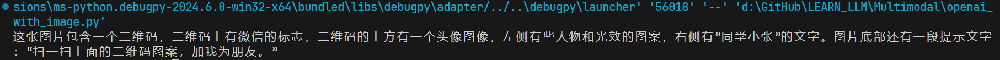
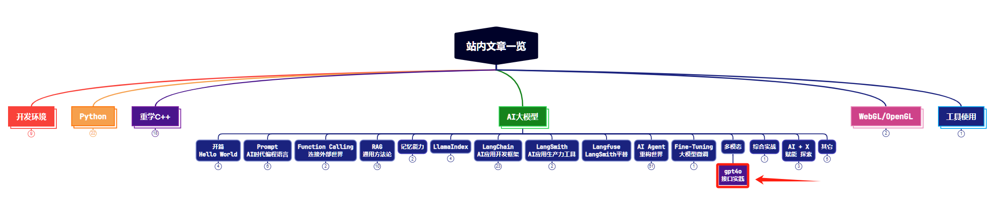
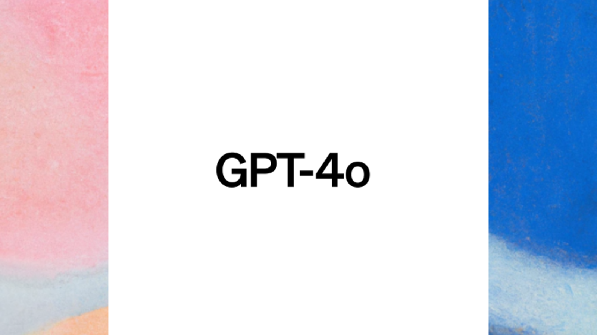

> **大家好，我是 <font color=blue>同学小张</font>，+v: <font color=blue>**jasper_8017**</font> 一起交流，持续学习<font color=red>C++进阶、OpenGL、WebGL知识技能</font>和<font color=red>AI大模型应用实战案例</font>，持续分享，欢迎大家<font color=red>点赞+关注</font>，共同学习和进步。**
---

一直没用过多模态大模型的接口。最近gpt4o很火，就学习了一下其接口的使用。

@[toc]

# 0. 回顾文字接口的用法

使用 OpenAI 的文字接口时，使用 client.chat.completions.create 接口，传入 model 参数，指定模型名称。传入 messages 参数，指定输入文本。

```python
import os
from openai import OpenAI

client = OpenAI()

response = client.chat.completions.create(
    model="gpt-3.5-turbo-1106",
    messages=[
        {
            "role": "user",
            "content": "讲个笑话"
        }
    ],
)

print(response.choices[0].message.content) 
```

# 1. 多模态接口

OpenAI 的多模态接口，和文字接口是同一个，所以用法相同，也是需要model参数和messages参数。不同的是，messages参数中，需要指定图片的url。

messages的格式如下：content字段中，需声明content的类型，例如 text、image_url等。

```python
"messages": [
    {
        "role": "user",
        "content": [
            {
                "type": "text",
                "text": "What’s in this image?"
            },
            {
                "type": "image_url",
                "image_url": {
                    # "url": f"data:image/jpeg;base64,{base64_image}"
                    # "url": "http://example.com/image.jpg"
                }
            }
        ]
    }
]
```
从上面的代码可以看到，image_url的url有两种方式：

* base64编码的图像
* 网络上的图像url

## 1.1 使用图片url

使用图片网络上的URL比较简单，直接写链接就好。例如下面这样使用：

```python
{
    "type": "image_url",
    "image_url": {
    "url": "https://upload.wikimedia.org/wikipedia/commons/thumb/d/dd/Gfp-wisconsin-madison-the-nature-boardwalk.jpg/2560px-Gfp-wisconsin-madison-the-nature-boardwalk.jpg",
    },
},
```

## 1.2 使用base64编码的图像

这种方式允许你传递本地的图片，而不用先将图片上传到某个服务器上。

（1）首先需要将图片转换为base64编码。

```python
def encode_image_to_base64(image):
    buffered = io.BytesIO()
    image.save(buffered, format=image.format)
    return base64.b64encode(buffered.getvalue()).decode('utf-8')
```

（2）将base64编码的字符串，写入到image_url中。

```python
{
    "type": "image_url",
    "image_url": {"url": f"data:image/jpeg;base64,{base64_image}"}
}
```

# 2. 完整示例代码

提供给大家一个完整的使用多模态接口的示例代码。

```python
import base64
from PIL import Image
import os
import io
from openai import OpenAI

client = OpenAI()

def encode_image_to_base64(image):
    buffered = io.BytesIO()
    image.save(buffered, format=image.format)
    return base64.b64encode(buffered.getvalue()).decode('utf-8')

def invoke_with_image(query, image_file=None):
    messages = [{"role": "user", "content": [{"type": "text", "text": query}]}]
    
    if image_file is not None:
        image = Image.open(image_file)
        base64_image = encode_image_to_base64(image)
        image_message = {
            "type": "image_url",
            "image_url": {"url": f"data:image/jpeg;base64,{base64_image}"}
        }
        messages[0]["content"].append(image_message)

    response = client.chat.completions.create(
        model="gpt-4o",
        messages=messages,
        max_tokens=1024,
    )
    return response.choices[0].message.content


if __name__ == "__main__":
    result = invoke_with_image(query="图片里有什么？", \
        image_file="c:\\xxx\\微信图片_20240405184354.jpg")
    print(result)
```

输入的本地图片如下：


运行结果如下：




> **如果觉得本文对你有帮助，麻烦点个赞和关注呗 ~~~**

---

> - 大家好，我是 <font color=blue>**同学小张**</font>，持续学习<font color=red>**C++进阶、OpenGL、WebGL知识技能**</font>和<font color=red>**AI大模型应用实战案例**</font>
> - 欢迎 <font color=red>**点赞 + 关注**</font> 👏，**持续学习**，**持续干货输出**。
> - +v: <font color=blue>**jasper_8017**</font> 一起交流💬，一起进步💪。
> - 微信公众号搜<font color=blue>【**同学小张**】</font> 🙏

**本站文章一览：**



