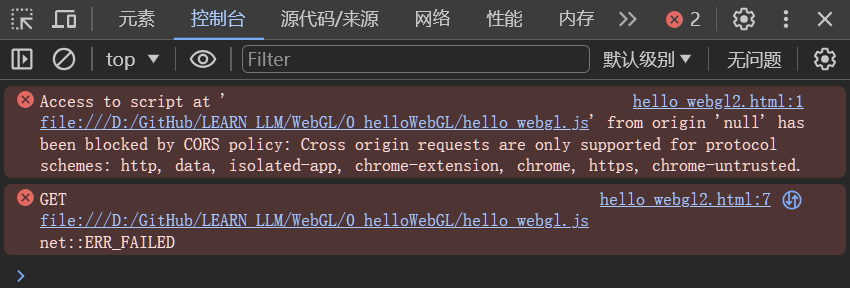
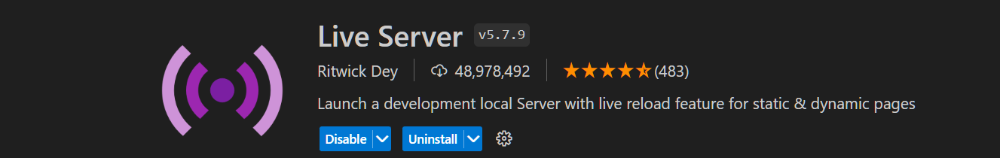
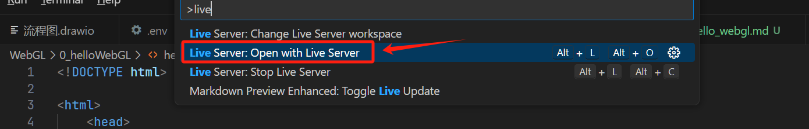
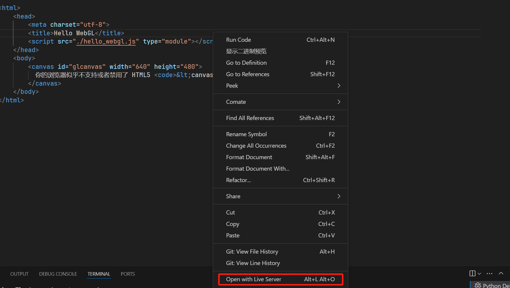
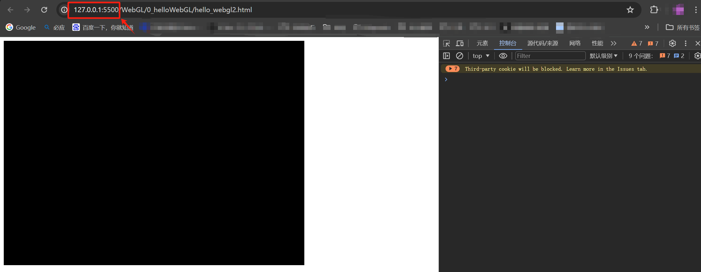
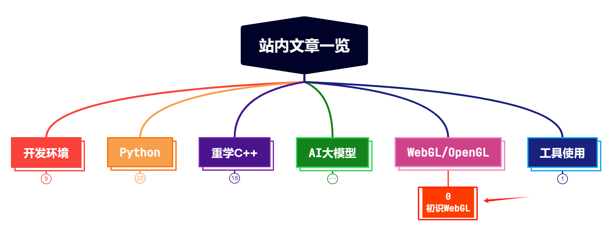
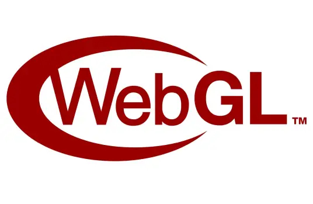

> **大家好，我是 <font color=blue>同学小张</font>，持续学习<font color=red>C++进阶、OpenGL、WebGL知识技能</font>和<font color=red>AI大模型应用实战案例</font>，持续分享，欢迎大家<font color=red>点赞+关注</font>，+v: <font color=blue>**jasper_8017**</font> 一起交流，共同学习和进步。**
---

WebGL在支持HTML的canvas标签的浏览器中，不需要安装任何插件，便可以使用基于OpenGL ES 2.0的API在canvas中进行2D和3D渲染。省去了C++使用OpenGL时需要安装各种依赖库的麻烦，并且在任何一个平台上，只要浏览器支持WebGL，都可以使用WebGL进行渲染。

因此，除了想要使用WebGL进行2D渲染或3D渲染之外，如果只是单纯的想学习OpenGL相关的知识，完全可以先使用WebGL进行。接口和原理都是类似的，而且上手更方便。

本文，我们初识一下WebGL。

@[toc]

# 0. 第一个WebGL程序

先直接上源码：

```html
<!DOCTYPE html>

<html>
    <head>
        <meta charset="utf-8">
        <title>Hello WebGL</title>
    </head>
    <body onload="main()">
        <canvas id="glcanvas" width="640" height="480">
          你的浏览器似乎不支持或者禁用了 HTML5 <code>&lt;canvas&gt;</code> 元素。
        </canvas>
    </body>
    <script>
        // 从这里开始
        function main() {
            const canvas = document.querySelector("#glcanvas");
            // 初始化 WebGL 上下文
            const gl = canvas.getContext("webgl");
        
            // 确认 WebGL 支持性
            if (!gl) {
            alert("无法初始化 WebGL，你的浏览器、操作系统或硬件等可能不支持 WebGL。");
            return;
            }
        
            // 使用完全不透明的黑色清除所有图像
            gl.clearColor(0.0, 0.0, 0.0, 1.0);
            // 用上面指定的颜色清除缓冲区
            gl.clear(gl.COLOR_BUFFER_BIT);
        }
    </script>  
</html>
```
执行效果如下：


# 1. 代码解释

（1）首先是创建一个 canvas 元素，并指定其 id 为 glcanvas。

```html
<body onload="main()">
  <canvas id="glcanvas" width="640" height="480">
    你的浏览器似乎不支持或者禁用了 HTML5 <code>&lt;canvas&gt;</code> 元素。
  </canvas>
</body>
```

这就是在HMTL中创建了一个canvas画布，为WebGL渲染提供了一个初始上下文。

（2）然后在js代码中获取画布和上下文。

```js
const canvas = document.querySelector("#glcanvas");
// 初始化 WebGL 上下文
const gl = canvas.getContext("webgl");
```
向 getContext 函数传递 "webgl" 参数，来尝试获取WebGLRenderingContext。如果浏览器不支持 webgl, getContext 将会返回 null。

（3）使用获取到的上下文gl进行渲染。上面的例子中是使用完全不透明的黑色清除所有图像。所以最后呈现的是画了一个黑色的矩形。


# 2. 代码拆分 - 文件结构优化 - 遇到的坑

上面我们HTML代码和JS代码都写在一个HTML文件中，这样看起来比较简单。但是实际开发中，我们通常会把HTML和JS分开，这样便于维护。

## 2.1 HTML和JS分开

（1）HTML文件如下：

```html
<!DOCTYPE html>

<html>
    <head>
        <meta charset="utf-8">
        <title>Hello WebGL</title>
        <script src="./hello_webgl.js" type="module"></script>
    </head>
    <body>
        <canvas id="glcanvas" width="640" height="480">
          你的浏览器似乎不支持或者禁用了 HTML5 <code>&lt;canvas&gt;</code> 元素。
        </canvas>
    </body>
</html>
```

（2）JS文件如下：

```js

main();

// 从这里开始
function main() {
    const canvas = document.querySelector("#glcanvas");
    // 初始化 WebGL 上下文
    const gl = canvas.getContext("webgl");

    // 确认 WebGL 支持性
    if (!gl) {
        alert("无法初始化 WebGL，你的浏览器、操作系统或硬件等可能不支持 WebGL。");
        return;
    }

    // 使用完全不透明的黑色清除所有图像
    gl.clearColor(0.0, 0.0, 0.0, 1.0);
    // 用上面指定的颜色清除缓冲区
    gl.clear(gl.COLOR_BUFFER_BIT);
}
```

## 2.2 执行报错及解决

像往常一样浏览器直接打开HTML文件，发现报错：

（1）CORS policy: No 'Access-Control-Allow-Origin' header is present on the requested resource.



这是由于浏览器安全策略导致的，浏览器无法加载本地文件。

解决方法：

我是用的 VSCode 编辑器，在 VSCode 中安装插件 Live Server，然后使用 Live Server 启动 HTML 文件。



启动 Live Server 的方式有两种，如下两图，一种是使用快捷键 Ctrl + Shift + P，然后输入 Live Server，选择启动服务器。另一种是单击右键，选择 Open with Live Server。





启动后，浏览器会自动打开HTML文件，并自动加载JS文件。可以看到，网页上方的地址已经变成了 http://127.0.0.1:5500/，说明已经不是加载本地文件了。



# 3. 总结

本文我们主要初始了一下WebGL，并使用它绘制了一个黑色矩形。同时介绍了HTML和JS代码分开，以及如何解决浏览器加载本地文件报错的问题。

> **如果觉得本文对你有帮助，麻烦点个赞和关注呗 ~~~**

---

> - 大家好，我是 <font color=blue>**同学小张**</font>，持续学习<font color=red>**C++进阶、OpenGL、WebGL知识技能**</font>和<font color=red>**AI大模型应用实战案例**</font>
> - 欢迎 <font color=red>**点赞 + 关注**</font> 👏，**持续学习**，**持续干货输出**。
> - +v: <font color=blue>**jasper_8017**</font> 一起交流💬，一起进步💪。
> - 微信公众号搜<font color=blue>【**同学小张**】</font> 🙏

**==本站文章一览：==**



