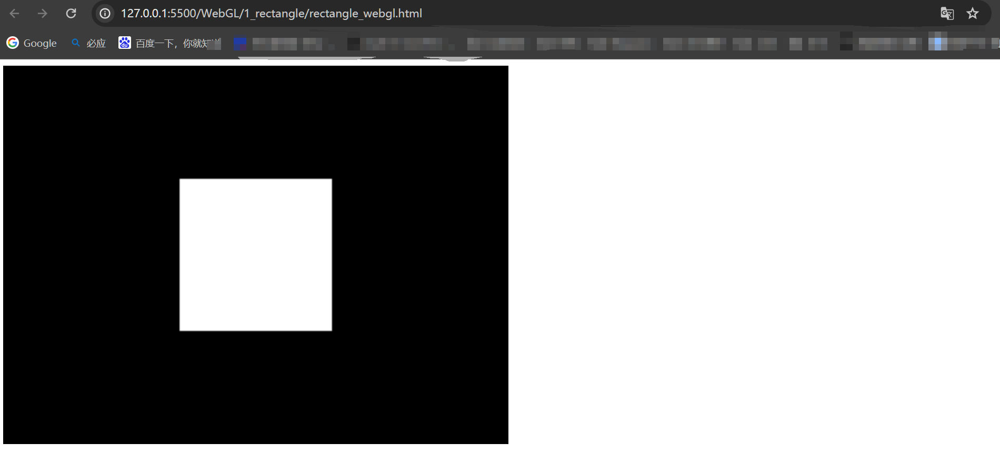
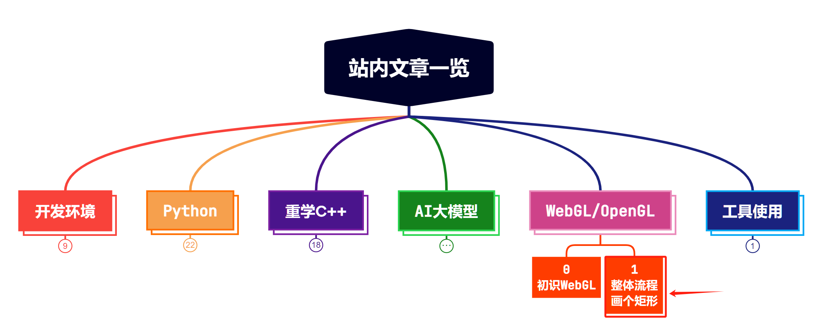

> **大家好，我是 <font color=blue>同学小张</font>，+v: <font color=blue>**jasper_8017**</font> 一起交流，持续学习<font color=red>C++进阶、OpenGL、WebGL知识技能</font>和<font color=red>AI大模型应用实战案例</font>，持续分享，欢迎大家<font color=red>点赞+关注</font>，共同学习和进步。**
---

> 参考：https://developer.mozilla.org/zh-CN/docs/Web/API/WebGL_API/Tutorial/Adding_2D_content_to_a_WebGL_context

@[toc]

# 0. 实现着色器

绘制 WebGL 时候有两种不同的着色器函数，顶点着色器和片段着色器。你需要通过用 GLSL 编写这些着色器，并将代码文本传递给 WebGL，使之在 GPU 执行时编译。顺便一提，顶点着色器和片段着色器的集合我们通常称之为着色器程序。

### 0.1 顶点着色器

### 0.1.1 基本知识简介

它的工作是将输入顶点从原始坐标系转换到 WebGL 使用的裁剪空间坐标系，其中每个轴的坐标范围从 -1.0 到 1.0。

顶点着色器需要对顶点坐标进行必要的转换，在每个顶点基础上进行其他调整或计算，然后通过将其保存在由 GLSL 提供的特殊变量（我们称为 **gl_Position**）中来返回变换后的顶点。

### 0.1.2 实现代码

```javascript
// Vertex shader program

const vsSource = `
    attribute vec4 aVertexPosition;

    uniform mat4 uModelViewMatrix;
    uniform mat4 uProjectionMatrix;

    void main() {
      gl_Position = uProjectionMatrix * uModelViewMatrix * aVertexPosition;
    }
  `;

```

这个顶点着色器接收一个我们定义的属性（aVertexPosition）的顶点位置值。之后这个值与两个 4x4 的矩阵（uProjectionMatrix 和 uModelMatrix）相乘; 乘积赋值给 gl_Position。


## 0.2 片段着色器

### 0.2.1 基本知识简介

它的职责是确定像素的颜色，之后颜色存储在特殊变量 gl_FragColor 中，返回到 WebGL 层。该颜色将最终绘制到屏幕上图形对应像素的对应位置。

### 0.2.2 实现代码

```javascript
const fsSource = `
    void main() {
      gl_FragColor = vec4(1.0, 1.0, 1.0, 1.0);
    }
  `;
```

这个片段着色器将 gl_FragColor 设置为纯白色，也就是，每个像素都是白色。

## 0.3 使用着色器

有了上面两个着色器之后，下面我们来看看怎么在WebGL中使用它们。

一般，使用着色器的步骤为：

（1）创建着色器对象

```javascript
const shader = gl.createShader(type);
```

（2）加载着色器源码

```javascript
gl.shaderSource(shader, source);
```

（3）编译着色器

```javascript
gl.shaderSource(shader, source);
```

可以通过以下代码检查着色器是否编译成功：如果着色器编译失败，则会弹出alert错误信息。

```javascript
if (!gl.getShaderParameter(shader, gl.COMPILE_STATUS)) {
    alert(
        "An error occurred compiling the shaders: " + gl.getShaderInfoLog(shader),
    );
    gl.deleteShader(shader);
    return null;
}
```

（4）链接着色器

链接着色器，在WebGL中是链接一个着色器程序，也就是上面的顶点着色器和片段着色器，两者一起。

所以，需要先创建一个着色器程序，并通过 attachShader 函数将着色器附加到着色器程序中。

```javascript
const shaderProgram = gl.createProgram();
gl.attachShader(shaderProgram, vertexShader);
gl.attachShader(shaderProgram, fragmentShader);
```
这样得到完整的着色器程序，然后通过 linkProgram 函数进行链接。

```javascript
gl.linkProgram(shaderProgram);
```

同样，可以检查着色器程序是否链接成功。使用以下代码检查：

```javascript
// 如果创建失败，alert
if (!gl.getProgramParameter(shaderProgram, gl。LINK_STATUS)) {
    alert(
        "Unable to initialize the shader program: " +
        gl.getProgramInfoLog(shaderProgram),
    );
    return null;
}
```

（5）使用着色器

使用着色器的实现，后文介绍。


# 1. 创建矩形对象

要想画矩形，首先得有矩形的顶点数据。如何创建矩形的顶点数据呢？如何将矩形的顶点数据传入顶点着色器呢？

假设矩形顶点的数据如下：

```javascript
const positions = [1.0, 1.0, -1.0, 1.0, 1.0, -1.0, -1.0, -1.0];
```

将以上顶点传入顶点着色器的步骤如下：

（1）创建一个缓冲区对象

```javascript
const positionBuffer = gl.createBuffer();
```

（2）绑定缓冲区对象，绑定上下文

```javascript
gl.bindBuffer(gl.ARRAY_BUFFER, positionBuffer);
```

（3）将顶点数据写入缓冲区对象

```javascript
gl.bufferData(gl.ARRAY_BUFFER, new Float32Array(positions), gl.STATIC_DRAW);
```

使用 Float32Array 将其转化为 WebGL 浮点型类型的数组。


# 2. 绘制场景

## 2.1 清除内容

在绘制之前，我们需要清除画布上的内容。

```javascript
gl.clearColor(0.0, 0.0, 0.0, 1.0); // 清空背景为黑色
gl.clearDepth(1.0); // 清除所有内容
gl.enable(gl.DEPTH_TEST); // 开启深度测试
gl.depthFunc(gl.LEQUAL); // 近处的物体掩盖远处的物体

// Clear the canvas before we start drawing on it.
gl.clear(gl.COLOR_BUFFER_BIT | gl.DEPTH_BUFFER_BIT);
```

## 2.2 定义矩阵

### 2.2.1 定义投影矩阵

```javascript
const fieldOfView = (45 * Math.PI) / 180; // in radians
const aspect = gl.canvas.clientWidth / gl.canvas.clientHeight;
const zNear = 0.1;
const zFar = 100.0;
const projectionMatrix = mat4.create();

// note: glmatrix.js always has the first argument
// as the destination to receive the result.
mat4.perspective(projectionMatrix, fieldOfView, aspect, zNear, zFar);
```

* fieldOfView: 定义了视场角（Field of View, FOV），即观察者眼睛能看到的场景的角度范围。这里将其从度转换为弧度。

* aspect: 定义了视口的宽高比，即 WebGL 画布的宽度与高度的比值。

* zNear 和 zFar: 定义了近裁剪面和远裁剪面的距离。这两个平面用于裁剪掉不在这个范围内的物体。

* projectionMatrix: 使用 glMatrix 的 mat4.create() 方法创建一个 4x4 的单位矩阵。

* mat4.perspective(): 使用给定的视场角、宽高比、近裁剪面和远裁剪面来计算透视投影矩阵，并将结果存储在 projectionMatrix 中。

### 2.2.2 定义模型矩阵

```javascript
const modelViewMatrix = mat4.create(); // 这是个单位矩阵

mat4.translate(
    modelViewMatrix, // 存储结果的地方
    modelViewMatrix, // 存储结果的地方
    [-0.0, 0.0, -6.0],
); // amount to translate
```

* modelViewMatrix: 使用 mat4.create() 创建一个 4x4 的单位矩阵。这个矩阵将用于存储模型视图变换

* mat4.translate(): 对 modelViewMatrix 应用平移变换。平移变换会移动物体在 3D 空间中的位置。
    * 第一个参数是目标矩阵，即我们希望存储结果的地方。
    * 第二个参数是原始矩阵，即我们希望在其基础上进行变换的矩阵。
    * 第三个参数是一个包含三个元素的数组，表示在 x、y 和 z 轴上分别平移的距离。在这里，物体在 x 轴上没有移动，在 y 轴上也没有移动，但在 z 轴上向后移动了 6 个单位。

### 2.2.3 往WebGL中传顶点数据

前面我们将矩形顶点数据写入了缓冲区，现在需要将缓冲区中的数据传给顶点着色器。

```javascript
{
    const numComponents = 2; // 每次从缓冲区中取 2 个数据
    const type = gl.FLOAT; // 缓冲区的数据类型是 32bit floats
    const normalize = false; // 不进行数据归一化
    const stride = 0; // 从一个顶点到下一个顶点需要跳过的字节数
    const offset = 0; // 从缓冲区的开头开始读取
    gl.bindBuffer(gl.ARRAY_BUFFER, buffers.position);
    gl.vertexAttribPointer(
        programInfo.attribLocations.vertexPosition,
        numComponents,
        type,
        normalize,
        stride,
        offset,
    );
    gl.enableVertexAttribArray(programInfo.attribLocations.vertexPosition);
}
```

- 使用gl.bindBuffer方法将buffers.position绑定到当前WebGL上下文的ARRAY_BUFFER目标。这告诉WebGL，后续的顶点属性操作将使用buffers.position缓冲区中的数据。

- gl.vertexAttribPointer方法告诉WebGL如何从缓冲区中取数据。具体参数含义在上面代码中详细注释了。

- gl.enableVertexAttribArray(programInfo.attribLocations.vertexPosition); 启用顶点位置属性

这里使用的 programInfo 定义如下：

```javascript
const programInfo = {
    program: shaderProgram,
    attribLocations: {
        vertexPosition: gl.getAttribLocation(shaderProgram, "aVertexPosition"),
    },
    uniformLocations: {
        projectionMatrix: gl.getUniformLocation(shaderProgram, "uProjectionMatrix"),
        modelViewMatrix: gl.getUniformLocation(shaderProgram, "uModelViewMatrix"),
    },
};

```
这是将着色器中定义的属性以及Uniform变量位置缓存起来，方便后面使用。gl.getAttribLocation 和 gl.getUniformLocation 用来获取着色器中定义的属性或Uniform变量的位置。

### 2.2.4 使用着色器程序

```javascript
 gl.useProgram(programInfo.program);
```

### 2.2.5 往着色器中设置矩阵

```javascript
gl.uniformMatrix4fv(
    programInfo.uniformLocations.projectionMatrix,
    false, // 是否应该将矩阵进行转置
    projectionMatrix,
);
gl.uniformMatrix4fv(
    programInfo.uniformLocations.modelViewMatrix,
    false, // 是否应该将矩阵进行转置
    modelViewMatrix,
);
```

### 2.2.6 绘制

```javascript
const offset = 0;
const vertexCount = 4;
gl.drawArrays(gl.TRIANGLE_STRIP, offset, vertexCount);
```

* gl.TRIANGLE_STRIP: 绘制三角形带。三角形条带是一种特殊的绘制模式，它使用一系列的顶点来生成多个相连的三角形。在三角形条带中，每增加一个新的顶点都会与前面的两个顶点形成一个新的三角形。
* offset: 开始绘制的顶点的索引。在这个例子中，从顶点缓冲区的第一个顶点开始。
* vertexCount: 要绘制的顶点数量。在这个例子中，绘制4个顶点。

# 3. 完整代码及执行结果

上面的程序我们用到了矩阵，在 js 中需要引入 gl-matrix 库。引入方式如下：

```html
<script
      src="https://cdnjs.cloudflare.com/ajax/libs/gl-matrix/2.8.1/gl-matrix-min.js"
      integrity="sha512-zhHQR0/H5SEBL3Wn6yYSaTTZej12z0hVZKOv3TwCUXT1z5qeqGcXJLLrbERYRScEDDpYIJhPC1fk31gqR783iQ=="
      crossorigin="anonymous"
      defer>
</script>
```
最后的完整代码如下：

```html
<!doctype html>
<html lang="en">
  <head>
    <meta charset="utf-8" />
    <title>WebGL Demo</title>
    <script
      src="https://cdnjs.cloudflare.com/ajax/libs/gl-matrix/2.8.1/gl-matrix-min.js"
      integrity="sha512-zhHQR0/H5SEBL3Wn6yYSaTTZej12z0hVZKOv3TwCUXT1z5qeqGcXJLLrbERYRScEDDpYIJhPC1fk31gqR783iQ=="
      crossorigin="anonymous"
      defer></script>
    <script src="rectangle_webgl.js" type="module" defer></script>
  </head>

  <body>
    <canvas id="glcanvas" width="640" height="480"></canvas>
  </body>
</html>
```

```javascript
// rectangle_webgl.js

main();

// 从这里开始
function main() {
    const canvas = document.querySelector("#glcanvas");
    // 初始化 WebGL 上下文
    const gl = canvas.getContext("webgl");

    // 确认 WebGL 支持性
    if (!gl) {
        alert("无法初始化 WebGL，你的浏览器、操作系统或硬件等可能不支持 WebGL。");
        return;
    }

    // 使用完全不透明的黑色清除所有图像
    gl.clearColor(0.0, 0.0, 0.0, 1.0);
    // 用上面指定的颜色清除缓冲区
    gl.clear(gl.COLOR_BUFFER_BIT);

    const vsSource = `
    attribute vec4 aVertexPosition;
    uniform mat4 uModelViewMatrix;
    uniform mat4 uProjectionMatrix;
    void main() {
        gl_Position = uProjectionMatrix * uModelViewMatrix * aVertexPosition;
    }
    `;

    const fsSource = `
    void main() {
        gl_FragColor = vec4(1.0, 1.0, 1.0, 1.0);
    }
    `;

    const shaderProgram = initShaderProgram(gl, vsSource, fsSource);
    const programInfo = {
    program: shaderProgram,
        attribLocations: {
            vertexPosition: gl.getAttribLocation(shaderProgram, "aVertexPosition"),
        },
        uniformLocations: {
            projectionMatrix: gl.getUniformLocation(
            shaderProgram,
            "uProjectionMatrix"
            ),
            modelViewMatrix: gl.getUniformLocation(shaderProgram, "uModelViewMatrix"),
        },
    };

    const buffers = initBuffers(gl);
    drawScene(gl, programInfo, buffers);
}

function initShaderProgram(gl, vsSource, fsSource) {
    const vertexShader = loadShader(gl, gl.VERTEX_SHADER, vsSource);
    const fragmentShader = loadShader(gl, gl.FRAGMENT_SHADER, fsSource);
  
    const shaderProgram = gl.createProgram();
    gl.attachShader(shaderProgram, vertexShader);
    gl.attachShader(shaderProgram, fragmentShader);
    gl.linkProgram(shaderProgram);
    if (!gl.getProgramParameter(shaderProgram, gl.LINK_STATUS)) {
      alert(
        `Unable to initialize the shader program: ${gl.getProgramInfoLog(
          shaderProgram
        )}`
      );
      return null;
    }
  
    return shaderProgram;
}

function loadShader(gl, type, source) {
    const shader = gl.createShader(type);

    gl.shaderSource(shader, source);
  
    gl.compileShader(shader);
  
    if (!gl.getShaderParameter(shader, gl.COMPILE_STATUS)) {
      alert(
        `An error occurred compiling the shaders: ${gl.getShaderInfoLog(shader)}`
      );
      gl.deleteShader(shader);
      return null;
    }
  
    return shader;
}

function initBuffers(gl) {
    const positionBuffer = initPositionBuffer(gl);
  
    return {
      position: positionBuffer,
    };
  }
  
 function initPositionBuffer(gl) {

    const positionBuffer = gl.createBuffer();

    gl.bindBuffer(gl.ARRAY_BUFFER, positionBuffer);
  
    const positions = [1.0, 1.0, -1.0, 1.0, 1.0, -1.0, -1.0, -1.0];

    gl.bufferData(gl.ARRAY_BUFFER, new Float32Array(positions), gl.STATIC_DRAW);
  
    return positionBuffer;
}

function drawScene(gl, programInfo, buffers) {
    gl.clearColor(0.0, 0.0, 0.0, 1.0);
    gl.clearDepth(1.0);
    gl.enable(gl.DEPTH_TEST);
    gl.depthFunc(gl.LEQUAL);
  
    gl.clear(gl.COLOR_BUFFER_BIT | gl.DEPTH_BUFFER_BIT);
  
    const fieldOfView = (45 * Math.PI) / 180; // in radians
    const aspect = gl.canvas.clientWidth / gl.canvas.clientHeight;
    const zNear = 0.1;
    const zFar = 100.0;
    const projectionMatrix = mat4.create();
  
    mat4.perspective(projectionMatrix, fieldOfView, aspect, zNear, zFar);
  
    const modelViewMatrix = mat4.create();
  
    mat4.translate(
        modelViewMatrix,
        modelViewMatrix,
        [-0.0, 0.0, -6.0]
    );
  
    setPositionAttribute(gl, buffers, programInfo);
  
    gl.useProgram(programInfo.program);
  
    gl.uniformMatrix4fv(
        programInfo.uniformLocations.projectionMatrix,
        false,
        projectionMatrix
    );
    gl.uniformMatrix4fv(
        programInfo.uniformLocations.modelViewMatrix,
        false,
        modelViewMatrix
    );
  
    {
        const offset = 0;
        const vertexCount = 4;
        gl.drawArrays(gl.TRIANGLE_STRIP, offset, vertexCount);
    }
}

function setPositionAttribute(gl, buffers, programInfo) {
    const numComponents = 2;
    const type = gl.FLOAT;
    const normalize = false;
    const stride = 0;
    const offset = 0;
    gl.bindBuffer(gl.ARRAY_BUFFER, buffers.position);
    gl.vertexAttribPointer(
        programInfo.attribLocations.vertexPosition,
        numComponents,
        type,
        normalize,
        stride,
        offset
    );
    gl.enableVertexAttribArray(programInfo.attribLocations.vertexPosition);
}
  

```

运行结果如下：




> **如果觉得本文对你有帮助，麻烦点个赞和关注呗 ~~~**

---

> - 大家好，我是 <font color=blue>**同学小张**</font>，持续学习<font color=red>**C++进阶、OpenGL、WebGL知识技能**</font>和<font color=red>**AI大模型应用实战案例**</font>
> - 欢迎 <font color=red>**点赞 + 关注**</font> 👏，**持续学习**，**持续干货输出**。
> - +v: <font color=blue>**jasper_8017**</font> 一起交流💬，一起进步💪。
> - 微信公众号搜<font color=blue>【**同学小张**】</font> 🙏

**本站文章一览：**

