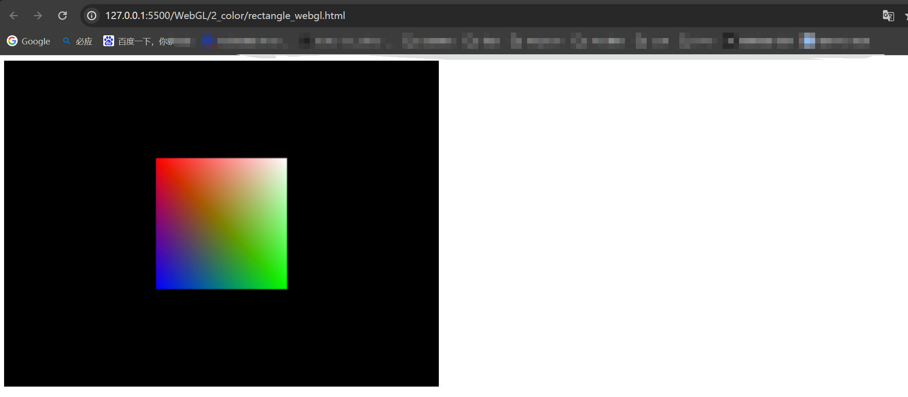
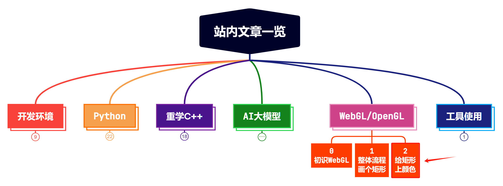

> **大家好，我是 <font color=blue>同学小张</font>，+v: <font color=blue>**jasper_8017**</font> 一起交流，持续学习<font color=red>C++进阶、OpenGL、WebGL知识技能</font>和<font color=red>AI大模型应用实战案例</font>，持续分享，欢迎大家<font color=red>点赞+关注</font>，共同学习和进步。**
---

本文我们在 [上篇文章:【WebGL实战】1. 全流程实现与拆解：WebGL绘制2D图形](https://blog.csdn.net/Attitude93/article/details/139263320?spm=1001.2014.3001.5501) 的基础上，改进着色器，实现矩形颜色填充。

> 参考：https://developer.mozilla.org/zh-CN/docs/Web/API/WebGL_API/Tutorial/Using_shaders_to_apply_color_in_WebGL

@[toc]

# 0. 之前的着色器代码

先来回顾一下之前的着色器代码。

顶点着色器：接收顶点坐标，返回投影处理后的顶点坐标，gl_Position 变量存储顶点坐标。

```js
const vsSource = `
attribute vec4 aVertexPosition;
uniform mat4 uModelViewMatrix;
uniform mat4 uProjectionMatrix;
void main() {
    gl_Position = uProjectionMatrix * uModelViewMatrix * aVertexPosition;
}
`;
```

片段着色器：返回片段颜色，gl_FragColor 变量存储片段颜色。这里的颜色固定为白色(1.0, 1.0, 1.0, 1.0)。

```js
const fsSource = `
void main() {
    gl_FragColor = vec4(1.0, 1.0, 1.0, 1.0);
}
`;
```

# 1. 改进着色器代码

## 1.1 顶点着色器

> 在 WebGL 中，物体是由一系列顶点组成的，每一个顶点都有位置和颜色信息。

之前我们只给了顶点位置，没有颜色信息。现在我们给顶点添加颜色属性。修改后的顶点着色器代码如下：

```js
const vsSource = `
attribute vec4 aVertexPosition;
attribute vec4 aVertexColor;
uniform mat4 uModelViewMatrix;
uniform mat4 uProjectionMatrix;

varying lowp vec4 vColor;
void main() {
    gl_Position = uProjectionMatrix * uModelViewMatrix * aVertexPosition;
    vColor = aVertexColor;
}
`;
```

具体改进如下：

* 在原来的基础上，我们增加了颜色属性：`attribute vec4 aVertexColor;`

* 增加了颜色变量：`varying lowp vec4 vColor;` , 这个颜色变量是传递给片段着色器的。`vColor = aVertexColor;` 语句，将顶点颜色传递给片段着色器。

## 1.2 片段着色器

修改后的片段着色器代码如下：

```js
const fsSource = `
varying lowp vec4 vColor;

void main() {
    gl_FragColor = vColor;
}
`;
```

具体改进如下：

* 增加了颜色变量：`varying lowp vec4 vColor;` , 这个颜色变量是接收来自顶点着色器的颜色。

* 片段着色器中，直接将颜色变量赋值给 gl_FragColor 变量。这样，片段着色器就获取到了顶点着色器传递过来的颜色，而不再是固定值。


# 2.颜色值的定义

(1) 定义顶点的颜色：每个颜色都是RGBA值，其中R、G、B、A分别代表红色、绿色、蓝色和透明度。

```js
const colors = [1.0, 1.0, 1.0, 1.0, // 白
    1.0, 0.0, 0.0, 1.0, // 红
    0.0, 1.0, 0.0, 1.0, // 绿
    0.0, 0.0, 1.0, 1.0, // 蓝
  ];
```

（2）创建一个 WebGL 缓冲区用来存储这些颜色

```js
const colorBuffer = gl.createBuffer();
gl.bindBuffer(gl.ARRAY_BUFFER, colorBuffer);
gl.bufferData(gl.ARRAY_BUFFER, new Float32Array(colors), gl.STATIC_DRAW);
```

# 3. 颜色值的传递

改造好着色器后，我们需要给着色器传递颜色。只需要将颜色值传递给顶点着色器即可。

## 3.1 programInfo 的修改

将颜色属性的位置添加到 programInfo 中：`vertexColor: gl.getAttribLocation(shaderProgram, "aVertexColor"),`

```js
const programInfo = {
    program: shaderProgram,
    attribLocations: {
        vertexPosition: gl.getAttribLocation(shaderProgram, "aVertexPosition"),
        vertexColor: gl.getAttribLocation(shaderProgram, "aVertexColor"),
    },
    uniformLocations: {
        projectionMatrix: gl.getUniformLocation(shaderProgram, "uProjectionMatrix"),
        modelViewMatrix: gl.getUniformLocation(shaderProgram, "uModelViewMatrix"),
    },
};
```

## 3.2 在渲染时传递颜色给顶点着色器

因为是传递给顶点着色器，所以参考 setPositionAttribute 函数的实现：

```js
function setColorAttribute(gl, buffers, programInfo) {
    const numComponents = 4;
    const type = gl.FLOAT;
    const normalize = false;
    const stride = 0;
    const offset = 0;
    gl.bindBuffer(gl.ARRAY_BUFFER, buffers.color);
    gl.vertexAttribPointer(
        programInfo.attribLocations.vertexColor,
        numComponents,
        type,
        normalize,
        stride,
        offset,
    );
    gl.enableVertexAttribArray(programInfo.attribLocations.vertexColor);
}
```

- 使用gl.bindBuffer方法将buffers.color绑定到当前WebGL上下文的ARRAY_BUFFER目标。这告诉WebGL，后续的颜色属性操作将使用buffers.color缓冲区中的数据。

- gl.vertexAttribPointer方法告诉WebGL如何从缓冲区中取数据。

- gl.enableVertexAttribArray(programInfo.attribLocations.vertexColor); 启用颜色位置属性

# 4. 完整js代码

修改后的完整js代码如下：

```js

main();


// 从这里开始
function main() {
    const canvas = document.querySelector("#glcanvas");
    // 初始化 WebGL 上下文
    const gl = canvas.getContext("webgl");

    // 确认 WebGL 支持性
    if (!gl) {
        alert("无法初始化 WebGL，你的浏览器、操作系统或硬件等可能不支持 WebGL。");
        return;
    }

    // 使用完全不透明的黑色清除所有图像
    gl.clearColor(0.0, 0.0, 0.0, 1.0);
    // 用上面指定的颜色清除缓冲区
    gl.clear(gl.COLOR_BUFFER_BIT);

    // Vertex shader program
    const vsSource = `
    attribute vec4 aVertexPosition;
    attribute vec4 aVertexColor;
    uniform mat4 uModelViewMatrix;
    uniform mat4 uProjectionMatrix;

    varying lowp vec4 vColor;
    void main() {
        gl_Position = uProjectionMatrix * uModelViewMatrix * aVertexPosition;
        vColor = aVertexColor;
    }
    `;

    const fsSource = `
    varying lowp vec4 vColor;

    void main() {
        gl_FragColor = vColor;
    }
    `;

    const shaderProgram = initShaderProgram(gl, vsSource, fsSource);
    const programInfo = {
        program: shaderProgram,
        attribLocations: {
            vertexPosition: gl.getAttribLocation(shaderProgram, "aVertexPosition"),
            vertexColor: gl.getAttribLocation(shaderProgram, "aVertexColor"),
        },
        uniformLocations: {
            projectionMatrix: gl.getUniformLocation(shaderProgram, "uProjectionMatrix"),
            modelViewMatrix: gl.getUniformLocation(shaderProgram, "uModelViewMatrix"),
        },
    };

    const buffers = initBuffers(gl);

    drawScene(gl, programInfo, buffers);
}

function initShaderProgram(gl, vsSource, fsSource) {
    const vertexShader = loadShader(gl, gl.VERTEX_SHADER, vsSource);
    const fragmentShader = loadShader(gl, gl.FRAGMENT_SHADER, fsSource);
    const shaderProgram = gl.createProgram();
    gl.attachShader(shaderProgram, vertexShader);
    gl.attachShader(shaderProgram, fragmentShader);
    gl.linkProgram(shaderProgram);

    if (!gl.getProgramParameter(shaderProgram, gl.LINK_STATUS)) {
      alert(
        `Unable to initialize the shader program: ${gl.getProgramInfoLog(
          shaderProgram
        )}`
      );
      return null;
    }
  
    return shaderProgram;
}

function loadShader(gl, type, source) {
    const shader = gl.createShader(type);
    gl.shaderSource(shader, source);
    gl.compileShader(shader);
    if (!gl.getShaderParameter(shader, gl.COMPILE_STATUS)) {
      alert(
        `An error occurred compiling the shaders: ${gl.getShaderInfoLog(shader)}`
      );
      gl.deleteShader(shader);
      return null;
    }
  
    return shader;
}

function initBuffers(gl) {
    const positionBuffer = initPositionBuffer(gl);
    const colorBuffer = initColorBuffer(gl);

    return {
        position: positionBuffer,
        color: colorBuffer,
    };
}

function initColorBuffer(gl) {
    const colors = [
        1.0,
        1.0,
        1.0,
        1.0, // 白
        1.0,
        0.0,
        0.0,
        1.0, // 红
        0.0,
        1.0,
        0.0,
        1.0, // 绿
        0.0,
        0.0,
        1.0,
        1.0, // 蓝
    ];

    const colorBuffer = gl.createBuffer();
    gl.bindBuffer(gl.ARRAY_BUFFER, colorBuffer);
    gl.bufferData(gl.ARRAY_BUFFER, new Float32Array(colors), gl.STATIC_DRAW);

    return colorBuffer;
}

function initPositionBuffer(gl) {
    const positionBuffer = gl.createBuffer();
    gl.bindBuffer(gl.ARRAY_BUFFER, positionBuffer);
    const positions = [1.0, 1.0, -1.0, 1.0, 1.0, -1.0, -1.0, -1.0];

    gl.bufferData(gl.ARRAY_BUFFER, new Float32Array(positions), gl.STATIC_DRAW);
  
    return positionBuffer;
}

function drawScene(gl, programInfo, buffers) {
    gl.clearColor(0.0, 0.0, 0.0, 1.0);
    gl.clearDepth(1.0);
    gl.enable(gl.DEPTH_TEST);
    gl.depthFunc(gl.LEQUAL); 
  
    gl.clear(gl.COLOR_BUFFER_BIT | gl.DEPTH_BUFFER_BIT);
  
    const fieldOfView = (45 * Math.PI) / 180; // in radians
    const aspect = gl.canvas.clientWidth / gl.canvas.clientHeight;
    const zNear = 0.1;
    const zFar = 100.0;
    const projectionMatrix = mat4.create();
  
    mat4.perspective(projectionMatrix, fieldOfView, aspect, zNear, zFar);
    const modelViewMatrix = mat4.create();
  
    mat4.translate(
        modelViewMatrix,
        modelViewMatrix,
        [-0.0, 0.0, -6.0]
    );
  
    setPositionAttribute(gl, buffers, programInfo);
    setColorAttribute(gl, buffers, programInfo);
  
    gl.useProgram(programInfo.program);
  
    gl.uniformMatrix4fv(
        programInfo.uniformLocations.projectionMatrix,
        false,
        projectionMatrix
    );
    gl.uniformMatrix4fv(
        programInfo.uniformLocations.modelViewMatrix,
        false,
        modelViewMatrix
    );
  
    {
        const offset = 0;
        const vertexCount = 4;
        gl.drawArrays(gl.TRIANGLE_STRIP, offset, vertexCount);
    }
}

function setPositionAttribute(gl, buffers, programInfo) {
    const numComponents = 2;
    const type = gl.FLOAT;
    const normalize = false;
    const stride = 0;
    const offset = 0;
    gl.bindBuffer(gl.ARRAY_BUFFER, buffers.position);
    gl.vertexAttribPointer(
        programInfo.attribLocations.vertexPosition,
        numComponents,
        type,
        normalize,
        stride,
        offset
    );
    gl.enableVertexAttribArray(programInfo.attribLocations.vertexPosition);
}

function setColorAttribute(gl, buffers, programInfo) {
    const numComponents = 4;
    const type = gl.FLOAT;
    const normalize = false;
    const stride = 0;
    const offset = 0;
    gl.bindBuffer(gl.ARRAY_BUFFER, buffers.color);
    gl.vertexAttribPointer(
        programInfo.attribLocations.vertexColor,
        numComponents,
        type,
        normalize,
        stride,
        offset,
    );
    gl.enableVertexAttribArray(programInfo.attribLocations.vertexColor);
}
  
```
运行结果：



# 5. 总结

本文我们在上文的基础上，为矩形的绘制增加了颜色。我们通过设置顶点着色器中的颜色变量，传递给片段着色器。本文的重点在于：顶点着色器中增加颜色属性，颜色属性如何在顶点着色器和片段着色器之间传递，以及如何设置颜色属性。


> **如果觉得本文对你有帮助，麻烦点个赞和关注呗 ~~~**

---

> - 大家好，我是 <font color=blue>**同学小张**</font>，持续学习<font color=red>**C++进阶、OpenGL、WebGL知识技能**</font>和<font color=red>**AI大模型应用实战案例**</font>
> - 欢迎 <font color=red>**点赞 + 关注**</font> 👏，**持续学习**，**持续干货输出**。
> - +v: <font color=blue>**jasper_8017**</font> 一起交流💬，一起进步💪。
> - 微信公众号搜<font color=blue>【**同学小张**】</font> 🙏

**本站文章一览：**

