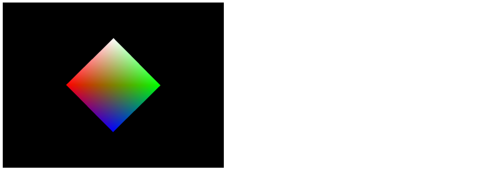
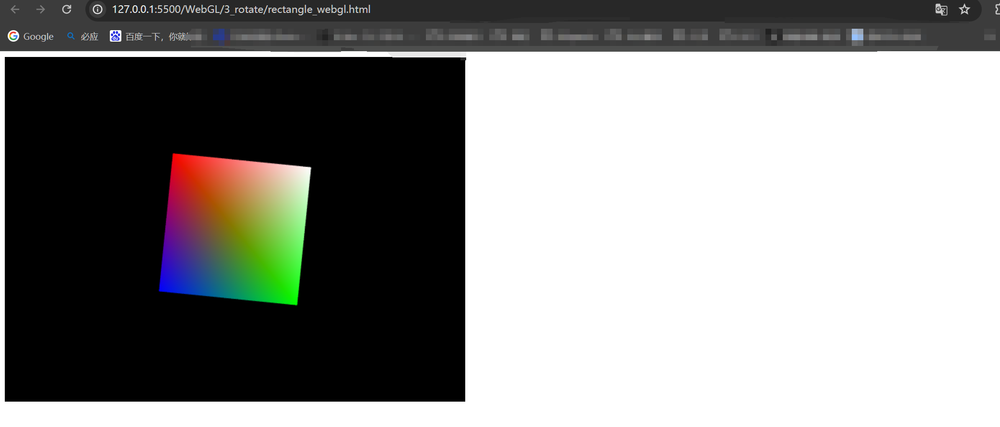
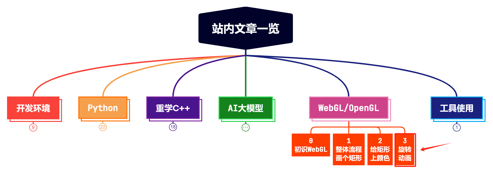

> **大家好，我是 <font color=blue>同学小张</font>，+v: <font color=blue>**jasper_8017**</font> 一起交流，持续学习<font color=red>C++进阶、OpenGL、WebGL知识技能</font>和<font color=red>AI大模型应用实战案例</font>，持续分享，欢迎大家<font color=red>点赞+关注</font>，共同学习和进步。**
---

本文我们在 [上篇文章:【WebGL实战】2. 给2D图形上色：颜色值应该如何传递给着色器？](https://blog.csdn.net/Attitude93/article/details/139412186) 的基础上，让矩形旋转起来。通过本文，我们将学会如何改变矩形的旋转角度，以及如何实现一个简单的动画效果。

> 参考：https://developer.mozilla.org/zh-CN/docs/Web/API/WebGL_API/Tutorial/Animating_objects_with_WebGL

@[toc]

# 0. 如何改变矩形的旋转角度

改变矩形的位置和旋转角度，是通过模型矩阵来实现的。之前的代码，我们的模型矩阵只是将模型进行了平移操作，并没有进行旋转操作。

```js
mat4.translate(
    modelViewMatrix, // destination matrix
    modelViewMatrix, // matrix to translate
    [-0.0, 0.0, -6.0]
); // amount to translate
```

现在，我们增加一个旋转角度，通过 `mat4.rotate` 函数来实现。rotate 的第三个参数为旋转的角度（弧度），这里我们给一个0.78，大概是45°。第四个参数是沿哪个轴旋转，这里我们选择[0, 0, 1]，沿z轴旋转。z轴是垂直于屏幕的方向。

```js
mat4.rotate(
    modelViewMatrix, // destination matrix
    modelViewMatrix, // matrix to rotate
    0.78, // amount to rotate in radians
    [0, 0, 1]
); // axis to rotate around
```

加入旋转后，运行代码，结果如下：



可以看到，矩形的旋转角度已经变成45°了。我们通过改变第三个参数值，也就能改变矩形的旋转角度。

所以，我们作以下改造：

（1）定义一个变量来存储这个旋转角度

let squareRotation = 0.0;

（2）旋转矩阵中将这个变量作为第三个参数

```js
mat4.rotate(
    modelViewMatrix, // destination matrix
    modelViewMatrix, // matrix to rotate
    squareRotation, // amount to rotate in radians
    [0, 0, 1]
); // axis to rotate around
```

（3）传递这个 squareRotation 值给 drawScene


```js
function drawScene(gl, programInfo, buffers, squareRotation)
```

squareRotation 值的计算，也是下面实现动画的关键。

# 1. 如何实现一个简单的动画效果

实现动画效果的思路很简单，就是每隔一段时间，改变矩形的旋转角度。当这个间隔足够小，就能实现比较流畅的动画效果。

（1）我们以时间间隔来作为变量，来计算旋转角度。

```js
let deltaTime = 0;

......

now *= 0.001; // convert to seconds
deltaTime = now - then;
then = now;

......

squareRotation += deltaTime;
```

（2）接下来，就是让上面这个变量的计算循环起来

```js
let then = 0;
// Draw the scene repeatedly
function render(now) {
    now *= 0.001; // convert to seconds
    deltaTime = now - then;
    then = now;

    drawScene(gl, programInfo, buffers, squareRotation);
    squareRotation += deltaTime;

    requestAnimationFrame(render);
}
requestAnimationFrame(render);
```

`requestAnimationFrame` 是一个浏览器提供的 API，它告诉浏览器你希望执行一个动画，并请求浏览器在下次重绘之前调用指定的函数来更新动画。这使得动画的渲染与浏览器的绘制循环同步，有助于实现平滑的动画效果。

使用 `requestAnimationFrame` 而不是 `setTimeout` 或 `setInterval` 的主要优势在于，它更精确地控制了动画的帧率，并考虑了页面的可见性、设备性能和其他可能影响渲染性能的因素。例如，如果页面被最小化或标签页被切换，浏览器可能会暂停或降低 `requestAnimationFrame` 的调用频率以节省资源。

# 2. 完整代码

完整js代码如下：

```js
let squareRotation = 0.0;
let deltaTime = 0;

main();

// 从这里开始
function main() {
    const canvas = document.querySelector("#glcanvas");
    // 初始化 WebGL 上下文
    const gl = canvas.getContext("webgl");

    // 确认 WebGL 支持性
    if (!gl) {
        alert("无法初始化 WebGL，你的浏览器、操作系统或硬件等可能不支持 WebGL。");
        return;
    }
    gl.clearColor(0.0, 0.0, 0.0, 1.0);
    gl.clear(gl.COLOR_BUFFER_BIT);

    const vsSource = `
    attribute vec4 aVertexPosition;
    attribute vec4 aVertexColor;
    uniform mat4 uModelViewMatrix;
    uniform mat4 uProjectionMatrix;

    varying lowp vec4 vColor;
    void main() {
        gl_Position = uProjectionMatrix * uModelViewMatrix * aVertexPosition;
        vColor = aVertexColor;
    }
    `;

    const fsSource = `
    varying lowp vec4 vColor;

    void main() {
        gl_FragColor = vColor;
    }
    `;

    const shaderProgram = initShaderProgram(gl, vsSource, fsSource);
    const programInfo = {
        program: shaderProgram,
        attribLocations: {
            vertexPosition: gl.getAttribLocation(shaderProgram, "aVertexPosition"),
            vertexColor: gl.getAttribLocation(shaderProgram, "aVertexColor"),
        },
        uniformLocations: {
            projectionMatrix: gl.getUniformLocation(shaderProgram, "uProjectionMatrix"),
            modelViewMatrix: gl.getUniformLocation(shaderProgram, "uModelViewMatrix"),
        },
    };

    const buffers = initBuffers(gl);

    let then = 0;
    // Draw the scene repeatedly
    function render(now) {
        now *= 0.001; // convert to seconds
        deltaTime = now - then;
        then = now;

        drawScene(gl, programInfo, buffers, squareRotation);
        squareRotation += deltaTime;

        requestAnimationFrame(render);
    }
    requestAnimationFrame(render);
}

function initShaderProgram(gl, vsSource, fsSource) {
    const vertexShader = loadShader(gl, gl.VERTEX_SHADER, vsSource);
    const fragmentShader = loadShader(gl, gl.FRAGMENT_SHADER, fsSource);
    const shaderProgram = gl.createProgram();
    gl.attachShader(shaderProgram, vertexShader);
    gl.attachShader(shaderProgram, fragmentShader);
    gl.linkProgram(shaderProgram);
    if (!gl.getProgramParameter(shaderProgram, gl.LINK_STATUS)) {
      alert(
        `Unable to initialize the shader program: ${gl.getProgramInfoLog(
          shaderProgram
        )}`
      );
      return null;
    }
  
    return shaderProgram;
}

function loadShader(gl, type, source) {
    const shader = gl.createShader(type);
    gl.shaderSource(shader, source);
    gl.compileShader(shader);
    if (!gl.getShaderParameter(shader, gl.COMPILE_STATUS)) {
      alert(
        `An error occurred compiling the shaders: ${gl.getShaderInfoLog(shader)}`
      );
      gl.deleteShader(shader);
      return null;
    }
  
    return shader;
}

function initBuffers(gl) {
    const positionBuffer = initPositionBuffer(gl);
    const colorBuffer = initColorBuffer(gl);

    return {
        position: positionBuffer,
        color: colorBuffer,
    };
}

function initColorBuffer(gl) {
    const colors = [
        1.0,
        1.0,
        1.0,
        1.0, // 白
        1.0,
        0.0,
        0.0,
        1.0, // 红
        0.0,
        1.0,
        0.0,
        1.0, // 绿
        0.0,
        0.0,
        1.0,
        1.0, // 蓝
    ];

    const colorBuffer = gl.createBuffer();
    gl.bindBuffer(gl.ARRAY_BUFFER, colorBuffer);
    gl.bufferData(gl.ARRAY_BUFFER, new Float32Array(colors), gl.STATIC_DRAW);

    return colorBuffer;
}

function initPositionBuffer(gl) {
    const positionBuffer = gl.createBuffer();
    gl.bindBuffer(gl.ARRAY_BUFFER, positionBuffer);
    const positions = [1.0, 1.0, -1.0, 1.0, 1.0, -1.0, -1.0, -1.0];
    gl.bufferData(gl.ARRAY_BUFFER, new Float32Array(positions), gl.STATIC_DRAW);
  
    return positionBuffer;
}

function drawScene(gl, programInfo, buffers, squareRotation) {
    gl.clearColor(0.0, 0.0, 0.0, 1.0);
    gl.clearDepth(1.0);
    gl.enable(gl.DEPTH_TEST);
    gl.depthFunc(gl.LEQUAL);
  
    gl.clear(gl.COLOR_BUFFER_BIT | gl.DEPTH_BUFFER_BIT);
  
    const fieldOfView = (45 * Math.PI) / 180; // in radians
    const aspect = gl.canvas.clientWidth / gl.canvas.clientHeight;
    const zNear = 0.1;
    const zFar = 100.0;
    const projectionMatrix = mat4.create();

    mat4.perspective(projectionMatrix, fieldOfView, aspect, zNear, zFar);
  
    const modelViewMatrix = mat4.create();
    mat4.translate(
        modelViewMatrix,
        modelViewMatrix,
        [-0.0, 0.0, -6.0]
    );

    mat4.rotate(
        modelViewMatrix,
        modelViewMatrix,
        squareRotation,
        [0, 0, 1]
    );

    setPositionAttribute(gl, buffers, programInfo);
    setColorAttribute(gl, buffers, programInfo);
    gl.useProgram(programInfo.program);
    gl.uniformMatrix4fv(
        programInfo.uniformLocations.projectionMatrix,
        false,
        projectionMatrix
    );
    gl.uniformMatrix4fv(
        programInfo.uniformLocations.modelViewMatrix,
        false,
        modelViewMatrix
    );
  
    {
        const offset = 0;
        const vertexCount = 4;
        gl.drawArrays(gl.TRIANGLE_STRIP, offset, vertexCount);
    }
}

function setPositionAttribute(gl, buffers, programInfo) {
    const numComponents = 2;
    const type = gl.FLOAT;
    const normalize = false;
    const stride = 0;
    const offset = 0;
    gl.bindBuffer(gl.ARRAY_BUFFER, buffers.position);
    gl.vertexAttribPointer(
        programInfo.attribLocations.vertexPosition,
        numComponents,
        type,
        normalize,
        stride,
        offset
    );
    gl.enableVertexAttribArray(programInfo.attribLocations.vertexPosition);
}

function setColorAttribute(gl, buffers, programInfo) {
    const numComponents = 4;
    const type = gl.FLOAT;
    const normalize = false;
    const stride = 0;
    const offset = 0;
    gl.bindBuffer(gl.ARRAY_BUFFER, buffers.color);
    gl.vertexAttribPointer(
        programInfo.attribLocations.vertexColor,
        numComponents,
        type,
        normalize,
        stride,
        offset,
    );
    gl.enableVertexAttribArray(programInfo.attribLocations.vertexColor);
}
```
运行结果截图：



# 3. 总结

本文我们主要让矩形旋转了起来，首先是如何让矩形旋转，然后是如何实现一个简单的动画（循环）。


> **如果觉得本文对你有帮助，麻烦点个赞和关注呗 ~~~**

---

> - 大家好，我是 <font color=blue>**同学小张**</font>，持续学习<font color=red>**C++进阶、OpenGL、WebGL知识技能**</font>和<font color=red>**AI大模型应用实战案例**</font>
> - 欢迎 <font color=red>**点赞 + 关注**</font> 👏，**持续学习**，**持续干货输出**。
> - +v: <font color=blue>**jasper_8017**</font> 一起交流💬，一起进步💪。
> - 微信公众号搜<font color=blue>【**同学小张**】</font> 🙏

**本站文章一览：**

