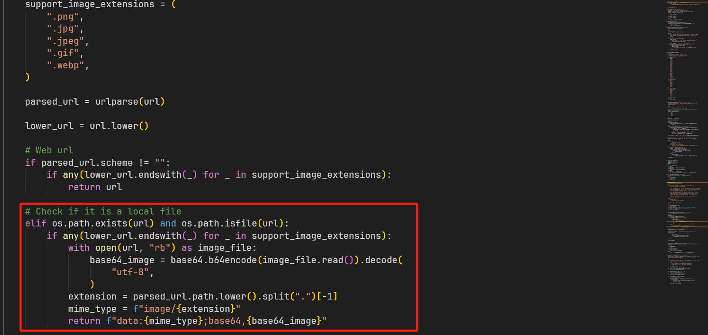
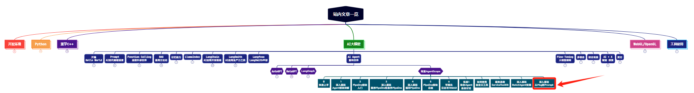

> **大家好，我是 <font color=blue>同学小张</font>，持续学习<font color=red>C++进阶、OpenGL、WebGL知识技能</font>和<font color=red>AI大模型应用实战案例</font>，持续分享，欢迎大家<font color=red>点赞+关注</font>，+v: <font color=blue>**jasper_8017**</font> 一起交流，共同学习和进步。**
---

前面咱们学习AgentScope，在使用Agent来对话时，输入为一个 Msg 对象，不能是字符串，然后在Agent内部，会将Msg对象转换为模型接受的Prompt。那 AgentScope 如何根据 Msg 形成相应模型接收的Prompt结构的？如何使用 Msg 带入更多的参数，传递给大模型呢？

@[toc]

# 0. 背景

前面咱们学习AgentScope，有两种使用大模型的方式。

第一种方式是直接使用Agent来实现对大模型的调用。在使用Agent来对话时，**输入为一个 Msg 对象，不能是字符串**，然后在Agent内部，会将Msg对象转换为模型接受的Prompt。如咱们在 [【AI Agent系列】【阿里AgentScope框架】实战1：利用AgentScope实现动态创建Agent和自由组织讨论](https://blog.csdn.net/Attitude93/article/details/137635518) 这篇文章中的例子：

```python

......

agent_builder = DialogAgent(
    name="agent_builder",
    sys_prompt="You're a helpful assistant.",
    model_config_name="gpt-3.5-turbo",
)

......

x = Msg("user", x, role="user")
settings = agent_builder(x)
```

第二种方式是直接使用模型接口来实现对大模型的调用。这时候就需要咱们自己给大模型接口一个Prompt。如咱们在 [【AI Agent系列】【阿里AgentScope框架】深入源码：ReActAgent实现与思考](https://blog.csdn.net/Attitude93/article/details/139263146) 这篇文章中看到的 ReActAgent 中的代码：

```python
hint_msg = Msg(
    "system",
    self.parser.format_instruction,
    role="system",
    echo=self.verbose,
)

# Prepare prompt for the model
prompt = self.model.format(self.memory.get_memory(), hint_msg)
```

那 AgentScope 如何根据 Msg 形成相应模型接收的Prompt结构的？如何使用 Msg 带入更多的参数，传递给大模型呢？

# 1. AgentScope 中的内置提示构建策略

AgentScope为以下的模型API提供了内置的提示构建策略。

* OpenAIChatWrapper

* DashScopeChatWrapper

* DashScopeMultiModalWrapper

* OllamaChatWrapper

* OllamaGenerationWrapper

* GeminiChatWrapper

* ZhipuAIChatWrapper

这个构建策略，在相应Model Wrapper类的format函数中实现。本文以 OpenAIChatWrapper 为例，来分析 AgentScope 中内置的提示构建策略。

> OpenAIChatWrapper封装了OpenAI聊天API，它以字典列表作为输入，其中字典必须遵循以下规则（更新于2024/03/22）：
> 
> * 需要role和content字段，以及一个可选的name字段。
> 
> * role字段必须是"system"、"user"或"assistant"之一。
>
> 参考：https://modelscope.github.io/agentscope/zh_CN/tutorial/206-prompt.html


## 1.1 先来看输入Msg与构建效果

### 1.1.1 纯文本的构建

示例代码：

```python
from agentscope.models import OpenAIChatWrapper
from agentscope.message import Msg

model = OpenAIChatWrapper(
    config_name="", # 我们直接初始化model wrapper，因此不需要填入config_name
    model_name="gpt-3.5-turbo",
)

prompt = model.format(
   Msg("system", "You're a helpful assistant", role="system"),   # Msg对象
   [                                                             # Msg对象的列表
      Msg(name="Bob", content="Hi.", role="assistant"),
      Msg(name="Alice", content="Nice to meet you!", role="assistant"),
   ],
)
print(prompt)
```

执行结果：

```python
[
  {"role": "system", "name": "system", "content": "You are a helpful assistant"},
  {"role": "assistant", "name": "Bob", "content": "Hi."},
  {"role": "assistant", "name": "Alice", "content": "Nice to meet you!"),
]
```

### 1.1.2 视觉模型Prompt的构建

示例代码：

```python
from agentscope.models import OpenAIChatWrapper
from agentscope.message import Msg

model = OpenAIChatWrapper(
    config_name="", # 为空，因为我们直接初始化model wrapper
    model_name="gpt-4o",
)

prompt = model.format(
   Msg("system", "You're a helpful assistant", role="system"),   # Msg 对象
   [                                                             # Msg 对象的列表
      Msg(name="user", content="Describe this image", role="user", url="https://xxx.png"),
      Msg(name="user", content="And these images", role="user", url=["/Users/xxx/test.png", "/Users/xxx/test.mp3"]),
   ],
)
print(prompt)
```

执行结果：

```python
[
    {
        "role": "system",
        "name": "system",
        "content": "You are a helpful assistant"
    },
    {
        "role": "user",
        "name": "user",
        "content": [
            {
                "type": "text",
                "text": "Describe this image"
            },
            {
                "type": "image_url",
                "image_url": {
                    "url": "https://xxx.png"
                }
            },
        ]
    },
    {
        "role": "user",
        "name": "user",
        "content": [
            {
                "type": "text",
                "text": "And these images"
            },
            {
                "type": "image_url",
                "image_url": {
                    "url": "data:image/png;base64,YWJjZGVm..." # 对应 /Users/xxx/test.png
                }
            },
        ]
    },
]
```

可以看到，输入是一系列的 Msg 对象，输出是符合 OpenAI Chat API 的 Prompt 结构。这些都是在 OpenAIChatWrapper 的 format 函数中实现的。

## 1.2 源码分析：OpenAIChatWrapper 的 format 函数

format 函数源码如下：

```python
def format(
    self,
    *args: Union[MessageBase, Sequence[MessageBase]],
) -> List[dict]:
    messages = []
    for arg in args:
        if arg is None:
            continue
        if isinstance(arg, MessageBase):
            if arg.url is not None:
                messages.append(self._format_msg_with_url(arg))
            else:
                messages.append(
                    {
                        "role": arg.role,
                        "name": arg.name,
                        "content": _convert_to_str(arg.content),
                    },
                )

        ......

    return messages
```

可以看到，format 函数接收一个或多个 MessageBase 对象。如果是纯文本消息，则直接将对应的 role、name 和 content 拼接成 dict，然后加入到 OpenAI Prompt对应的messages 中。如果Msg中包含了url，则说明这是个多模态的输入，调用 \_format_msg_with_url 函数处理。

```python
def _format_msg_with_url(
    self,
    msg: MessageBase,
) -> Dict:
    # Check if the model is a vision model
    ......

    # Put all urls into a list
    urls = [msg.url] if isinstance(msg.url, str) else msg.url

    # Check if the url refers to an image
    checked_urls = []
    for url in urls:
        try:
            checked_urls.append(_to_openai_image_url(url))
        except TypeError:
            ......

    if len(checked_urls) == 0:
        # If no valid image url is provided, return the normal message dict
        return {
            "role": msg.role,
            "name": msg.name,
            "content": _convert_to_str(msg.content),
        }
    else:
        # otherwise, use the vision format message
        returned_msg = {
            "role": msg.role,
            "name": msg.name,
            "content": [
                {
                    "type": "text",
                    "text": _convert_to_str(msg.content),
                },
            ],
        }

        image_dicts = [
            {
                "type": "image_url",
                "image_url": {
                    "url": _,
                },
            }
            for _ in checked_urls
        ]

        returned_msg["content"].extend(image_dicts)

        return returned_msg
```

这个函数主要做了以下几件事：

（1）检查模型是否为视觉模型，如果不是，则直接返回普通消息。

（2）校验 url 是否为有效的图片，如果不是，则不添加到返回的 dict 中。这里面，不仅包含了url的校验，还会判断是否是本地的图片，如果是本地图片，则会转成base64格式返回。



（3）组装成 OpenAI 的多模态 Prompt 格式。前面咱们刚学习了 OpenAI 的多模态Prompt形式，不知道的可以看下这篇文章：[【多模态】gpt4o的接口使用实践](https://blog.csdn.net/Attitude93/article/details/139304213)

```python
image_dicts = [
    {
        "type": "image_url",
        "image_url": {
            "url": _,
        },
    }
    for _ in checked_urls
]
```

# 2. 实战

知道了组装原理，我们来实战一下。纯文字类型的太简单了，这里我们直接看多模态的。

```python
import agentscope
from agentscope.message import Msg

def main() -> None:
  # 一次性初始化多个模型配置
  openai_cfg_dict = {
      "config_name": "openai_cfg",
      "model_type": "openai",

      "model_name": "gpt-4o",
  }

  agentscope.init(model_configs=[openai_cfg_dict], logger_level="INFO")

  from agentscope.agents import DialogAgent, UserAgent

  # 创建一个对话智能体和一个用户智能体
  dialogAgent = DialogAgent(name="assistant", model_config_name="openai_cfg", sys_prompt="You are a helpful ai assistant")
  
  x = Msg(name="user", content="图片里有什么？", role="user", url=["xxx/微信图片_20240405184354.jpg"])
  response = dialogAgent(x)
  print(response)
  
if __name__ == "__main__":
    main()
```

这样可以实现用AgentScope的Agent来进行多模态的对话。

> 如果路径中带`c:/`类似的本地路径，会识别成url... 报错... 所以最好是在linux或mac下测试。


> **如果觉得本文对你有帮助，麻烦点个赞和关注呗 ~~~**

---

> - 大家好，我是 <font color=blue>**同学小张**</font>，持续学习<font color=red>**C++进阶、OpenGL、WebGL知识技能**</font>和<font color=red>**AI大模型应用实战案例**</font>
> - 欢迎 <font color=red>**点赞 + 关注**</font> 👏，**持续学习**，**持续干货输出**。
> - +v: <font color=blue>**jasper_8017**</font> 一起交流💬，一起进步💪。
> - 微信公众号搜<font color=blue>【**同学小张**】</font> 🙏

**本站文章一览：**

