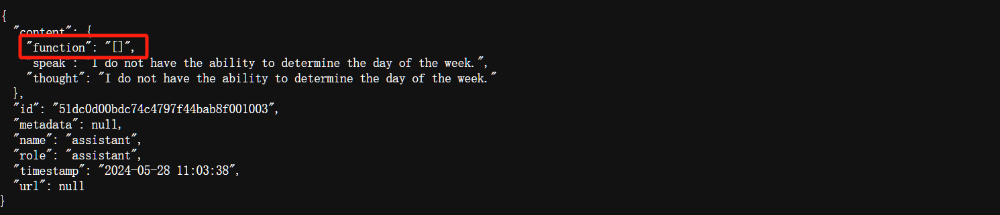

> **大家好，我是 <font color=blue>同学小张</font>，持续学习<font color=red>C++进阶、OpenGL、WebGL知识技能</font>和<font color=red>AI大模型应用实战案例</font>，持续分享，欢迎大家<font color=red>点赞+关注</font>，+v: <font color=blue>**jasper_8017**</font> 一起交流，共同学习和进步。**
---

通过前面的两篇文章，我们知道目前在 AgentScope 中使用工具，首先是使用 SerivceToolkit 将工具封装，然后通过 ReActAgent 来使用工具。ServiceToolkit 的使用方法我们已经介绍过了，本文我们来看下 ReActAgent 的源码，了解下其实现与使用。


@[toc]

# 0. ReActAgent 源码解析

## 0.1 __init__函数

源码如下：

```python
def __init__(
    self,
    name: str,
    model_config_name: str,
    service_toolkit: ServiceToolkit = None,
    sys_prompt: str = "You're a helpful assistant. Your name is {name}.",
    max_iters: int = 10,
    verbose: bool = True,
    **kwargs: Any,
) -> None:
    super().__init__(
        name=name,
        sys_prompt=sys_prompt,
        model_config_name=model_config_name,
    )

    if service_toolkit is None:
        raise ValueError(
            "The argument `service_toolkit` is required to initialize "
            "the ReActAgent.",
        )

    self.service_toolkit = service_toolkit
    self.verbose = verbose
    self.max_iters = max_iters

    if not sys_prompt.endswith("\n"):
        sys_prompt = sys_prompt + "\n"

    self.sys_prompt = "\n".join(
        [
            sys_prompt.format(name=self.name),
            self.service_toolkit.tools_instruction,
            INSTRUCTION_PROMPT,
        ],
    )

    self.memory.add(Msg("system", self.sys_prompt, role="system"))

    # Initialize a parser object to formulate the response from the model
    self.parser = MarkdownJsonDictParser(
        content_hint={
            "thought": "what you thought",
            "speak": "what you speak",
            "function": service_toolkit.tools_calling_format,
        },
        required_keys=["thought", "speak", "function"],
        keys_to_content=True if self.verbose else "speak",
    )
```

### 0.1.1 函数参数说明

init 函数参数说明：

* name：agent 的名称
* sys_prompt：系统提示
* model_config_name：模型配置名称
* service_toolkit：ServiceToolkit 对象
* max_iters：最大迭代次数
* verbose：是否输出详细信息

### 0.1.2 函数代码解析

初始化函数，除了接收外部传入的配置参数并存储之外，还有两个关键的步骤：

（1）组装 sys_prompt

（2）定义了一个模型输出的解析器：MarkdownJsonDictParser

#### 0.1.2.1 组装 sys_prompt

```python
self.sys_prompt = "\n".join(
    [
        sys_prompt.format(name=self.name),
        self.service_toolkit.tools_instruction,
        INSTRUCTION_PROMPT,
    ],
)
```

根据以上代码，sys_prompt 由三部分组成：

（1）最原始的 sys_prompt 字符串，包含了 agent 的名称。这个作用感觉不大。

（2）工具说明字符串，由 ServiceToolkit 对象中的 tools_instruction 属性组成，根据上篇文章我们实践的例子，它的形式类似如下：


这个Prompt部分是告诉大模型有哪些可用的工具以及工具的参数格式。

（3）INSTRUCTION_PROMPT，是一个固定的字符串，内容如下，作用是告诉大模型如何进行思考。

```python
INSTRUCTION_PROMPT = """## What You Should Do:
1. First, analyze the current situation, and determine your goal.
2. Then, check if your goal is already achieved. If so, try to generate a response. Otherwise, think about how to achieve it with the help of provided tool functions.
3. Respond in the required format.

## Note:
1. Fully understand the tool functions and their arguments before using them.
2. You should decide if you need to use the tool functions, if not then return an empty list in "function" field.
3. Make sure the types and values of the arguments you provided to the tool functions are correct.
4. Don't take things for granted. For example, where you are, what's the time now, etc. You can try to use the tool functions to get information.
5. If the function execution fails, you should analyze the error and try to solve it.
"""  # noqa
```

#### 0.1.2.2 定义解析器：MarkdownJsonDictParser

```python
self.parser = MarkdownJsonDictParser(
    content_hint={
        "thought": "what you thought",
        "speak": "what you speak",
        "function": service_toolkit.tools_calling_format,
    },
    required_keys=["thought", "speak", "function"],
    keys_to_content=True if self.verbose else "speak",
)
```

这个解析器的作用是解析大模型输出的结果，并返回一个字典。将大模型的结果按 thought、speak、function 三个字段进行解析。

## 0.2 reply 函数

源码如下：

```python
def reply(self, x: dict = None) -> dict:
    self.memory.add(x)
    for _ in range(self.max_iters):
        # Step 1: Thought
        hint_msg = Msg(
            "system",
            self.parser.format_instruction,
            role="system",
            echo=self.verbose,
        )

        # Prepare prompt for the model
        prompt = self.model.format(self.memory.get_memory(), hint_msg)

        # Generate and parse the response
        try:
            res = self.model(
                prompt,
                parse_func=self.parser.parse,
                max_retries=1,
            )

            # Record the response in memory
            self.memory.add(
                Msg(
                    self.name,
                    self.parser.to_memory(res.parsed),
                    "assistant",
                ),
            )

            # Print out the response
            msg_returned = Msg(
                self.name,
                self.parser.to_content(res.parsed),
                "assistant",
            )
            self.speak(msg_returned)

            arg_function = res.parsed["function"]
            if (
                isinstance(arg_function, str)
                and arg_function in ["[]", ""]
                or isinstance(arg_function, list)
                and len(arg_function) == 0
            ):
                return msg_returned
        except ResponseParsingError as e:
            ......
            continue

        # Step 2: Acting
        try:
            execute_results = self.service_toolkit.parse_and_call_func(
                res.parsed["function"],
            )

            msg_res = Msg("system", execute_results, "system")
            self.speak(msg_res)
            self.memory.add(msg_res)

        except FunctionCallError as e:
            ......

    # Exceed the maximum iterations
    hint_msg = Msg(
        "system",
        "You have failed to generate a response in the maximum "
        "iterations. Now generate a reply by summarizing the current "
        "situation.",
        role="system",
        echo=self.verbose,
    )

    # Generate a reply by summarizing the current situation
    prompt = self.model.format(self.memory.get_memory(), hint_msg)
    res = self.model(prompt)
    res_msg = Msg(self.name, res.text, "assistant")
    self.speak(res_msg)

    return res_msg
```

### 0.2.1 函数解析

该函数实现的是 ReAct 思想，即先思考后续行动，然后根据思考的结果执行相应的操作。所以，该函数分为两个步骤：思考和行动。

#### 0.2.1.1 思考

思考步骤，即调用大模型生成思考结果，并解析该结果。

```python
res = self.model(
    prompt,
    parse_func=self.parser.parse,
    max_retries=1,
)
```

思考步骤这里还有个判断条件：

```python
arg_function = res.parsed["function"]
if (
    isinstance(arg_function, str)
    and arg_function in ["[]", ""]
    or isinstance(arg_function, list)
    and len(arg_function) == 0
):
    return msg_returned
```

如果大模型返回的结果中不需要调用工具，则直接返回该结果。所以也就出现了前面文章中的那个结果：




#### 0.2.1.2 行动

行动步骤，最主要的就是调用工具，生成结果。

```python
execute_results = self.service_toolkit.parse_and_call_func(
    res.parsed["function"],
)
```

parse_and_call_func 这个函数之前也学习过了，作用就是解析大模型返回的function相关名称和参数，然后调用工具。

执行完函数获取结果后，将结果添加到内存中。下次思考时，会将该结果带入Prompt中。

```python
msg_res = Msg("system", execute_results, "system")
self.memory.add(msg_res)
```

# 1. 总结

本文我们学习了 AgentScope 中的 ReActAgent 类，从源码角度拆解了其实现。ReAct原理我们之前也单独详细讲解过，其核心思路概括起来就是外部一个大循环，循环内先调用大模型思考接下来该做什么，该用什么工具，然后根据思考调用相关工具获取结果。

这里，ServerToolKit 中的工具是如何传给大模型的？我看到的是通过 sys_prompt 将 ServerToolKit 的 tools_instruction 传给大模型。这与OpenAI等function calling的使用方式不太一样。


> **如果觉得本文对你有帮助，麻烦点个赞和关注呗 ~~~**

---

> - 大家好，我是 <font color=blue>**同学小张**</font>，持续学习<font color=red>**C++进阶、OpenGL、WebGL知识技能**</font>和<font color=red>**AI大模型应用实战案例**</font>
> - 欢迎 <font color=red>**点赞 + 关注**</font> 👏，**持续学习**，**持续干货输出**。
> - +v: <font color=blue>**jasper_8017**</font> 一起交流💬，一起进步💪。
> - 微信公众号搜<font color=blue>【**同学小张**】</font> 🙏

**本站文章一览：**


