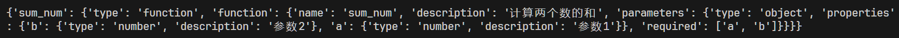

> **大家好，我是 <font color=blue>同学小张</font>，持续学习<font color=red>C++进阶、OpenGL、WebGL知识技能</font>和<font color=red>AI大模型应用实战案例</font>，持续分享，欢迎大家<font color=red>点赞+关注</font>，+v: <font color=blue>**jasper_8017**</font> 一起交流，共同学习和进步。**
---

[上文](https://blog.csdn.net/Attitude93/article/details/139263132) 我们在学习如何在AgentScope中使用自定义的工具时，用到了一个叫 ServiceToolkit 的东西。本文就来详细看下这个玩意。

@[toc]

# 0. ServiceToolkit介绍

该模块是 AgentScope 封装的大模型调用工具步骤的一个类，它提供以下功能：

* 注册python函数为工具函数
* 生成字符串和JSON schema格式的工具函数说明
* 内置一套工具函数的调用格式
* 解析模型响应、调用工具功能，并处理异常

# 1. ServiceToolkit使用

## 1.1 基本使用步骤

以 [上篇文章](https://blog.csdn.net/Attitude93/article/details/139263132) 中的代码为例：

（1）写一个自定义工具函数：

```python
def sum_num(a: int, b: int) -> int:
    """计算两个数的和

    Args:
        a (int): 参数1
        b (int): 参数2

    Returns:
        int: 结果
    """
    output = a + b
    status = ServiceExecStatus.SUCCESS
    return ServiceResponse(status, output)
```

这里有三点需要注意：

* docstring起码要写一个函数说明
* 返回值必须是ServiceResponse对象
* 参数最好规定类型，例如上面的 a: int, b: int


（2）创建ServiceToolkit实例

```python
from agentscope.service import ServiceToolkit
service_toolkit = ServiceToolkit()
```

（3）将工具函数添加到ServiceToolkit中

```python
service_toolkit.add(sum_num)
```

这样完整的serveice_toolkit就创建好了。可以像上篇文章那样传入 ReActAgent 中使用它。

## 1.2 ServiceToolkit的一些比较有用的属性

### 1.2.1 tools_instruction

```python
print(service_toolkit.tools_instruction)
```

打印出该ServiceToolkit中的tools_instruction如下：


这个属性可以用来组装成Prompt来指导大模型如何使用工具。

自定义工具时的docstring是必须要的，如果没有，tools_instruction如下，没有工具描述，大模型可能不知道该工具是干什么的。


### 1.2.2 json_schemas

```python
print(service_toolkit.json_schemas)
```
打印出该ServiceToolkit中的json_schemas如下：



这就像极了 OpenAI 接口所需要的 tools 参数中的函数说明。感觉可以直接将这个属性传递给OpenAI的接口来使用。

### 1.2.3 tools_calling_format

```python
print(service_toolkit.tools_calling_format)
```

打印出该ServiceToolkit中的tools_calling_format如下：


这个属性指导LLM如何使用工具函数。ServiceToolkit中默认大模型需要返回一个JSON格式的列表，列表中包含若干个字典，每个字典即为一个函数调用。必须包含name和 arguments两个字段，其中name为函数名，arguments为函数参数。arguments键值对应的值是从 “参数名”映射到“参数值”的字典。

## 1.3 工具的解析和调用 parse_and_call_func

通过`parse_and_call_func`方法解析大模型生成的字符串，并调用函数。此函数可以接收字符串或解析后符合格式要求的字典作为输入。

* 输入字符串：

```python
# a string input
string_input = '[{"name": "bing_search", "arguments": {"question": "xxx"}}]'
res_of_string_input = service_toolkit.parse_and_call_func(string_input)
```

* 输入字典：

```python
# a parsed dictionary
dict_input = [{"name": "bing_search", "arguments": {"question": "xxx"}}]
# res_of_dict_input is the same as res_of_string_input
res_of_dict_input = service_toolkit.parse_and_call_func(dict_input)
```

执行输出格式如下：


# 2. 内置的服务函数

AgentScope内置了一些工具，其称为服务函数。大概列表如下，可以去官网查看。


这里咱们主要说下这些内置的函数如何用。

通过 agentscope.service 导入这些内置的服务函数，即可使用：

```python
from agentscope.service import (
    bing_search, # or google_search,
    read_text_file,
    write_text_file, 
)
```

然后添加到ServiceToolkit中：

```python
service_toolkit.add(bing_search, api_key=BING_API_KEY, num_results=3)
service_toolkit.add(read_text_file)
service_toolkit.add(write_text_file)
```

# 3. 总结

本文我们主要对 AgentScope 中用来进行工具封装的类进行了介绍和学习。ServiceToolkit 提供了从工具封装到模型结果解析，再到工具调用的完整过程的封装。AgentScope还提供了一些内置的工具函数，可以方便我们使用。而对于自定义工具来说，一定要注意 docstring、返回值和参数类型的书写规范。


# 4. 参考

> https://modelscope.github.io/agentscope/zh_CN/tutorial/204-service.html


> **如果觉得本文对你有帮助，麻烦点个赞和关注呗 ~~~**

---

> - 大家好，我是 <font color=blue>**同学小张**</font>，持续学习<font color=red>**C++进阶、OpenGL、WebGL知识技能**</font>和<font color=red>**AI大模型应用实战案例**</font>
> - 欢迎 <font color=red>**点赞 + 关注**</font> 👏，**持续学习**，**持续干货输出**。
> - +v: <font color=blue>**jasper_8017**</font> 一起交流💬，一起进步💪。
> - 微信公众号搜<font color=blue>【**同学小张**】</font> 🙏

**本站文章一览：**


