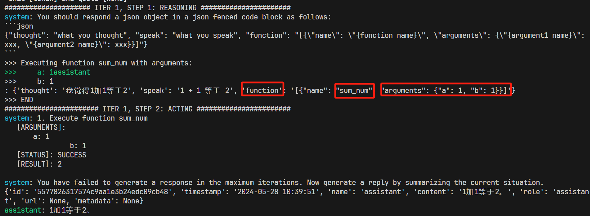
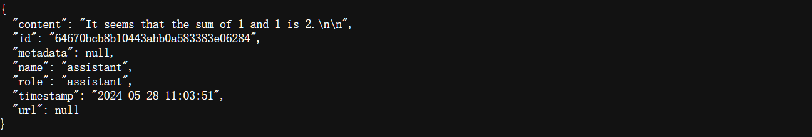
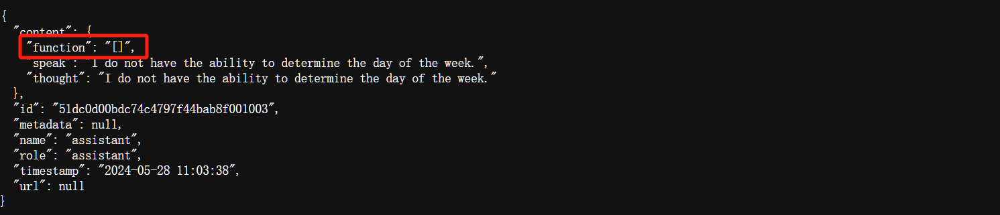
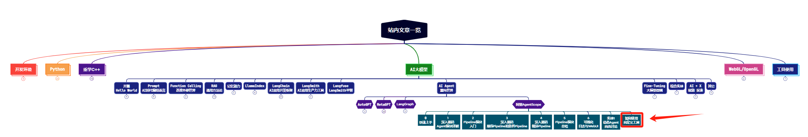

> **大家好，我是 <font color=blue>同学小张</font>，持续学习<font color=red>C++进阶、OpenGL、WebGL知识技能</font>和<font color=red>AI大模型应用实战案例</font>，持续分享，欢迎大家<font color=red>点赞+关注</font>，+v: <font color=blue>**jasper_8017**</font> 一起交流，共同学习和进步。**
---

本文我们来学习下如何在AgentScope中使用自定义的工具。

@[toc]

# 0. 开篇

在AgentScope中，自定义工具和内置工具的使用似乎没那么明显，但确实也提供了这个框架。它其实是通过一个叫 ServiceToolkit 来封装的工具。至于工具的使用，可以通过 ReActAgent 来实现。但这样使用在我看来有点问题。

先来看下具体怎么使用。

# 1. 在 AgentScope 中使用自定义工具

## 1.1 创建自定义工具

创建自定义工具，本质上是创建一个自定义函数。与LangChain和MetaGPT会通过类似 @tools 装饰器来将函数封装成框架内可用的工具不同，在 AgentScope 中，你只将函数的返回值封装成 ServiceResponse 对象即可。ServiceResponse 接收一个运行状态和一个content内容。

> 当然，记得要写该函数的docstring。还没细看源码，但猜测 AgentScope 内部应该是通过 docstring 来当作该工具的Prompt，并明确工具的参数和返回值。

```python
def sum_num(a: int, b: int) -> int:
    """计算两个数的和

    Args:
        a (int): 参数1
        b (int): 参数2

    Returns:
        int: 结果
    """
    output = a + b
    status = ServiceExecStatus.SUCCESS
    return ServiceResponse(status, output)
```

## 1.2 使用自定义工具

（1）首先，你需要将该工具添加到 ServiceToolkit 中。

```python
service_toolkit = ServiceToolkit()
service_toolkit.add(sum_num)
```

（2）实例化一个 ReActAgent，通过 service_toolkit 参数来将自定义工具添加进去。

```python
self.agent = ReActAgent(
    name="assistant",
    model_config_name="openai_cfg",
    verbose=True,
    service_toolkit=service_toolkit,
    max_iters=1,
)
```

（3）使用该 agent 即可

```python
msg = Msg("user", query, role="user")
return self.agent(msg)
```

# 2. 完整代码与运行结果

完整代码如下:

```python
from agentscope.agents.react_agent import ReActAgent

import agentscope
from agentscope.message import Msg
import os

from agentscope.service import (
    ServiceToolkit,
    ServiceResponse,
    ServiceExecStatus,
)

openai_api_key = os.getenv('OPENAI_API_KEY')

# 此Agent的模型配置，按需修改
OPENAI_CFG_DICT = {
    "config_name": "openai_cfg",    # 此配置的名称，必须保证唯一
    "model_type": "openai",         # 模型类型
    "model_name": "gpt-3.5-turbo",  # 模型名称
    "api_key": openai_api_key,      # OpenAI API key. 如果没有设置，将使用环境变量中的 OPENAI_API_KEY
}

def sum_num(a: int, b: int) -> int:
    """计算两个数的和

    Args:
        a (int): 参数1
        b (int): 参数2

    Returns:
        int: 结果
    """
    output = a + b
    status = ServiceExecStatus.SUCCESS
    return ServiceResponse(status, output)


class ToolDemo:
    def __init__(self):
        # Prepare the tools for the agent
        service_toolkit = ServiceToolkit()
        service_toolkit.add(sum_num)

        agentscope.init(model_configs=[OPENAI_CFG_DICT])

        self.agent = ReActAgent(
            name="assistant",
            model_config_name="openai_cfg",
            verbose=True,
            service_toolkit=service_toolkit,
            max_iters=1,
        )
        
    def invoke(self, query):
        msg = Msg("user", query, role="user")
        return self.agent(msg)
    
if __name__ == '__main__':
    tool_demo = ToolDemo()
    response = tool_demo.invoke("你是谁？")
    print(response)
```

运行结果：



可以看到它成功识别并使用了 sum_num 这个工具。

# 3. 存在的问题 - 一些思考，仅供参考

文章开始，我提到了通过 ReActAgent 来实现使用工具在我看来有点问题。

首先，ReActAgent 是实现的ReAct思想，即思考+行动。大模型先思考下一步该干什么，然后执行。这对于只想判断是否应该使用工具的场景来说，有点浪费。细心的同学可能发现了，在ReActAgent初始化的过程中，有个 max_iters 参数。这是最大的迭代步数，也就是思考多少次。判断一个工具的使用，其实只需要一次思考即可。（个人意见，欢迎讨论）。

其次，ReActAgent 最终的返回，是最终的结论，中间过程外部不可见。如果想要获取中间过程，需要自己实现，不能用 ReActAgent 了。目前还没看到 AgentScope 中有类似 LangChain 那样直接 bind_tools 或 bind_functions 这样的接口封装，让用户在执行之后可以获取是否需要调用工具的判断。

当识别到工具时，返回的结果是类似下图这样：



没有识别到工具时，返回的结果是类似下图这样：



难道可以通过这个返回值中有无 function 参数来判断是否使用过工具？感觉不太靠谱啊... 可能还是得自己写一个吧。欢迎熟悉的大佬指教！感谢！


> **如果觉得本文对你有帮助，麻烦点个赞和关注呗 ~~~**

---

> - 大家好，我是 <font color=blue>**同学小张**</font>，持续学习<font color=red>**C++进阶、OpenGL、WebGL知识技能**</font>和<font color=red>**AI大模型应用实战案例**</font>
> - 欢迎 <font color=red>**点赞 + 关注**</font> 👏，**持续学习**，**持续干货输出**。
> - +v: <font color=blue>**jasper_8017**</font> 一起交流💬，一起进步💪。
> - 微信公众号搜<font color=blue>【**同学小张**】</font> 🙏

**本站文章一览：**




