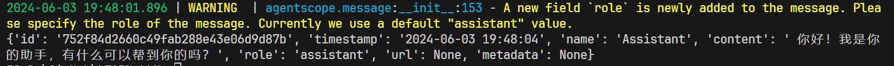
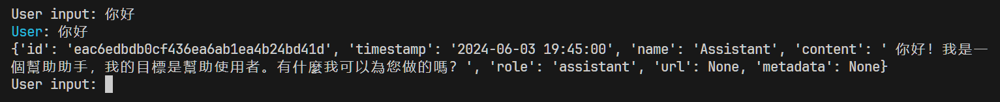
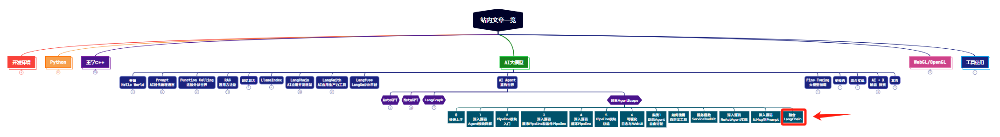

> **大家好，我是 <font color=blue>同学小张</font>，+v: <font color=blue>**jasper_8017**</font> 一起交流，持续学习<font color=red>C++进阶、OpenGL、WebGL知识技能</font>和<font color=red>AI大模型应用实战案例</font>，持续分享，欢迎大家<font color=red>点赞+关注</font>，共同学习和进步。**
---

对于多智能体框架来说，其主要攻关的方向是多智能体间交互的数据流组织、智能体的创建等方向，而对于单个智能体内的方法，还是需要自己去实现，而这时候，多框架的组合就会使开发变得很方便。例如，你想用AgentScope实现一个文档读取和拆分的智能体，AgentScope并没有提供类似的很好用的工具，而LangChain中则集成了大量的读取各种文档和拆分文档的方法。将LangChain和AgentScope结合，可以省去自己写文档读取和拆分的方法，大大提高开发效率。

本文以一个例子来看下AgentScope框架和LangChain如何实现融合使用，真的超级简单，一看就懂。这是一种思路，为多种框架的融合使用提供借鉴。

> 参考：https://github.com/modelscope/agentscope/blob/main/examples/conversation_with_langchain/conversation_with_langchain.py

@[toc]

# 0. 定义Agent框架

回顾一下使用AgentScope定义自己的Agent的步骤：

（1）继承AgentBase基类

（2）实现`__init__`方法

（3）实现`reply`方法

于是，有了框架如下：

```python
class LangChainAgent(AgentBase):
    def __init__(self, name: str) -> None:
        ......

    def reply(self, x: Optional[dict] = None) -> Msg:
        ......
```

# 1. 实现`__init__`方法

init方法，主要是构建一个 LangChain 的 Chain。

```python
def __init__(self, name: str) -> None:
    # Disable AgentScope memory and use langchain memory instead
    super().__init__(name, use_memory=False)

    # [START] BY LANGCHAIN
    # Create a memory in langchain
    memory = ConversationBufferMemory(memory_key="chat_history")

    # prompt
    template = """
            You are a helpful assistant, and your goal is to help the user.

            {chat_history}
            Human: {human_input}
            Assistant:"""

    prompt = PromptTemplate(
        input_variables=["chat_history", "human_input"],
        template=template,
    )

    llm = OpenAI(openai_api_key=os.environ["OPENAI_API_KEY"])

    # Prepare a chain and manage the memory by LLMChain in langchain
    self.llm_chain = LLMChain(
        llm=llm,
        prompt=prompt,
        verbose=False,
        memory=memory,
    )
    # [END] BY LANGCHAIN
```

以上代码包含了 LangChain 创建一个对话Chain的过程：
（1）使用了 LangChain 的Prompt模板
（2）创建了 LLMChain
（3）使用了 LangChain 的 ConversationBufferMemory，来实现对话历史的记录。

如果对 LangChain 的这一套操作比较熟悉，那很容易想到可以将 ConversationBufferMemory 替换成 LangChain 中其它的记忆类型，从而实现不同的记忆方式。将 LLMChain 换成不同的 Chain，从而不实现不同的能力，比只是用 AgentScope 中的 memory 和 llm，方便了很多。

# 2. 实现`reply`方法

`reply`方法，主要是调用 Chain 的 predict 方法，实现对话功能。

```python
def reply(self, x: Optional[dict] = None) -> Msg:
    response_str = self.llm_chain.predict(human_input=x.content)
    return Msg(name=self.name, content=response_str, role="assistant")
```

注意这里返回的是 Msg 对象。这是为了与其它的 Agent 交互，所以需要返回一个 Msg 对象。AgentScope 中，Msg 对象是 Agent 和 Agent 之间的信息传递对象。

# 3. 运行

## 3.1 直接运行

```python
# init AgentScope
agentscope.init()

agent = LangChainAgent(name="Assistant")
msg = Msg(name="user", content="你好")
response = agent(msg)

print(response)
```

运行结果：




## 3.2 多智能体交互

可以让该智能体与其它智能体交互，实现多智能体运行。

```python
# Create a user agent from AgentScope
user = UserAgent("User")

msg = None
while True:
    # User input
    msg = user(msg)
    if msg.content == "exit":
        break
    # Agent speaks
    msg = agent(msg)
    print(msg)
```

运行结果：





# 4. 总结

本文我们介绍了如何将 AgentScope 和 LangChain 框架结合起来使用：在初始化时，创建 LangChain 的 Chain，在 reply 方法中调用 Chain 的 predict 方法，从而实现对话功能。注意的是，为了让我们自己的智能体能与其它智能体交互，reply 方法需要返回一个 Msg 对象。

> **如果觉得本文对你有帮助，麻烦点个赞和关注呗 ~~~**

---

> - 大家好，我是 <font color=blue>**同学小张**</font>，持续学习<font color=red>**C++进阶、OpenGL、WebGL知识技能**</font>和<font color=red>**AI大模型应用实战案例**</font>
> - 欢迎 <font color=red>**点赞 + 关注**</font> 👏，**持续学习**，**持续干货输出**。
> - +v: <font color=blue>**jasper_8017**</font> 一起交流💬，一起进步💪。
> - 微信公众号搜<font color=blue>【**同学小张**】</font> 🙏

**本站文章一览：**


