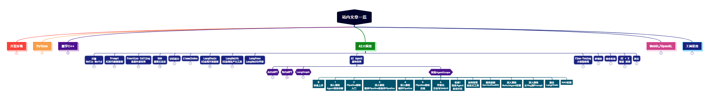

> **大家好，我是 <font color=blue>同学小张</font>，+v: <font color=blue>**jasper_8017**</font> 一起交流，持续学习<font color=red>C++进阶、OpenGL、WebGL知识技能</font>和<font color=red>AI大模型应用实战案例</font>，持续分享，欢迎大家<font color=red>点赞+关注</font>，共同学习和进步。**
---

对于多智能体框架来说，RAG似乎并不是其框架内的内容，所以类似 AgentScope、LangGraph、MetaGPT 等框架，都没有提供特别明确的RAG实现流程。但RAG作为当前提高大模型能力、知识库问答等方向的主流方法，还是很重要的。所以这些框架也提供了实现RAG的一些示例。

本文来学习下AgentScope中如何实现RAG。

@[toc]

# 0. 前言

我们知道，RAG 中重要的几个步骤：

（1）加载文档

（2）文档分块

（3）分块向量化和存储

（4）向量索引的创建

（5）检索相关文档块

AgentScope 中并没有实现好的文本分块、创建向量化索引的模块，为了快速实现此功能，我们可以结合 LangChain 或 LLamaIndex 框架来实现。这篇文章主要介绍在 AgentScope 中使用 LangChain 框架来实现文本分块和创建向量索引。

# 1. LangChainRAG 的实现拆解

## 1.1 框架

所谓框架，就是需要实现上面提到的几个步骤，并且提供接口供我们使用。所以，除了 __init__ 函数，例子中我们封装了 load_data、store_and_index 和 retrieve 三个函数，分别对应上述步骤的加载文档、文档分块及创建分块向量化存储索引、检索相关文档块。

```python
class LangChainRAG():
    def __init__(
        self,
        model: Optional[ModelWrapperBase],
        emb_model: Union[ModelWrapperBase, Embeddings, None],
        config: Optional[dict] = None,
        **kwargs: Any,
    ) -> None:
        ......

    def load_data(
        self,
        loader: BaseLoader,
        query: Optional[Any] = None,
        **kwargs: Any,
    ) -> list[Document]:
        ......

    def store_and_index(
        self,
        docs: Any,
        vector_store: Optional[VectorStore] = None,
        splitter: Optional[TextSplitter] = None,
        **kwargs: Any,
    ) -> Any:
        ......

    def retrieve(self, query: Any, to_list_strs: bool = False) -> list[Any]:
        ......

```

## 1.2 初始化 

初始化函数，主要是设置一些初始化参数，例如使用的模型，这里主要设置的是向量化的模型。

```python
def __init__(
    self,
    model: Optional[ModelWrapperBase],
    emb_model: Union[ModelWrapperBase, Embeddings, None],
    config: Optional[dict] = None,
    **kwargs: Any,
) -> None:

    ......

    self.config = config or {}
    if isinstance(emb_model, ModelWrapperBase):
        self.emb_model = _LangChainEmbModel(emb_model)
    elif isinstance(emb_model, Embeddings):
        self.emb_model = emb_model
    else:
        ......
```


## 1.3 加载文档 load_data

load_data 函数，主要是加载文档。使用外部传入的 loader 加载文档，然后返回 Document 类型的文档列表。

```python
def load_data(
    self,
    loader: BaseLoader,
    query: Optional[Any] = None,
    **kwargs: Any,
) -> list[Document]:
    self.loader = loader
    docs = self.loader.load()
    return docs
```

## 1.4 文档分块、存储、索引创建 store_and_index

store_and_index 函数，主要是文档分块、存储、索引创建的功能。

首先，用传入的自定义 `splitter` 或者默认的 `CharacterTextSplitter` 对上一步加载的文档进行分块。

然后，将分块后的文档列表，通过传入的向量存储模型，创建向量索引：`vector_store.from_documents`

最后，创建检索器：`vector_store.as_retriever`。

```python
def store_and_index(
    self,
    docs: Any,
    vector_store: Optional[VectorStore] = None,
    splitter: Optional[TextSplitter] = None,
    **kwargs: Any,
) -> Any:
    
    self.splitter = splitter or CharacterTextSplitter(
        chunk_size=self.config.get("chunk_size", DEFAULT_CHUNK_SIZE),
        chunk_overlap=self.config.get(
            "chunk_overlap",
            DEFAULT_CHUNK_OVERLAP,
        ),
    )
    all_splits = self.splitter.split_documents(docs)

    # indexing the chunks and store them into the vector store
    if vector_store is None:
        vector_store = Chroma()
    self.vector_store = vector_store.from_documents(
        documents=all_splits,
        embedding=self.emb_model,
    )

    # build retriever
    search_type = self.config.get("search_type", "similarity")
    self.retriever = self.vector_store.as_retriever(
        search_type=search_type,
        search_kwargs={
            "k": self.config.get("similarity_top_k", 6),
        },
    )
```

## 1.5 检索相关文档块 retrieve

retrieve 函数，主要是检索相关文档块。根据用户的输入，检索相似的内容。

```python
def retrieve(self, query: Any, to_list_strs: bool = False) -> list[Any]:
    retrieved_docs = self.retriever.invoke(query)
    ......
    return retrieved_docs
```

# 2. 总结

本文主要学习了在 AgentScope 中，使用 LangChain 框架实现一个 LangChainRAG 的封装。简单总结来说，将RAG的基本步骤封装成三个函数：load_data、store_and_index、retrieve。这三个函数的具体实现都进行了解释。这个封装与 AgentScope 框架的关系不大，只是为了方便使用。LangChain 实现RAG的这些构建步骤更详细的解释，可以参考我之前的文章：[【AI大模型应用开发】【LangChain系列】2. 一文全览LangChain数据连接模块：从文档加载到向量检索RAG，理论+实战+细节](https://blog.csdn.net/Attitude93/article/details/135996698)。

本文先介绍到这里，后面我们来将 LangChain 与 AgentScope 结合起来，看下这个封装的LangChainRAG，在AgentScope中是如何使用的。

> 完整代码参考：https://github.com/modelscope/agentscope/blob/main/examples/conversation_with_RAG_agents/rag/langchain_rag.py

> **如果觉得本文对你有帮助，麻烦点个赞和关注呗 ~~~**

---

> - 大家好，我是 <font color=blue>**同学小张**</font>，持续学习<font color=red>**C++进阶、OpenGL、WebGL知识技能**</font>和<font color=red>**AI大模型应用实战案例**</font>
> - 欢迎 <font color=red>**点赞 + 关注**</font> 👏，**持续学习**，**持续干货输出**。
> - +v: <font color=blue>**jasper_8017**</font> 一起交流💬，一起进步💪。
> - 微信公众号搜<font color=blue>【**同学小张**】</font> 🙏

**本站文章一览：**


