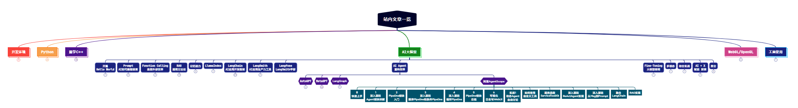

> **大家好，我是 <font color=blue>同学小张</font>，+v: <font color=blue>**jasper_8017**</font> 一起交流，持续学习<font color=red>C++进阶、OpenGL、WebGL知识技能</font>和<font color=red>AI大模型应用实战案例</font>，持续分享，欢迎大家<font color=red>点赞+关注</font>，共同学习和进步。**
---

对于多智能体框架来说，RAG似乎并不是其框架内的内容，所以类似 AgentScope、LangGraph、MetaGPT 等框架，都没有提供特别明确的RAG实现流程。但RAG作为当前提高大模型能力、知识库问答等方向的主流方法，还是很重要的。所以这些框架也提供了实现RAG的一些示例。

上文我们学习的是在AgentScope中用 LangChain 来实现RAG的流程，本文来学习下AgentScope中如何使用 LlamaIndex 来实现RAG。

@[toc]

# 0. 前言

我们知道，RAG 中重要的几个步骤：

（1）加载文档

（2）文档分块

（3）分块向量化和存储

（4）向量索引的创建

（5）检索相关文档块

AgentScope 中并没有实现好的文本分块、创建向量化索引的模块，为了快速实现此功能，我们可以结合 LangChain 或 LLamaIndex 框架来实现。这篇文章主要介绍在 AgentScope 中使用 LLamaIndex 框架来实现文本分块和创建向量索引。

# 1. LlamaIndexRAG 的实现拆解

## 1.1 框架

所谓框架，就是需要实现上面提到的几个步骤，并且提供接口供我们使用。所以，除了 __init__ 函数，例子中我们封装了 load_data、store_and_index 和 retrieve 三个函数，分别对应上述步骤的加载文档、文档分块及创建分块向量化存储索引、检索相关文档块。

```python
class LlamaIndexRAG(RAGBase):
    def __init__(
        self,
        model: Optional[ModelWrapperBase],
        emb_model: Union[ModelWrapperBase, BaseEmbedding, None] = None,
        config: Optional[dict] = None,
        **kwargs: Any,
    ) -> None:
        ......

    def load_data(
        self,
        loader: BaseReader,
        query: Optional[str] = None,
        **kwargs: Any,
    ) -> Any:
        ......

    def store_and_index(
        self,
        docs: Any,
        vector_store: Union[BasePydanticVectorStore, VectorStore, None] = None,
        retriever: Optional[BaseRetriever] = None,
        transformations: Optional[list[NodeParser]] = None,
        **kwargs: Any,
    ) -> Any:
        ......

    def retrieve(self, query: str, to_list_strs: bool = False) -> list[Any]:
        ......
```

## 1.2 初始化 

初始化函数，主要是设置一些初始化参数，例如使用的模型，这里主要设置的是向量化的模型。

```python
def __init__(
    self,
    model: Optional[ModelWrapperBase],
    emb_model: Union[ModelWrapperBase, BaseEmbedding, None] = None,
    config: Optional[dict] = None,
    **kwargs: Any,
) -> None:
    ......
    self.persist_dir = kwargs.get("persist_dir", "/")
    self.emb_model = emb_model
    ......
    if isinstance(emb_model, ModelWrapperBase):
        self.emb_model = _EmbeddingModel(emb_model)
    elif isinstance(self.emb_model, BaseEmbedding):
        pass
    else:
        ......
```


## 1.3 加载文档 load_data

load_data 函数，主要是加载文档。使用外部传入的 loader 加载文档，然后返回 Document 类型的文档列表。

```python
def load_data(
    self,
    loader: BaseReader,
    query: Optional[str] = None,
    **kwargs: Any,
) -> Any:
    if query is None:
        documents = loader.load_data()
    else:
        documents = loader.load_data(query)
    logger.info(f"loaded {len(documents)} documents")
    return documents
```

## 1.4 文档分块、存储、索引创建 store_and_index

store_and_index 函数，主要是文档分块、存储、索引创建的功能。

首先，用传入的自定义 `transformations` 或者默认的 `SentenceSplitter` 作为 `transformations` 创建一个`IngestionPipeline`流水线来对文档进行分块、向量化、索引化。

`pipeline.run(documents=docs)` 将文档列表传入流水线，返回一个节点列表。这些节点就是文档分块后的结果。

通过 `VectorStoreIndex` 来创建索引。

```python
self.index = VectorStoreIndex(
    nodes=nodes,
    embed_model=self.emb_model,
)
```

最后，通过 `index.as_retriever` 创建索引器。


```python
def store_and_index(
    self,
    docs: Any,
    vector_store: Union[BasePydanticVectorStore, VectorStore, None] = None,
    retriever: Optional[BaseRetriever] = None,
    transformations: Optional[list[NodeParser]] = None,
    **kwargs: Any,
) -> Any:
    # build and run preprocessing pipeline
    if transformations is None:
        transformations = [
            SentenceSplitter(
                chunk_size=self.config.get(
                    "chunk_size",
                    DEFAULT_CHUNK_SIZE,
                ),
                chunk_overlap=self.config.get(
                    "chunk_overlap",
                    DEFAULT_CHUNK_OVERLAP,
                ),
            ),
        ]

    transformations.append(self.emb_model)

    if vector_store is not None:
        pipeline = IngestionPipeline(
            transformations=transformations,
            vector_store=vector_store,
        )
        _ = pipeline.run(docs)
        self.index = VectorStoreIndex.from_vector_store(vector_store)
    else:
        # No vector store is provide, use simple in memory
        pipeline = IngestionPipeline(
            transformations=transformations,
        )
        nodes = pipeline.run(documents=docs)
        self.index = VectorStoreIndex(
            nodes=nodes,
            embed_model=self.emb_model,
        )

    # set the retriever
    if retriever is None:
        ......
        self.retriever = self.index.as_retriever(
            embed_model=self.emb_model,
            similarity_top_k=self.config.get(
                "similarity_top_k",
                DEFAULT_TOP_K,
            ),
            **kwargs,
        )
    else:
        self.retriever = retriever
    return self.index
```

## 1.5 检索相关文档块 retrieve

retrieve 函数，主要是检索相关文档块。根据用户的输入，检索相似的内容。

```python
def retrieve(self, query: str, to_list_strs: bool = False) -> list[Any]:
    retrieved = self.retriever.retrieve(str(query))
    ......
    return retrieved
```

# 2. 总结

本文主要学习了在 AgentScope 中，使用 LlamaIndex 框架实现一个 LlamaIndexRAG 的封装。简单总结来说，将RAG的基本步骤封装成三个函数：load_data、store_and_index、retrieve。这三个函数的具体实现都进行了解释。这个封装与 AgentScope 框架的关系不大，只是为了方便使用，大家以此来复习下 LlamaIndex 的使用步骤。LlamaIndex 实现RAG的这些构建步骤更详细的解释，可以参考我之前的 LlamaIndex 系列文章。

本文先介绍到这里，后面我们来将 LlamaIndex 与 AgentScope 结合起来，看下这个封装的LlamaIndexRAG，在AgentScope中是如何使用的。

> 完整代码参考：https://github.com/modelscope/agentscope/blob/main/examples/conversation_with_RAG_agents/rag/llama_index_rag.py

> **如果觉得本文对你有帮助，麻烦点个赞和关注呗 ~~~**

---

> - 大家好，我是 <font color=blue>**同学小张**</font>，持续学习<font color=red>**C++进阶、OpenGL、WebGL知识技能**</font>和<font color=red>**AI大模型应用实战案例**</font>
> - 欢迎 <font color=red>**点赞 + 关注**</font> 👏，**持续学习**，**持续干货输出**。
> - +v: <font color=blue>**jasper_8017**</font> 一起交流💬，一起进步💪。
> - 微信公众号搜<font color=blue>【**同学小张**】</font> 🙏

**本站文章一览：**


