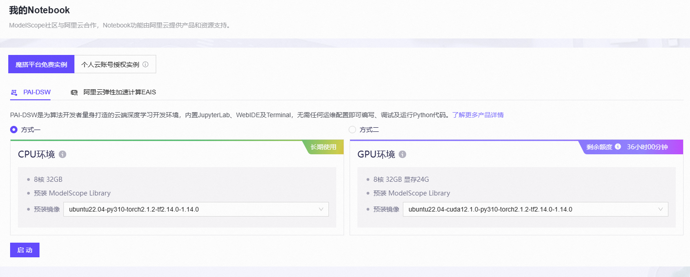
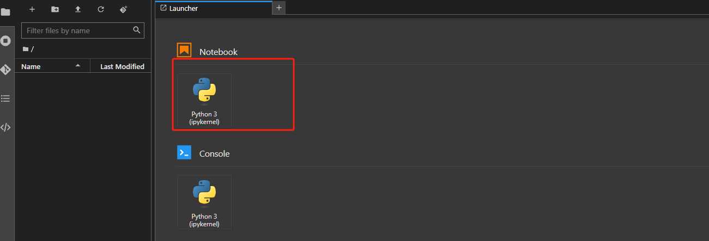
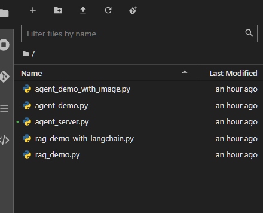
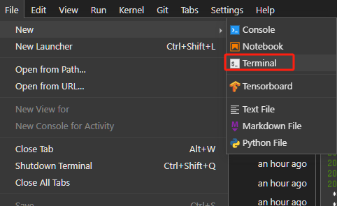
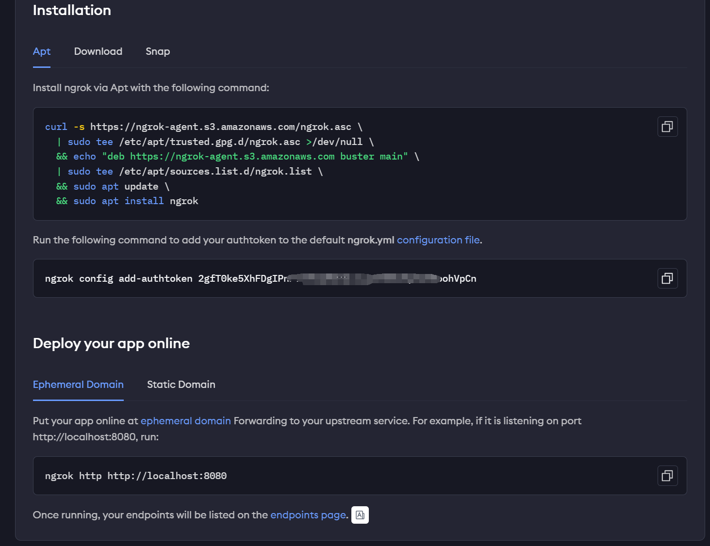
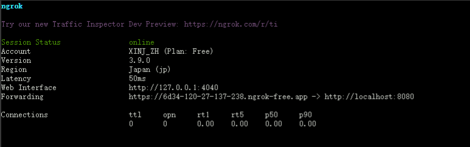
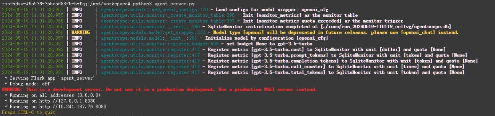
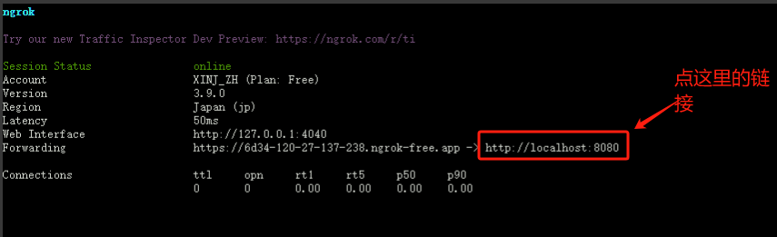
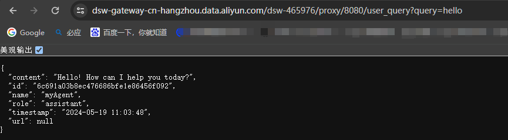

## 1. 启动我的Notebook





## 2. 把文件一个一个复制到里面。类似下面这样：



## 3. 打开一个终端：



### 3.1 修改环境变量：

执行命令打开环境变量文件：

```
vim ~/.bashrc
```

在文件的最后，加上：

```python
export OPENAI_API_KEY="sk-xxxx"

export OPENAI_BASE_URL="https://xxxx" 
```

保存文件之后，执行命令：

```

source ~/.bashrc

```

## 4. 下载ngrok工具：

首先得注册账号，登录 https://dashboard.ngrok.com/get-started/setup/linux

依次在终端执行以下命令：



执行完之后你会看到notebook中下面的界面：




## 5. 打开一个新的终端，运行程序：

### 5.1 安装所需的依赖库

```
pip install pypdf pdfminer.six openai langchain langchain_openai agentscope Chroma chromadb SpeechRecognition
```

### 5.2 启动Flask程序

```python
python3 agent_server.py
```

运行成功后看到如下界面：



## 6. 在电脑浏览器中访问：



后面加接口就可以调用了，类似下面这样：

https://dsw-gateway-cn-hangzhou.data.aliyun.com/dsw-465976/proxy/8080/user_query?query=hello




