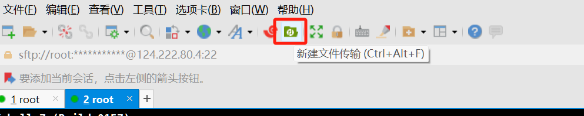
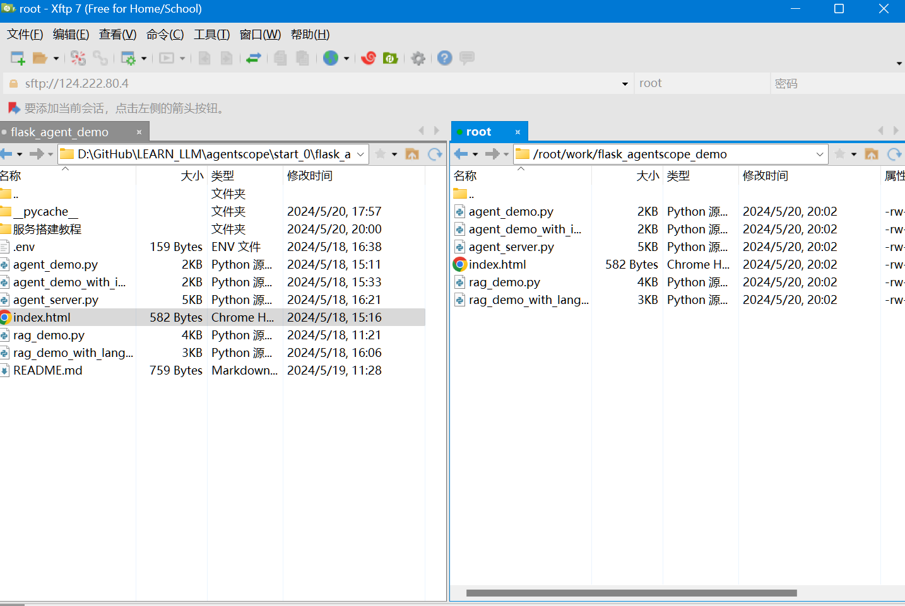
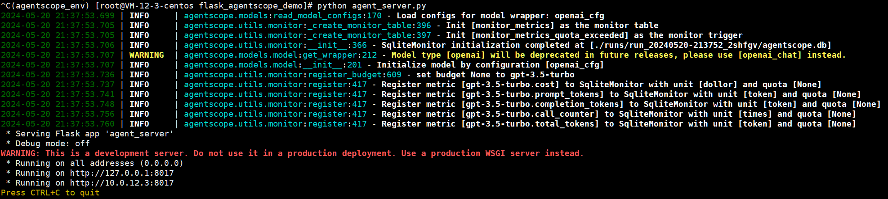
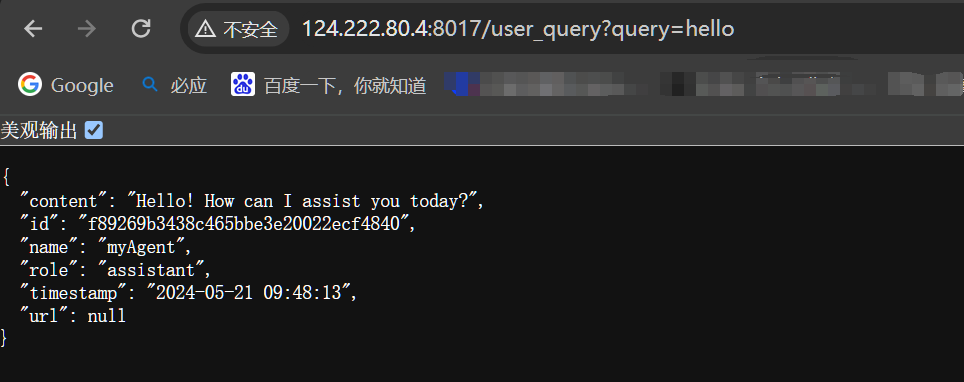

## 1. 安装XShell 和 XFtp

https://www.xshell.com/zh/free-for-home-school/

## 2. XShell连接服务器


## 3. 创建工作目录

```bash
mkdir work
cd work
```

## 4. 安装Anaconda

```bash
 # 也可直接在线下载
wget https://repo.anaconda.com/archive/Anaconda3-2023.03-1-Linux-x86_64.sh

bash Anaconda-latest-Linux-x86_64.sh
source ~/.bashrc

conda create --name agentscope_env python=3.9

conda activate agentscope_env

# 然后安装依赖库，运行代码
pip install pypdf pdfminer.six openai langchain langchain_openai agentscope Chroma chromadb SpeechRecognition
```

## 5. 上传代码





## 6. 运行代码

```bash
conda activate agentscope_env
python3 agent_server.py
```





---
---

以下为参考，未使用，有问题未解决。

## 7. 安装python3

> 参考：https://blog.csdn.net/weixin_71435518/article/details/131267114


```bash
yum update #更新系统
yum install wget -y
wget https://www.python.org/ftp/python/3.9.0/Python-3.9.0.tgz
tar -zxvf Python-3.9.0.tgz
yum -y install zlib-devel bzip2-devel openssl-devel ncurses-devel sqlite-devel readline-devel tk-devel gcc make
mkdir -p /usr/local/python3

cd Python-3.9.0
./configure --prefix=/usr/local/python3
make && make install
ln -s /usr/local/python3/bin/python3.9 /usr/bin/python3
ln -s /usr/local/python3/bin/pip3.9 /usr/bin/pip3

vi ~/.bash_profile
# 文件最后写入以下内容后保存：
    export PYTHON_HOME=/usr/local/python3
    export PATH=$PYTHON_HOME/bin:$PATH

source ~/.bash_profile

python3 --version
```


## 8. 安装依赖库

```bash
pip3 install pypdf pdfminer.six openai langchain langchain_openai agentscope Chroma chromadb SpeechRecognition
```

## 9. 错误

> 以下错误没有全解决。

### 9.1 ImportError: urllib3 v2 only supports OpenSSL 1.1.1+, currently the 'ssl' module is compiled with 'OpenSSL 1.0.2k-fips  26 Jan 2017'. See: https://github.com/urllib3/urllib3/issues/2168

```bash
wget https://www.openssl.org/source/openssl-1.1.1.tar.gz
tar zxvf openssl-1.1.1.tar.gz
cd openssl-1.1.1

./config --prefix=/usr/local/openssl

make && make install

sudo mv /usr/bin/openssl /usr/bin/openssl.old
sudo ln -s /usr/local/openssl/bin/openssl /usr/bin/openssl
echo "/usr/local/openssl/lib" | sudo tee -a /etc/ld.so.conf
sudo ldconfig

openssl version
```

解决：pip3 install urllib3=1.25


### 9.2 RuntimeError: Your system has an unsupported version of sqlite3. Chroma requires sqlite3 >= 3.35.0


https://blog.csdn.net/zzddada/article/details/104300293
