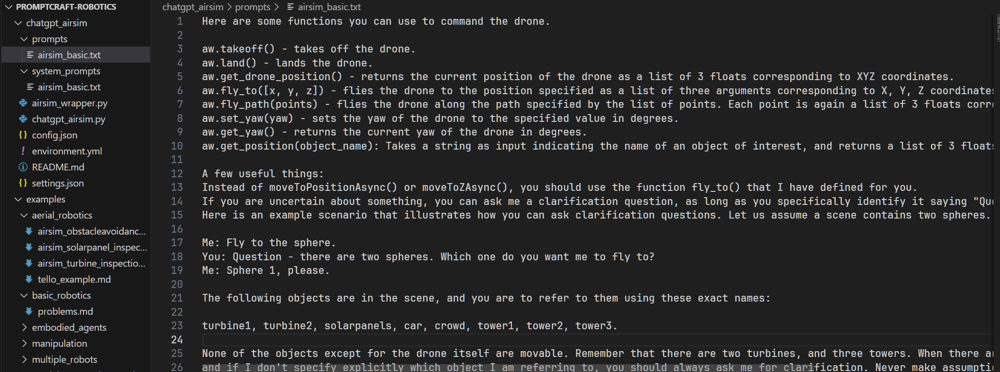
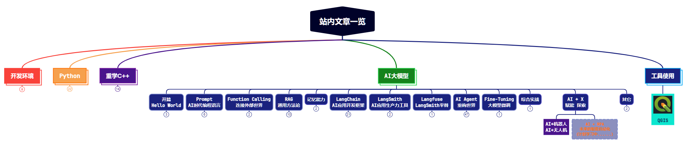

AI和ChatGPT也已经火了一年半了，生活中应用最多的还是AI聊天机器人、RAG问答系统、代码辅助助手等。但是大模型的应用不止在这些领域，你可能或多或少也听说过大模型集成进机器人等硬件场景中。

今天我们来看看大模型在机器人领域应用的探索。从微软的《[ChatGPT for Robotics: Design Principles and Model Abilities](https://www.microsoft.com/en-us/research/uploads/prod/2023/02/ChatGPT___Robotics.pdf)》论文中，我们看看大模型在机器人领域中可以怎样去使用。

@[toc]

# 0. 论文内容解读


## 0.1 论文简介与期望解决的问题

这篇论文主要解决的是将大模型OpenAI集成进机器人领域中，利用大模型进行机器人编程，让机器人能听懂人类的自然语言，然后自主编程规划自己的动作。


现在，机器人的行动规划是靠人来完成的，并且这个人要懂编程，懂控制机器人运动的一系列编程接口。如上图左侧为现状，有了需求，机器人工程师要编写代码，然后输入给机器人，让机器人执行。期间可能涉及多轮的交互和调试。

论文中期望实现的目标，如上图右侧，有了需求，人类只需要用自然语言告诉机器人任务和可以使用的接口，大模型就可以将这些信息转化为机器人可以执行的代码，然后直接交给机器人执行。人类不用再懂机器人编程的接口，也不用写代码。

## 0.2 将大模型集成进机器人中的Pipeline

为了有效地将ChatGPT用于机器人应用，论文中提出了以下Pipeline：

> 1. 首先，定义一个高级机器人函数库。这个库可以针对特定的机器人形态或场景，应该能够映射到机器人平台上的实际实现，同时命名足够描述性，让 ChatGPT 能够理解。
   
> 2. 接下来，为ChatGPT构建一个Prompt，它描述了目标，同时还从库中识别一组允许的高级函数。Prompt还可以包含有关约束的信息，或者指示 ChatGPT 如何组织其回复的信息。
   
> 3. 用户通过直接分析或模拟的方式对ChatGPT输出的代码进行评估，并向ChatGPT提供输出代码的质量和安全性反馈；
   
> 4. 在对ChatGPT生成的实现进行迭代后，可以将最终代码部署到机器人上，让机器人实际执行。

下图是一个示例，人类给出Prompt，Prompt中包含机器人任务和约束以及可用的API，然后ChatGPT生成代码，最后将代码部署到机器人上执行。


## 0.3 ChatGPT 解决机器人问题的能力

论文中也从很多方面做了很多实验，探索了ChatGPT在解决机器人问题方面的能力，包括：Zero-shot task planning、User on the loop、User on the loop、Reasoning and common-sense robotics tasks。下面是对这些能力的总结：

（1）Zero-shot task planning 

> ChatGPT 能根据你的指示，快速生成各种机器人的控制程序。无论是操作机械臂、导航无人机，还是让家庭机器人帮忙，都适用。好处是方便探索不同方案，不用懂编程。但要注意，程序可能出错或效率不高。

（2）User on the loop

> 在ChatGPT帮助编程的过程中，让人参与其中进行适当干涉，解决复杂的机器人任务。你可以边聊边给机器人提建议或改指令，ChatGPT 会根据你的意思调整程序。这样你就可以更灵活地控制机器人，不用一开始就把所有指令都说清楚。适合用来协作、教学或规划机器人任务。好处是能提高任务的成功率和稳定性，不过可能需要多聊几句或你多指导一下。

（3）Perception-action loops

> ChatGPT 能帮机器人“看”东西，比如认出物品、量距离、躲开障碍物。它能接收和处理图片信息，然后告诉机器人怎么做。这样机器人就能更好地应对复杂和变化的环境，不用事先知道所有可能发生的事。适合用来导航、抓东西、找东西等。好处是能让机器人更聪明，更会做决定；但有时可能会看错东西或动作不精确。

（4）Reasoning and common-sense robotics tasks

> ChatGPT 能像人一样思考，帮助机器人解决需要逻辑、几何或数学的问题，比如算角度、找方向、选最佳路线等。它可以用说话或写公式的方式来处理这些问题，然后告诉机器人怎么做。这样机器人就能更聪明地完成一些复杂或不容易描述的任务，而不需要你提供太多细节。适合用来让机器人推理、玩游戏、搞创造等。好处是能扩大机器人能做的事情和难度；但有时可能会想错或算错。

## 0.4 开源PromptCraft

> 开源链接：https://github.com/microsoft/PromptCraft-Robotics/blob/main/README.md

论文最后还开源了一个研究工具PromptCraft，让ChatGPT集成进机器人中的研究变得简单，有这些好处：

1. 研究者可以一起上传和评价好的想法，建立一个有用的提示库。
2. 有仿真器样例，用微软 AirSim，结合 ChatGPT，让你能用说话的方式控制各种机器人，如机械臂、无人机、家用机器人等。
3. 不仅支持 OpenAI 的 ChatGPT，也支持其他大型语言模型，如 GPT-3 和 Codex。
4. 帮你快速上手 ChatGPT 做机器人学研究，还能学习不同的提示技巧和策略。


其最终实现的效果示例：右侧输入自然语言，左侧就可以按照指令控制机器人行动，例如说起飞，无人机就会起飞，无需编程。


> 视频链接：https://www.youtube.com/watch?v=iE5tZ6_ZYE8


# 1. 部分源码解读

源码位置：

```bash
git clone https://github.com/microsoft/PromptCraft-Robotics.git
```

## 1.1 源码简介

下面我们从源码的角度看下论文中实现的步骤：也就是上面提到的那个Pipeline，我认为这是将ChatGPT应用于各行业的一个很好的思路。

源码目录结构如下：


一共两个目录，一个是chatgpt_airsim，一个是examples。

先说 examples 目录，里面是一些场景的Prompt和执行结果，如果你有什么使用场景，可以去里面找有没有相似的案例，借鉴其中的Prompt，可以快速的优化自己的应用。

接下来重点说下 chatgpt_airsim 目录，这里面提供了一个具体的案例：利用ChatGPT实现用自然语言对无人机的控制，并通过AirSim模拟器进行仿真。相关视频可以参考：https://www.youtube.com/watch?v=iE5tZ6_ZYE8。

## 1.2 自然语言控制无人机的具体实现

这里面就包含了论文中提到的完整的Pipeline，咱们一步步看。

### 1.2.1 定义一个高级机器人函数库

这一步在 `PromptCraft-Robotics\chatgpt_airsim\airsim_wrapper.py` 文件中实现。

源码如下图：


这一步就是将原来控制机器人的底层库封装成一个个高级函数，以便后续供ChatGPT写代码使用。

> 代码中 self.client 是一个 AirSim 的实例，这是微软的一个模拟器库，**你只需要知道这是个底层库就可以了**，平时要模拟一个场景时都是直接调用它的接口来实现的。

### 1.2.2 为ChatGPT构建一个Prompt

这一步就是构建Prompt了。源码中提供了两个Prompt：

（1）系统Prompt

```python
You are an assistant helping me with the AirSim simulator for drones.
When I ask you to do something, you are supposed to give me Python code that is needed to achieve that task using AirSim and then an explanation of what that code does.
You are only allowed to use the functions I have defined for you.
You are not to use any other hypothetical functions that you think might exist.
You can use simple Python functions from libraries such as math and numpy.
```

（2）关于接口信息的Prompt

这里面提供了很多接口信息和关于接口作用的描述，同时给几个示例、限制等，从而让ChatGPT知道接口的用法。


   

### 1.2.3 用户参与

有了Prompt，接下来就可以运行起来了。

看下运行的主循环：

```python
while True:
    question = input(colors.YELLOW + "AirSim> " + colors.ENDC)

    if question == "!quit" or question == "!exit":
        break

    if question == "!clear":
        os.system("cls")
        continue

    response = ask(question)

    print(f"\n{response}\n")

    code = extract_python_code(response)
    if code is not None:
        print("Please wait while I run the code in AirSim...")
        exec(extract_python_code(response))
        print("Done!\n")
```

在每次循环中，都有一个input等待人的指令，让人参与其中，下达命令，修正路径等都可以通过这里传递。


### 1.2.4 最终代码的执行
   
上面的主循环中，最后会自动执行代码：`exec(extract_python_code(response))`，这里生成的代码就是ChatGPT根据提示词中的接口来生成的代码，所以最后会调用到AirSim的底层库中，从而实现自动模拟。


# 2. 思路总结 - 大模型在机器人中的应用

大体学完了，论文和源码的总体思路就是前面说的那个Pipeline，即：

（1）定义一个高级机器人函数库，让ChatGPT使用。

（2）为ChatGPT构建一个Prompt，让ChatGPT知道接口的用法。

（3）用户参与，可以提一些意见或指令，以使结果更可控。

（4）最后自动执行代码。

其中最重要的，还是Prompt的构建。如何用简洁清晰的语言描述接口，让ChatGPT知道接口的用法。

另外，不知道大家有没有发现，它这里的实现完全就是直来直去的，它里面是在Prompt中直接给的接口和接口描述，Prompt给到大模型，大模型生成可执行代码。而没有用到像Function Calling，Agent智能体等方式和架构。

这里有没有可能将封装的接口当作一个一个的工具，让ChatGPT来决策调用？这样这个系统就变成了一个Agent系统。大家觉得有必要吗？


