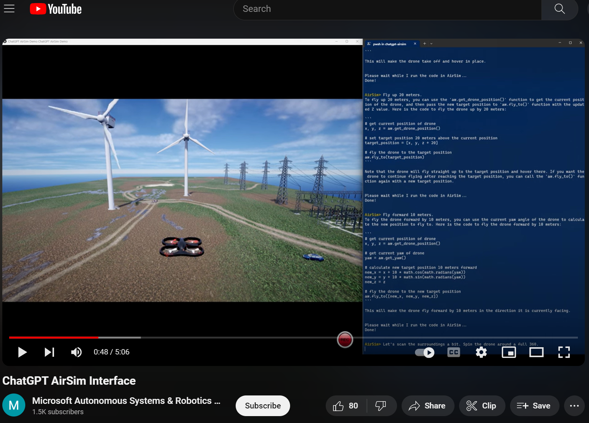
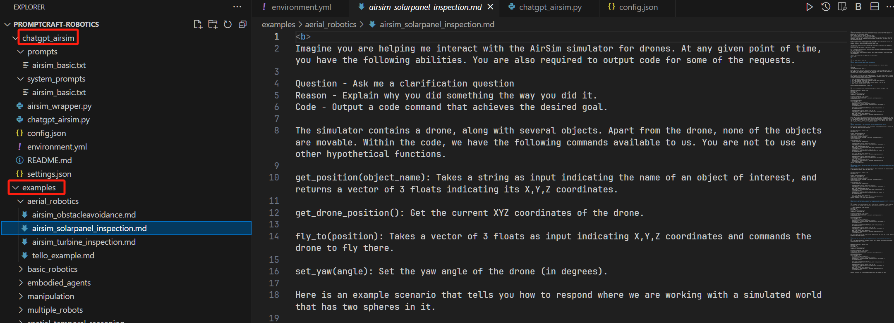
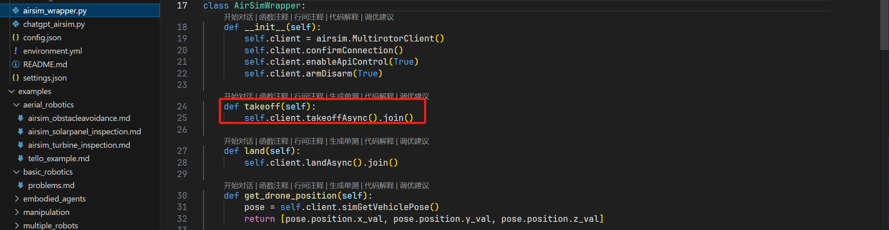
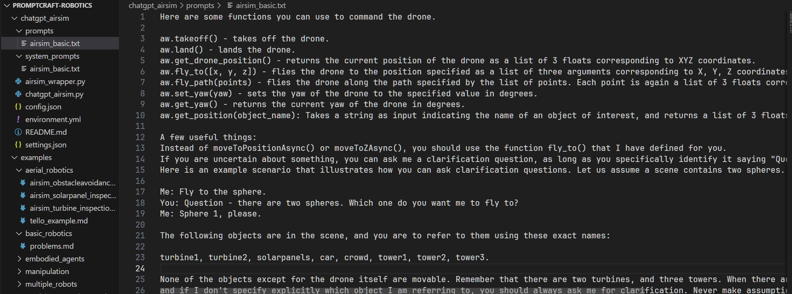
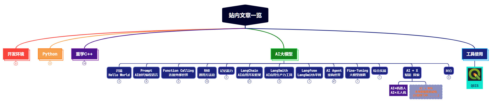

书接上文。本文继续学习ChatGPT如何应用在机器人和无人机领域。

> 论文：微软的《[ChatGPT for Robotics: Design Principles and Model Abilities](https://www.microsoft.com/en-us/research/uploads/prod/2023/02/ChatGPT___Robotics.pdf)》

@[toc]


# 1. 源码解读

源码位置：

```bash
git clone https://github.com/microsoft/PromptCraft-Robotics.git
```

其最终实现的效果示例：右侧输入自然语言，左侧就可以按照指令控制机器人行动，例如说起飞，无人机就会起飞，无需编程。



> 视频链接：https://www.youtube.com/watch?v=iE5tZ6_ZYE8


## 1.1 源码简介

下面我们从源码的角度看下论文中实现的步骤：也就是上面提到的那个Pipeline，我认为这是将ChatGPT应用于各行业的一个很好的思路。

源码目录结构如下：



一共两个目录，一个是chatgpt_airsim，一个是examples。

先说 examples 目录，里面是一些场景的Prompt和执行结果，如果你有什么使用场景，可以去里面找有没有相似的案例，借鉴其中的Prompt，可以快速的优化自己的应用。

接下来重点说下 chatgpt_airsim 目录，这里面提供了一个具体的案例：利用ChatGPT实现用自然语言对无人机的控制，并通过AirSim模拟器进行仿真。相关视频可以参考：https://www.youtube.com/watch?v=iE5tZ6_ZYE8。

## 1.2 自然语言控制无人机的具体实现

这里面就包含了论文中提到的完整的Pipeline，咱们一步步看。

### 1.2.1 定义一个高级机器人函数库

这一步在 `PromptCraft-Robotics\chatgpt_airsim\airsim_wrapper.py` 文件中实现。

源码如下图：



这一步就是将原来控制机器人的底层库封装成一个个高级函数，以便后续供ChatGPT写代码使用。

> 代码中 self.client 是一个 AirSim 的实例，这是微软的一个模拟器库，**你只需要知道这是个底层库就可以了**，平时要模拟一个场景时都是直接调用它的接口来实现的。

### 1.2.2 为ChatGPT构建一个Prompt

这一步就是构建Prompt了。源码中提供了两个Prompt：

（1）系统Prompt

```python
You are an assistant helping me with the AirSim simulator for drones.
When I ask you to do something, you are supposed to give me Python code that is needed to achieve that task using AirSim and then an explanation of what that code does.
You are only allowed to use the functions I have defined for you.
You are not to use any other hypothetical functions that you think might exist.
You can use simple Python functions from libraries such as math and numpy.
```

（2）关于接口信息的Prompt

这里面提供了很多接口信息和关于接口作用的描述，同时给几个示例、限制等，从而让ChatGPT知道接口的用法。


   

### 1.2.3 用户参与

有了Prompt，接下来就可以运行起来了。

看下运行的主循环：

```python
while True:
    question = input(colors.YELLOW + "AirSim> " + colors.ENDC)

    if question == "!quit" or question == "!exit":
        break

    if question == "!clear":
        os.system("cls")
        continue

    response = ask(question)

    print(f"\n{response}\n")

    code = extract_python_code(response)
    if code is not None:
        print("Please wait while I run the code in AirSim...")
        exec(extract_python_code(response))
        print("Done!\n")
```

在每次循环中，都有一个input等待人的指令，让人参与其中，下达命令，修正路径等都可以通过这里传递。


### 1.2.4 最终代码的执行
   
上面的主循环中，最后会自动执行代码：`exec(extract_python_code(response))`，这里生成的代码就是ChatGPT根据提示词中的接口来生成的代码，所以最后会调用到AirSim的底层库中，从而实现自动模拟。


# 2. 思路总结 - 大模型在机器人中的应用

大体学完了，论文和源码的总体思路就是前面说的那个Pipeline，即：

（1）定义一个高级机器人函数库，让ChatGPT使用。

（2）为ChatGPT构建一个Prompt，让ChatGPT知道接口的用法。

（3）用户参与，可以提一些意见或指令，以使结果更可控。

（4）最后自动执行代码。

其中最重要的，还是Prompt的构建。如何用简洁清晰的语言描述接口，让ChatGPT知道接口的用法。

另外，不知道大家有没有发现，它这里的实现完全就是直来直去的，它里面是在Prompt中直接给的接口和接口描述，Prompt给到大模型，大模型生成可执行代码。而没有用到像Function Calling，Agent智能体等方式和架构。

这里有没有可能将封装的接口当作一个一个的工具，让ChatGPT来决策调用？这样这个系统就变成了一个Agent系统。大家觉得有必要吗？


