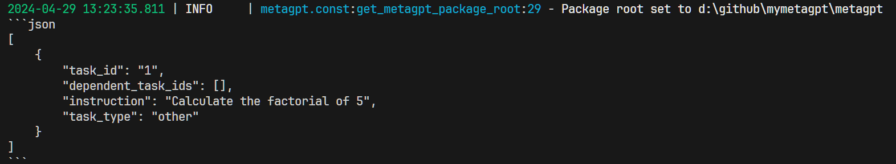
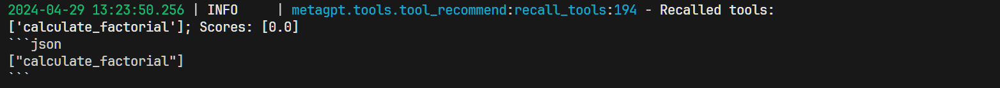
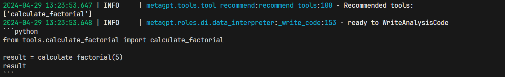
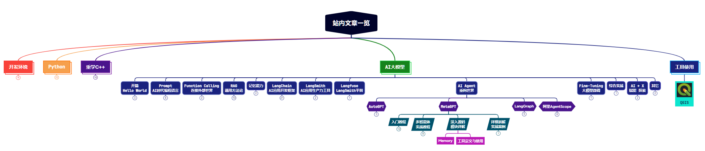

学了这么久的MetaGPT，突然发现，竟然没有用到过工具。工具作为大模型连接外部世界，融入工程中的重要一环，必不可少。本文我们就来学习一下如何在MetaGPT中定义工具、使用工具。

@[toc]


> 参考：https://docs.deepwisdom.ai/main/zh/guide/tutorials/create_and_use_tools.html

# 0. 先上手体验

官方例子：自定义阶乘工具

## 0.1 定义工具

新开一个文件，定义工具。

官方是要求在 metagpt/tools/libs 中创建一个你自己的函数，但一身反骨的我，随便找个目录放就行了。

```python
# MyMetaGPT/tools/calculate_factorial.py
import math
from metagpt.tools.tool_registry import register_tool

# 使用装饰器注册工具
@register_tool()
def calculate_factorial(n):
    """
    计算非负整数的阶乘
    """
    if n < 0:
        raise ValueError("输入必须是非负整数")
    print(f"计算{n}的阶乘------>：")
    return math.factorial(n)
```

## 0.2 使用工具

再开一个文件，使用工具。


```python
# main.py
import asyncio
from metagpt.roles.di.data_interpreter import DataInterpreter
import calculate_factorial

async def main(requirement: str):
    role = DataInterpreter(tools=["calculate_factorial"]) # 集成工具
    await role.run(requirement)

if __name__ == "__main__":
    requirement = "请计算 5 的阶乘"
    asyncio.run(main(requirement))
```

## 0.3 运行结果

以下是运行过程与结果。

结构化输入信息：





找到工具：



输出结果：


# 1. 代码解释

## 1.1 工具定义与集成的步骤

以上代码调用工具时是使用了 `DataInterpreter` 模块，这个模块应该是0.8版本正式发布的，后面会详细介绍。本文主要介绍工具的定义和集成步骤：

（1）首先是引入工具定义的依赖：`from metagpt.tools.tool_registry import register_tool`

（2）使用 `@register_tool()` 装饰器注册工具

（3）导入你的工具：`import calculate_factorial`

（4）集成并使用工具: `role = DataInterpreter(tools=["calculate_factorial"])`

## 1.2 工具定义的注意事项

工具定义时，最最重要的，我认为是下面的这几行：

除了函数名和参数外，不要忘了写这个函数的注释，用 """ 括起来。这不仅仅是注释这么简单，在Python中叫文档字符串（docstring）。在定义工具时，**这个字符串就是工具的Prompt，是直接决定大模型是否选择这个工具的依据**。

```python
def calculate_factorial(n):
    """
    计算非负整数的阶乘
    """
```

# 2. 另一个更复杂的例子 - 计算器类作为工具

上面的例子是将单个函数作为一个工具。官方还给了一个将一个类作为工具的例子。

## 2.1 示例代码

```python
# metagpt/tools/libs/calculator.py
import math
from metagpt.tools.tool_registry import register_tool

# 使用装饰器注册工具
# “math”的tag用于将工具分类为数学工具，include_functions 参数用于指定要包含的函数。这有利于`DataInterpreter`选择并理解工具
@register_tool(tags=["math"], include_functions=["__init__", "add", "subtract", "multiply", "divide", "factorial"])
class Calculator:
   """
   一个简单的计算器工具，可以执行基本的算术运算并计算阶乘。
   """

   @staticmethod
   def add(a, b):
       """
       计算两个数的和。
       """
       return a + b

   @staticmethod
   def subtract(a, b):
       """
       计算两个数的差。
       """
       return a - b

   @staticmethod
   def multiply(a, b):
       """
       计算两个数的乘积。
       """
       return a * b

   @staticmethod
   def divide(a, b):
       """
       计算两个数的商。
       """
       if b == 0:
           return "错误：除数不能为零"
       else:
           return a / b

   @staticmethod
   def factorial(n):
       """
       计算非负整数的阶乘。
       """
       if n < 0:
           raise ValueError("输入必须是非负整数")
       return math.factorial(n)
```

## 2.2 代码解释

这个代码与单函数作为工具的区别在于这一行：

```python
@register_tool(tags=["math"], include_functions=["__init__", "add", "subtract", "multiply", "divide", "factorial"])
```

这个装饰器中，有两个参数：`tags` 和 `include_functions`。

`tags` 参数用于指定工具的分类。这个在单函数工具和类作为工具中都适用。

`include_functions` 参数用于指定工具中包含的函数。这个在类作为工具中才适用，单函数工具不需要这个参数。

同样，**最关键的一点**，要注意给这个类和各个函数添加文档字符串。


# 3. 工具与Action的关系

其实学到这里，MetaGPT中的工具的定义和使用，已经差不多可以了。但是这也衍生了我的一个疑问：工具和Action的关系是什么？工具用来执行特定动作，Action也是用来执行特定动作的吧？有了Action，那工具存在的意义是什么呢？

我隐约觉得，工具其实实现原理是大模型的Function Calling功能，是可以让大模型识别和执行的，而Action因为无法封装成大模型Function Calling的形式，所以不能被大模型直接识别和执行。Action更像是流程中的一环，可以是主动触发的。而工具是放在那被大模型调用的？

但是似乎又觉得这样的理解还是不清楚。大家有什么好的见解吗？



