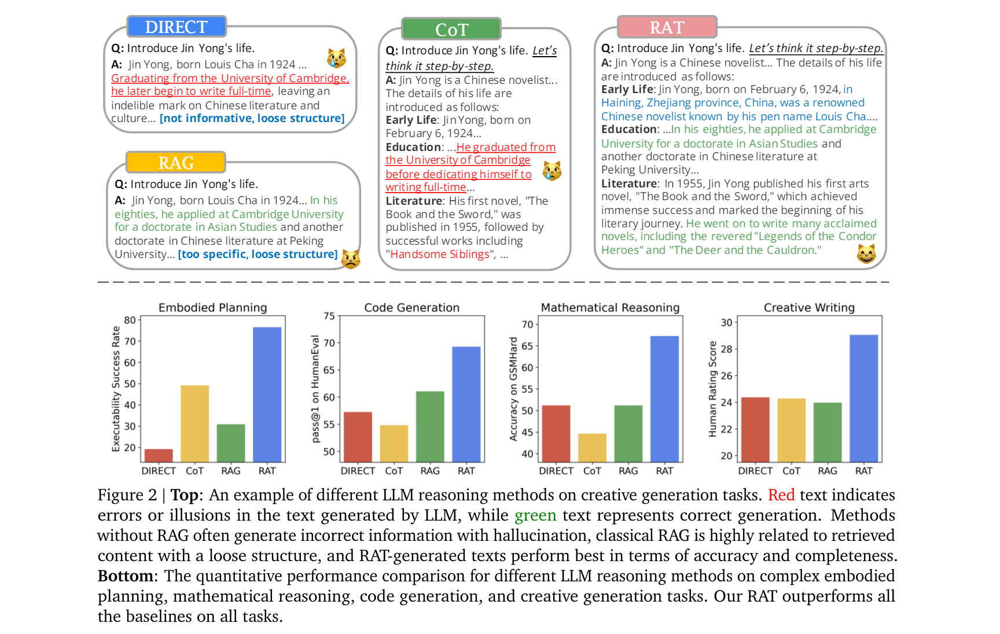

> **大家好，我是 <font color=blue>同学小张</font>，持续学习<font color=red>C++进阶知识</font>和<font color=red>AI大模型应用实战案例</font>，持续分享，欢迎大家<font color=red>点赞+关注</font>，共同学习和进步。**

---

如果你对大模型应用有一定了解，一定听说过下面的几个词儿：COT（思维链）、TOT（思维树）、RAG（检索增强生成）、LATS（Language Agent Tree Search）...

大模型相关的领域真的是在高速发展，现在竟然又出现了一个RAT。本文我们来看下RAT是什么，能用来解决什么问题，以及其实现思路和原理。

@[toc]

# 0. 什么是RAT

RAT，全称是 Retrieval Augmented Thoughts，检索增强思维。它的提出是想要用来提高RAG（检索增强生成）的能力，改善RAG效果，减少幻觉。

乍一听高端，但其实很简单：RAT = RAG + COT。即，在RAG的基础上，增加COT思维链。

相关论文：https://arxiv.org/pdf/2403.05313

论文中实验的RAT的实现效果：在代码生成、数学推理、具体任务规划和创意写作等各个方面，RAT的效果都优于直接生成、单用COT、单用RAG的效果（如下图中的下半部分）。



上图的上半部分，论文中展示了相同问题在 直接生成、单用COT、单用RAG 和 RAT 4种情况下生成的效果。可以更加直观的感受到RAT的优化效果。

# 1. RAT的原理与实现

## 1.1 RAT的原理

上面已经提到了，RAT的实现原理其实就是 RAG + COT。其实现步骤如下：

（1）生成初始CoT：给定一个任务提示，LLM首先零样本（zero-shot）生成一个初始的、分步的思维链（CoT），其中包含多个推理步骤。

（2）检索相关信息：对于CoT中的每一步，RAT使用当前和之前所有的思维步骤，以及原始任务提示，生成一个查询（query）。然后，这个查询被用来从外部知识库中检索相关信息。

（3）修正思维步骤：利用检索到的信息，LLM逐步修正CoT中的每一步。这意味着，每一步的修正都基于当前步骤和之前所有已修正步骤的信息。

（4）生成最终回答：修正完所有的思维步骤后，LLM会根据这些修正后的步骤生成最终的输出。

伪代码实现如下：


## 1.2 RAT的实现

上面有了RAT的原理和基本步骤，可能还是有点懵。别急，下面我们看下RAT的具体实现代码。

### 1.2.1 实现代码及解析

> 实现代码：https://github.com/CraftJarvis/RAT

下面是RAT的基本流程部分：

```python
# RAT Function
newline_char = '\n'

def rat(question):
    print(f"{datetime.now()} [INFO] 获取草稿...")
    draft = get_draft(question)
    print(draft)
    print(f"{datetime.now()} [INFO] 处理草稿...")
    draft_paragraphs = split_draft(draft)

    answer = ""
    for i, p in enumerate(draft_paragraphs):
        print(str(i)*80)
        print(f"{datetime.now()} [INFO] 修改第{i+1}/{len(draft_paragraphs)}部分...")
        answer = answer + '\n\n' + p

        print(f"{datetime.now()} [INFO] 生成对应Query...")
        res = run_with_timeout(get_query_wrapper, 3, question, answer)
        if not res:
            print(f"{datetime.now()} [INFO] 跳过后续步骤...")
            continue
        else:
            query = res
        print(f">>> {i}/{len(draft_paragraphs)} Query: {query.replace(newline_char, ' ')}")

        print(f"{datetime.now()} [INFO] 获取网页内容...")
        # content = get_content(query)
        res = run_with_timeout(get_content_wrapper, 5, query)
        if not res:
            print(f"{datetime.now()} [INFO] 跳过后续步骤...")
            continue
        else:
            content = res

        for j, c in enumerate(content):
            if  j > 2:
                break
            print(f"{datetime.now()} [INFO] 根据网页内容修改对应答案...[{j}/{min(len(content),3)}]")
            # answer = get_revise_answer(question, answer, c)
            res = run_with_timeout(get_revise_answer_wrapper, 10, question, answer, c)
            if not res:
                print(f"{datetime.now()} [INFO] 跳过后续步骤...")
                continue
            else:
                diff_html = generate_diff_html(answer, res)
                display(HTML(diff_html))
                answer = res
            print(f"{datetime.now()} [INFO] 答案修改完成[{j}/{min(len(content),3)}]")
        # print(f"[{i}/{len(draft_paragraphs)}] REVISED ANSWER:\n {answer.replace(newline_char, ' ')}")
        # print()
    return draft, answer
```

对以上代码的解释：

（1）生成初始CoT：`draft = get_draft(question)`

（2）然后切分出CoT的步骤（论文中的T1、T2、... 、Tn）：`draft_paragraphs = split_draft(draft)`

（3）生成对应Query：`res = run_with_timeout(get_query_wrapper, 3, question, answer)`

```python
def get_query(question, answer):
    query_prompt = '''
I want to verify the content correctness of the given question, especially the last sentences.
Please summarize the content with the corresponding question.
This summarization will be used as a query to search with Bing search engine.
The query should be short but need to be specific to promise Bing can find related knowledge or pages.
You can also use search syntax to make the query short and clear enough for the search engine to find relevant language data.
Try to make the query as relevant as possible to the last few sentences in the content.
**IMPORTANT**
Just output the query directly. DO NOT add additional explanations or introducement in the answer unless you are asked to.
'''
    query = openai_client.chat.completions.create(
        model="gpt-3.5-turbo",
        messages=[
            {
                "role": "system",
                "content": chatgpt_system_prompt
            },
            {
                "role": "user",
                "content": f"##Question: {question}\n\n##Content: {answer}\n\n##Instruction: {query_prompt}"
            }
        ],
        temperature = 1.0
    ).choices[0].message.content
    return query
```

这里值得注意的一点，也是我觉得比较核心的一点：`answer = answer + '\n\n' + p`，在生成Query的时候，将之前的答案和对应的段落拼接在一起，然后一起总结。

（4）根据生成的Query检索内容：`res = run_with_timeout(get_content_wrapper, 5, query)`

```python
def get_content(query):
    res = get_search(query, 1)
    if not res:
        print(">>> No good Google Search Result was found")
        return None
    search_results = res[0]
    link = search_results['link'] # title, snippet
    res = get_page_content(link)
    if not res:
        print(f">>> No content was found in {link}")
        return None
    retrieved_text = res
    trunked_texts = chunk_texts(retrieved_text, 1500)
    trunked_texts = [trunked_text.replace('\n', " ") for trunked_text in trunked_texts]
    return trunked_texts
```

（5）根据检索内容修正答案：`res = run_with_timeout(get_revise_answer_wrapper, 10, question, answer, c)`

```python
def get_revise_answer(question, answer, content):
    revise_prompt = '''
I want to revise the answer according to retrieved related text of the question in WIKI pages.
You need to check whether the answer is correct.
If you find some errors in the answer, revise the answer to make it better.
If you find some necessary details are ignored, add it to make the answer more plausible according to the related text.
If you find the answer is right and do not need to add more details, just output the original answer directly.
**IMPORTANT**
Try to keep the structure (multiple paragraphs with its subtitles) in the revised answer and make it more structual for understanding.
Split the paragraphs with `\n\n` characters.
Just output the revised answer directly. DO NOT add additional explanations or annoucement in the revised answer unless you are asked to.
'''
    revised_answer = openai_client.chat.completions.create(
        model="gpt-3.5-turbo",
        messages=[
                {
                    "role": "system",
                    "content": chatgpt_system_prompt
                },
                {
                    "role": "user",
                    "content": f"##Existing Text in Wiki Web: {content}\n\n##Question: {question}\n\n##Answer: {answer}\n\n##Instruction: {revise_prompt}"
                }
            ],
            temperature = 1.0
    ).choices[0].message.content
    return revised_answer
```

### 1.2.2 代码中的Prompt

代码中是以创意写作场景为例。

#### 1.2.2.1 生成初始答案


用 CoT 思想生成初始答案，答案需要使用 \n\n 进行分段。

#### 1.2.2.2 生成检索query


将答案进行总结，生成相应的问题query。这个query会用来检索知识库或使用Bing搜索来检索相关内容。

#### 1.2.2.3 根据检索内容修正答案


根据检索到的内容，修正答案。包括：如果发现了错误，修正答案。如果发现答案不够完整，补充答案。如果答案正确且充分，直接输出原始答案。

# 2. 总结

RAT（Retrieval-Augmented Thoughts）方法固然如上所述在各个场景下都有更好的表现和通用性，但是也有不足之处：

（1）**依赖基础模型**：RAT的性能依赖于底层LLMs的CoT推理和RAG能力。对于较小或较弱的模型，RAT的效果可能会受限。

（2）**知识库质量**：RAT的有效性受限于检索到的知识库的质量和相关性。如果知识库与用户查询不相关，可能无法提供有用的信息。

（3）**检索成本**：从大型知识库中检索信息可能会带来较高的计算和维护成本，并且可能会影响检索的精确度。

（4）**复杂性**：RAT方法需要复杂的处理步骤，包括生成初始CoT、构建查询、检索信息以及迭代修正，增加了实现的复杂性。

（5）**效率问题**：RAT迭代修正过程影响生成速度，尤其是在需要大量检索和处理的情况下。

其中，成本问题和效率问题，是大家更加关心的。


> **如果觉得本文对你有帮助，麻烦点个赞和关注呗 ~~~**

---

> - 大家好，我是 <font color=blue>**同学小张**</font>，持续学习<font color=red>**C++进阶知识**</font>和<font color=red>**AI大模型应用实战案例**</font>
> - 欢迎 <font color=red>**点赞 + 关注**</font> 👏，**持续学习**，**持续干货输出**。
> - +v: <font color=blue>**jasper_8017**</font> 一起交流💬，一起进步💪。
> - 微信公众号也可搜<font color=blue>【**同学小张**】</font> 🙏

**==本站文章一览：==**

