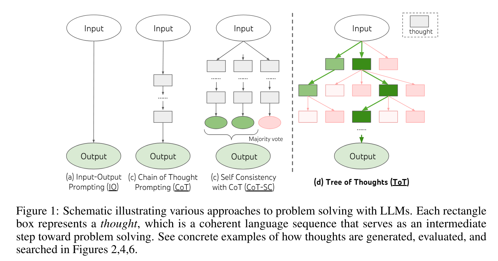
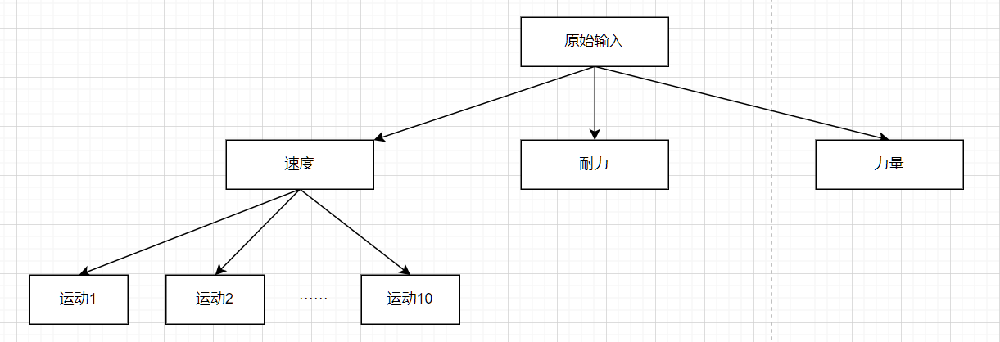
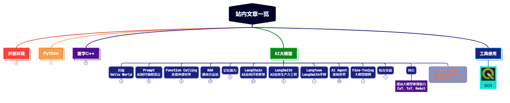

今天我们主要学习下当下提高大模型推理能力的几个主要技术，从CoT（Chain of Thought）到TOT（Tree of Thought），再到ReAct。从概念到实现代码框架，一点点去理解这些思想背后的原理。

@[toc]

# 1. CoT（Chain of Thought，思维链）

第一次接触到CoT是在Prompt工程中，其作为Prompt高级技巧的一部分，可以显著提高大模型在推理方面的能力，尤其是解决数学等具有逻辑性的问题时。

区别于传统的 Prompt 从输入直接到输出的映射 <input——>output> 的方式，CoT 完成了从输入到思维链再到输出的映射，即 <input——>reasoning chain——>output>。

原论文：https://arxiv.org/pdf/2201.11903.pdf


## 1.1 基本使用

目前没有看到 CoT 相关的实现代码，仅仅在 Prompt 中添加了一句 “Let's Step by Step” 就让大模型在推理上用到了思维链。

而关于 CoT 的论文，也基本上都是在讲如何微调来让大模型具备思维链的能力。例如这篇论文：https://arxiv.org/pdf/2210.11416.pdf


所以，我想，CoT 在现在应该是大模型本身就应该具备的能力，我们在使用时及时唤醒这个能力（例如Prompt加入 Let's think step by step.），然后使用就可以了，并不需要自己去写代码写逻辑去亲自实现CoT。


> 总结：CoT的核心思想是通过提供一系列中间推理步骤来引导模型逐步思考，从而生成更加准确和连贯的输出。这种方法特别适用于需要复杂推理、数学计算或解决多步骤问题的场景。

## 1.2 Self-consistency with CoT（CoT的自我一致性）

一种CoT在实际应用中的方案是：Self-consistency with CoT（CoT的自我一致性）。**简单地要求模型对同一提示进行多次回答，并将多数结果作为最终答案。** 它是CoT（Chain of Thought）的后续方法。示例代码如下：对同一个Prompt，重复调用5次，然后取其中多数结果作为最终答案。

```python
# 连续调用 5 次
for _ in range(5):
    prompt = f"{instruction}\n\n{output_format}\n\n请一步一步分析:\n{context}"
    print(f"------第{_+1}次------")
    response = get_completion(prompt)
    print(response)
```

> 这种结果应该有评价标准和归类标准，例如只能回答yes or no，这样才能统计出多数结果作为返回。


# 2. ToT（Tree of Thought，思维树）

在CoT的基础上，有人指出其存在的缺陷：
* 对于局部，没有探索一个思考过程下的不同延续-树的分支。
* 对于全局，没有利用任何类型的规划，前瞻以及回溯去帮助评估不同抉择-而启发式的探索正式人类解决问题的特性。

针对以上缺陷，他提出了ToT（Tree of Thought，思维树）的概念。


> 相关论文：https://arxiv.org/pdf/2305.10601.pdf

具体结构图如下：虚线左边为基本Prompt、CoT以及CoT Self Consisitency，虚线右边为ToT。




下面以一个实际案例来看下ToT的思想和实现。

## 2.1 案例

> 本案例来自知乎AIGC课程

> 案例内容：小明 100 米跑成绩：10.5 秒，1500 米跑成绩：3 分 20 秒，铅球成绩：12 米。他适合参加哪些搏击运动训练。

### 2.1.1 示例代码


```python
import json
from openai import OpenAI
from dotenv import load_dotenv, find_dotenv
_ = load_dotenv(find_dotenv())
 
client = OpenAI(
    api_key=os.getenv("OPENAI_API_KEY"),
    base_url=os.getenv("OPENAI_BASE_URL")
)
 
def get_completion(prompt, model="gpt-4", temperature=0):
    messages = [{"role": "user", "content": prompt}]
    response = client.chat.completions.create(
        model=model,
        messages=messages,
        temperature=temperature  # 模型输出的随机性，0 表示随机性最小
    )
    return response.choices[0].message.content
 
def performance_analyser(text):
    prompt = f"{text}\n请根据以上成绩，分析候选人在速度、耐力、力量三方面素质的分档。分档包括：强（3），中（2），弱（1）三档。\
                \n以JSON格式输出，其中key为素质名，value为以数值表示的分档。"
    response = get_completion(prompt)
    return json.loads(response)
 
 
def possible_sports(talent, category):
    prompt = f"需要{talent}强的{category}运动有哪些。给出10个例子，以array形式输出。确保输出能由json.loads解析。"
    response = get_completion(prompt, temperature=0.8)
    return json.loads(response)
 
 
def evaluate(sports, talent, value):
    prompt = f"分析{sports}运动对{talent}方面素质的要求: 强（3），中（2），弱（1）。\
                \n直接输出挡位数字。输出只包含数字。"
    response = get_completion(prompt)
    val = int(response)
    print(f"{sports}: {talent} {val} {value>=val}")
    return value >= val
 
 
def report_generator(name, performance, talents, sports):
    level = ['弱', '中', '强']
    _talents = {k: level[v-1] for k, v in talents.items()}
    prompt = f"已知{name}{performance}\n身体素质：{_talents}。\n生成一篇{name}适合{sports}训练的分析报告。"
    response = get_completion(prompt, model="gpt-3.5-turbo")
    return response
 
 
name = "小明"
performance = "100米跑成绩：10.5秒，1500米跑成绩：3分20秒，铅球成绩：12米。"
category = "搏击"
 
talents = performance_analyser(name+performance)
print("===talents===")
print(talents)
 
cache = set()
# 深度优先
 
# 第一层节点
for k, v in talents.items():
    if v < 3:  # 剪枝
        continue
    leafs = possible_sports(k, category)
    print(f"==={k} leafs===")
    print(leafs)
    # 第二层节点
    for sports in leafs:
        if sports in cache:
            continue
        cache.add(sports)
        suitable = True
        for t, p in talents.items():
            if t == k:
                continue
            # 第三层节点
            if not evaluate(sports, t, p):  # 剪枝
                suitable = False
                break
        if suitable:
            report = report_generator(name, performance, talents, sports)
            print("****")
            print(report)
            print("****")

```

### 2.1.2 代码解释

（1）从 ```talents = performance_analyser(name+performance) ``` 开始，performance_analyser主要用来分析小明成绩，并返回一个JSON格式的字符串。

```python
def performance_analyser(text):
    prompt = f"{text}\n请根据以上成绩，分析候选人在速度、耐力、力量三方面素质的分档。分档包括：强（3），中（2），弱（1）三档。\
                \n以JSON格式输出，其中key为素质名，value为以数值表示的分档。"
    response = get_completion(prompt)
    return json.loads(response)
```

输出如下：

```json
{
  "速度": 3,
  "耐力": 2,
  "力量": 2
}
```

然后就有了树的第一层节点，即速度、耐力和力量。


（2）然后遍历第一层节点，执行 possible_sports：

```python
def possible_sports(talent, category):
    prompt = f"需要{talent}强的{category}运动有哪些。给出10个例子，以array形式输出。确保输出能由json.loads解析。"
    response = get_completion(prompt, temperature=0.8)
    return json.loads(response)
```

以速度节点为例，prompt为：需要速度强的搏击运动有哪些。给出10个例子，以array形式输出。确保输出能由json.loads解析。这时候得到了第二层节点。



（3）然后遍历第二层节点，执行 evaluate：

```python
def evaluate(sports, talent, value):
    prompt = f"分析{sports}运动对{talent}方面素质的要求: 强（3），中（2），弱（1）。\
                \n直接输出挡位数字。输出只包含数字。"
    response = get_completion(prompt)
    val = int(response)
    print(f"{sports}: {talent} {val} {value >= val}")
    return value >= val
```

输出结果：

```python
speed_intensive_martial_arts: 耐力 2 True
speed_intensive_martial_arts: 力量 3 False
```

（4）类似这样一层一层遍历，评估，最后得到最终结果。当然，为了提高效率，代码中也做了剪枝操作：

```python
if v < 3:  # 剪枝
    continue
```

### 2.1.3 总结

上面的代码，从原始输入开始，在思维链的每一步，采样多个分支。逐渐形成树状结构。对每一个分支进行评估，然后在合适的分支上进行搜索。这就是ToT思维树的基本过程。


# 3. ReAct（Reason + Action）

## 3.1 各开源框架中 ReAct 实现方法详解

请看我上次的分享：[【AI Agent教程】各种Agent开发框架都是如何实现ReAct思想的？深入源码学习一下](https://blog.csdn.net/Attitude93/article/details/137954190)，其中详细介绍了ReAct思想在各个开源框架中的实现，包括LangChain、AutoGPT、MetaGPT等。

## 3.2 ReAct 与 CoT、ToT 的区别

个人理解一下：CoT、ToT 都是作用在大模型本身的内在推理过程上，而 ReAct 则是统筹整个系统，从推理过程，结合外部工具共同实现最终的目标。

以ReAct论文中那张图来看，可以更清晰的理解ReAct与CoT、ToT的区别：


ReAct 是Reason + Action，而Cot、ToT 则只是 Reason。


# 4. 总结

本文我们深入学习了改进大模型推理能力的三种方法：CoT、ToT、ReAct。并从使用和实现的角度，进行了详细讲解。CoT目前来看已经集成进了大模型内部，通过在Prompt中加入一些提示词（Let's think step by step）即可唤醒大模型的CoT思考能力。对于ToT，有实现代码参考，就是在思维链的基础上，每一步不再是只有一个结果，而是采样多个分支，综合评估。对于ReAct，则是从推理过程，结合外部工具共同实现最终目标。ReAct 与 CoT和ToT 的本质区别，就是ReAct不止在推理，还在利用外部工具实现目标。



