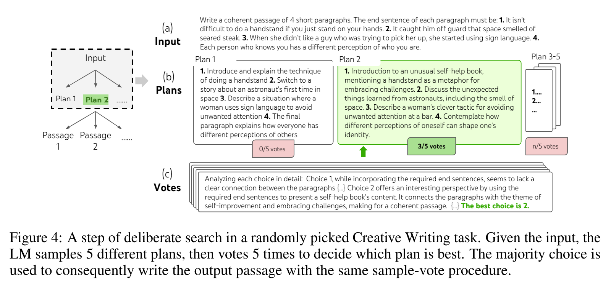
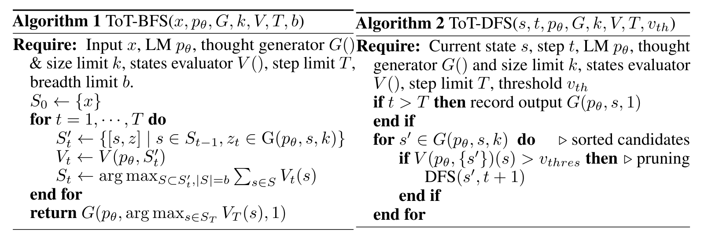
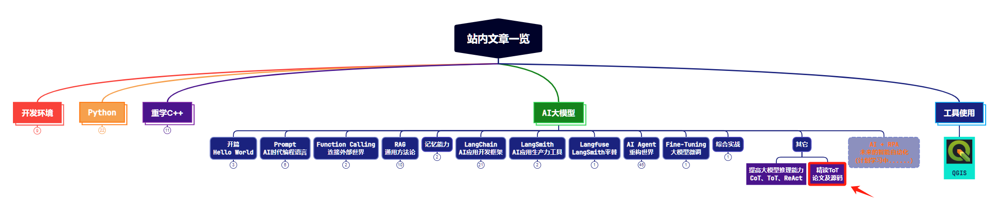

上篇文章我们学习了当下提高大模型推理能力的几个主要技术，从CoT（Chain of Thought）到TOT（Tree of Thought），再到ReAct。关于 ReAct 的实现方式，我们前面也有文章进行了非常详细的介绍。**本文，我们重点研读一下ToT的论文，以及其实现源码中的主要流程。**

@[toc]

与论文配套的ToT代码：https://github.com/princeton-nlp/tree-of-thought-llm

# 1. 源码中的ToT框架

ToT的主要实现框架都在这个函数中：```def solve(args, task, idx, to_print=True)```:

```python
for step in range(task.steps):
    # generation
    if args.method_generate == 'sample':
        new_ys = [get_samples(task, x, y, args.n_generate_sample, prompt_sample=args.prompt_sample, stop=task.stops[step]) for y in ys]
    elif args.method_generate == 'propose':
        new_ys = [get_proposals(task, x, y) for y in ys]
    new_ys = list(itertools.chain(*new_ys))
    ids = list(range(len(new_ys)))
    # evaluation
    if args.method_evaluate == 'vote':
        values = get_votes(task, x, new_ys, args.n_evaluate_sample)
    elif args.method_evaluate == 'value':
        values = get_values(task, x, new_ys, args.n_evaluate_sample)

    # selection
    if args.method_select == 'sample':
        ps = np.array(values) / sum(values)
        select_ids = np.random.choice(ids, size=args.n_select_sample, p=ps).tolist()
    elif args.method_select == 'greedy':
        select_ids = sorted(ids, key=lambda x: values[x], reverse=True)[:args.n_select_sample]
    select_new_ys = [new_ys[select_id] for select_id in select_ids]

    # log
    if to_print: 
        sorted_new_ys, sorted_values = zip(*sorted(zip(new_ys, values), key=lambda x: x[1], reverse=True))
        print(f'-- new_ys --: {sorted_new_ys}\n-- sol values --: {sorted_values}\n-- choices --: {select_new_ys}\n')
    
    infos.append({'step': step, 'x': x, 'ys': ys, 'new_ys': new_ys, 'values': values, 'select_new_ys': select_new_ys})
    ys = select_new_ys
```

可以看到，ToT的主要流程如下：

（1）generation：根据输入和当前节点，生成一定数量的候选子节点。

（2）evaluation：对候选子节点进行打分。


（3）selection：根据打分结果，选择一定数量的候选子节点作为下一轮的父节点。

然后循环。

# 2. 流程拆解

在拆解流程之前，先看下源码中对ChatGPT的封装：

```python
def chatgpt(messages, model="gpt-4", temperature=0.7, max_tokens=1000, n=1, stop=None) -> list:
    global completion_tokens, prompt_tokens
    outputs = []
    while n > 0:
        cnt = min(n, 20)
        n -= cnt
        res = completions_with_backoff(model=model, messages=messages, temperature=temperature, max_tokens=max_tokens, n=cnt, stop=stop)
        outputs.extend([choice["message"]["content"] for choice in res["choices"]])
        # log completion tokens
        completion_tokens += res["usage"]["completion_tokens"]
        prompt_tokens += res["usage"]["prompt_tokens"]
    return outputs
```

重点记住参数里的n，它代表每次重复调用多少次大模型，生成多少个候选节点。

## 2.1 generation 想法生成

这一步是根据输入和当前节点，生成一定数量的候选子节点。文中给出了两种生成方式：

（1）Sample 方式：利用CoT的提示词重复调用大模型，生成多次回复作为候选节点。

> 当思维空间丰富时（例如，创意写作），这种方法更有效。由于采样是独立的，因此这有助于增加候选思维之间的多样性。

```python
new_ys = [get_samples(task, x, y, args.n_generate_sample, prompt_sample=args.prompt_sample, stop=task.stops[step]) for y in ys]
```

（2）Propose 方式：依据propose prompt依次生成想法。

> 当思维空间受到更多限制时（例如，数学计算等），这种方法更有效。可以避免同一个上下文生成重复的想法。

以24点游戏为例，propose prompt如下：prompt给定1-shot样例，期望大模型能按照样例生成多个下一阶段的想法。

```python
propose_prompt = '''Input: 2 8 8 14
Possible next steps:
2 + 8 = 10 (left: 8 10 14)
8 / 2 = 4 (left: 4 8 14)
14 + 2 = 16 (left: 8 8 16)
2 * 8 = 16 (left: 8 14 16)
8 - 2 = 6 (left: 6 8 14)
14 - 8 = 6 (left: 2 6 8)
14 /  2 = 7 (left: 7 8 8)
14 - 2 = 12 (left: 8 8 12)
Input: {input}
Possible next steps:
'''
```

## 2.2 evaluation 状态评估

这一步是对所有候选子节点进行状态评估，评估出是否需要进一步在此基础上探索最终答案。作者提出两种评估方式：

（1）对每个状态，让大模型给出数值或分级的评价（例如：sure/likely/impossible）

> 这样的评估方式不需要非常准确，只要能近似预估即可。


让大模型给出分级评价的Prompt示例：


```python
value_prompt = '''Evaluate if given numbers can reach 24 (sure/likely/impossible)
10 14
10 + 14 = 24
sure
11 12
11 + 12 = 23
12 - 11 = 1
11 * 12 = 132
11 / 12 = 0.91
impossible
4 4 10
4 + 4 + 10 = 8 + 10 = 18
4 * 10 - 4 = 40 - 4 = 36
(10 - 4) * 4 = 6 * 4 = 24
sure
4 9 11
9 + 11 + 4 = 20 + 4 = 24
sure
5 7 8
5 + 7 + 8 = 12 + 8 = 20
(8 - 5) * 7 = 3 * 7 = 21
I cannot obtain 24 now, but numbers are within a reasonable range
likely
5 6 6
5 + 6 + 6 = 17
(6 - 5) * 6 = 1 * 6 = 6
I cannot obtain 24 now, but numbers are within a reasonable range
likely
10 10 11
10 + 10 + 11 = 31
(11 - 10) * 10 = 10
10 10 10 are all too big
impossible
1 3 3
1 * 3 * 3 = 9
(1 + 3) * 3 = 12
1 3 3 are all too small
impossible
{input}
'''
```

（2）跨状态投票，让大模型在不同的状态间进行投票式选择，投票多次后选择得票率最高的选项。

```python
vote_prompt = '''Given an instruction and several choices, decide which choice is most promising. Analyze each choice in detail, then conclude in the last line "The best choice is {s}", where s the integer id of the choice.
'''
```



## 2.3 selection 搜索算法

论文中还是采用了两种搜索算法：

（1）BFS，广度优先算法：每一步中保留最有潜力的K个状态。

（2）DFS，深度优先算法：优先探索最有潜力的状态，直到得到最终结果，如果最终结果不可行，则回溯到父节点，继续探索。



代码中貌似只实现了BFS算法，但是仍然是两种选择的策略：

（1）随机选择

（2）贪婪选择

```python
if args.method_select == 'sample':
    ps = np.array(values) / sum(values)
    select_ids = np.random.choice(ids, size=args.n_select_sample, p=ps).tolist()
elif args.method_select == 'greedy':
    select_ids = sorted(ids, key=lambda x: values[x], reverse=True)[:args.n_select_sample]
```

# 3. 总结

本文学习了一下ToT（Tree of Thoughts，思维树）的论文以及源代码，从源码角度详细分析了整个流程：一个大循环，循环内先生成候选节点，然后评估候选节点，最后选择有用的节点。以此循环，直到得到最终答案或到一定循环次数。


1

1

1

1
11

1

1

1


1
1





