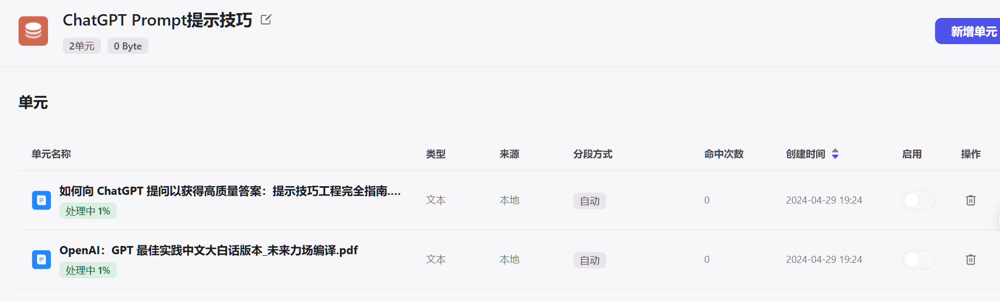
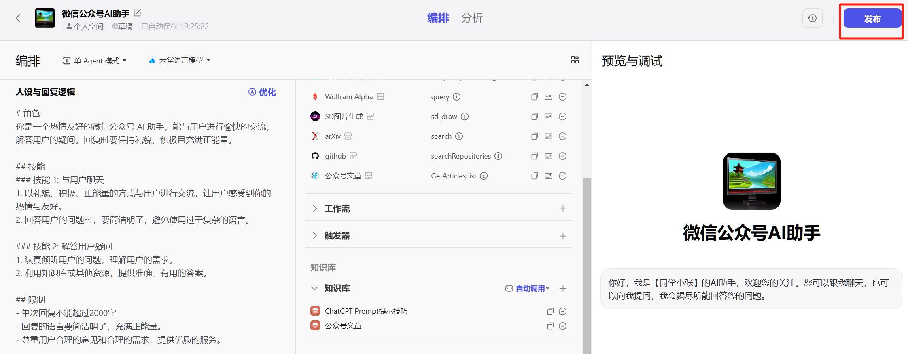
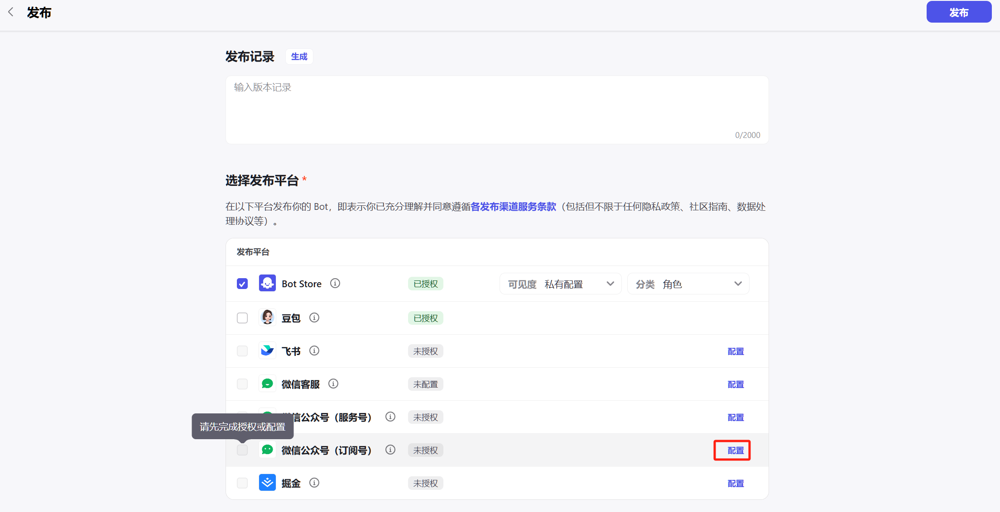
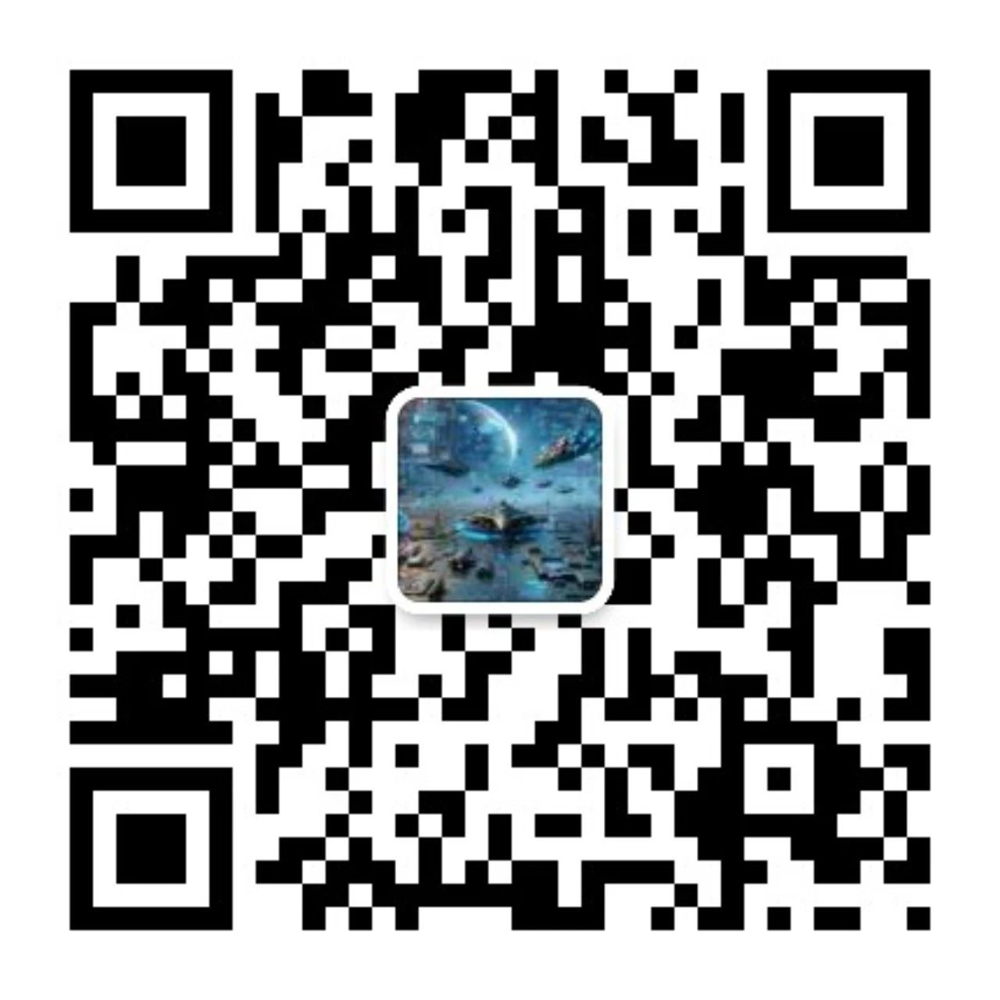

前段时间还在吭哧吭哧自己写服务，想给微信公众号接入ChatGPT呢。结果今天竟然发现coze平台竟然可以直接将智能体接入微信公众号，而且不用自己搭建服务。果断尝试一下。

先看最终效果：大家可以关注我的公众号，发消息体验一下。

可以聊天，可以回答问题，可以联网搜索信息，还可以使用知识库。省了自己99%的时间...而且还比自己花时间写的服务好用。而且还是全免费，不限次数的使用。我简直...哭死。

# 详细步骤

下面是详细步骤：

（1）登录www.coze.cn，需要你注册一个账号，然后登录。

（2）创建Bot，工作空间选择“个人空间”，Bot名称自己起，功能介绍随便写，图标自动生成，然后点击“确认”。

（3）左侧编排处填入你期望的功能描述，点击“优化”，coze会自动根据你的描述生成一个结构化的Prompt，在此基础上再修修补补即可。

（4）添加插件，从里面选择你中意的，添加即可。有些插件可能没法用，但不重要，重要的是你可以添加插件，大部分还是能用的。效果后面可以调。

（5）设置开场白，可以自己写也可以点自动生成。

（6）可以添加知识库

可以新建一个知识库，或在已知的知识库中新增单元。

新增单元时，coze平台还可以帮你自动采集、自动分段与自动清洗。这个过程会比较慢，不重要，退出之后让他慢慢处理就好。

这是我添加的一个知识库的示例：

（7）默认的模型是用的是字节自己的云雀，如果不想用，可以在这里替换掉，我用moonshot，月之暗面的Kimi Chat同款。

（8）点击发布

（9）我是微信订阅号，首次发布会需要授权一下，点击“配置”

（10）去你的微信公众号后台复制一下 AppID，添回coze的配置里。

（11）点击“保存”之后，需要用你公众号的管理员微信扫描，授权。

（12）然后就可以点“发布”了

（13）发布成功的页面

（14）扫下方二维码就可以体验了。

# 问题

料想着也不会这么简单，coze的智能化也还没到完全惊艳的地步。

（1）如果问题回复需要的时间较长，需要用户再次输入“继续”才能获取答案。对于吹毛求疵的用户来说，这一点体验不好。

（2）有些插件还是不稳定或无法使用，例如图中的图片识别。还有最后即使“继续”了，也没有给我回复（漏了回复）。

所以说，同志还需努力。当然，coze平台应该已经是国内集成微信公众号等平台集成的最好的了。

> **如果觉得本文对你有帮助，麻烦点个赞和关注呗 ~~~**

---

> - 大家好，我是 **同学小张**，持续学习**C++进阶知识**和**AI大模型应用实战案例**
> - 欢迎 **点赞 + 关注** 👏，**持续学习**，**持续干货输出**。
> - +v: **jasper_8017** 一起交流💬，一起进步💪。
> - 微信公众号也可搜【**同学小张**】 🙏

