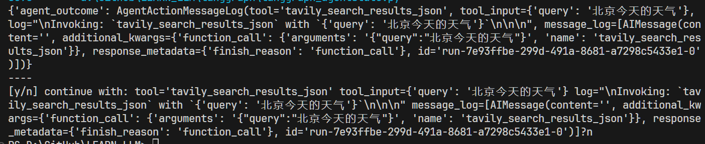
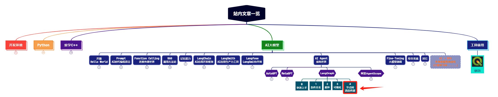
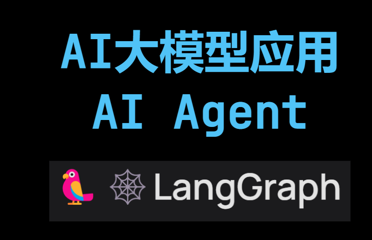

前面我们学过LangGraph的基本使用，知道了如何添加边，添加Node，组装图，以及将图进行可视化。还有一个重要的点我之前忽略了，那就是如何在这些节点之间进行消息传递。今天我们就来学习一下如何在LangGraph的节点之间进行消息传递以及自定义的消息传递。

@[toc]


# 0. 先上代码

> 代码来源: https://github.com/langchain-ai/langgraph/blob/main/examples/agent_executor/human-in-the-loop.ipynb


```python

from langchain import hub
from langchain.agents import create_openai_functions_agent
from langchain_openai.chat_models import ChatOpenAI
from langchain_community.tools.tavily_search import TavilySearchResults

tools = [TavilySearchResults(max_results=1)]

# Get the prompt to use - you can modify this!
prompt = hub.pull("hwchase17/openai-functions-agent")

# Choose the LLM that will drive the agent
llm = ChatOpenAI(model="gpt-3.5-turbo-1106", streaming=True)

# Construct the OpenAI Functions agent
agent_runnable = create_openai_functions_agent(llm, tools, prompt)

from typing import TypedDict, Annotated, List, Union
from langchain_core.agents import AgentAction, AgentFinish
from langchain_core.messages import BaseMessage
import operator

class AgentState(TypedDict):
    # The input string
    input: str
    # The list of previous messages in the conversation
    chat_history: list[BaseMessage]
    # The outcome of a given call to the agent
    # Needs `None` as a valid type, since this is what this will start as
    agent_outcome: Union[AgentAction, AgentFinish, None]
    # List of actions and corresponding observations
    # Here we annotate this with `operator.add` to indicate that operations to
    # this state should be ADDED to the existing values (not overwrite it)
    intermediate_steps: Annotated[list[tuple[AgentAction, str]], operator.add]
    

from langchain_core.agents import AgentFinish
from langgraph.prebuilt.tool_executor import ToolExecutor

# This a helper class we have that is useful for running tools
# It takes in an agent action and calls that tool and returns the result
tool_executor = ToolExecutor(tools)


# Define the agent
def run_agent(data):
    agent_outcome = agent_runnable.invoke(data)
    return {"agent_outcome": agent_outcome}


# Define the function to execute tools
def execute_tools(data):
    # Get the most recent agent_outcome - this is the key added in the `agent` above
    agent_action = data["agent_outcome"]
    response = input(f"[y/n] continue with: {agent_action}?")
    if response == "n":
        raise ValueError
    output = tool_executor.invoke(agent_action)
    return {"intermediate_steps": [(agent_action, str(output))]}


# Define logic that will be used to determine which conditional edge to go down
def should_continue(data):
    # If the agent outcome is an AgentFinish, then we return `exit` string
    # This will be used when setting up the graph to define the flow
    if isinstance(data["agent_outcome"], AgentFinish):
        return "end"
    # Otherwise, an AgentAction is returned
    # Here we return `continue` string
    # This will be used when setting up the graph to define the flow
    else:
        return "continue"
    
    
from langgraph.graph import END, StateGraph

# Define a new graph
workflow = StateGraph(AgentState)

# Define the two nodes we will cycle between
workflow.add_node("agent", run_agent)
workflow.add_node("action", execute_tools)

# Set the entrypoint as `agent`
# This means that this node is the first one called
workflow.set_entry_point("agent")

# We now add a conditional edge
workflow.add_conditional_edges(
    # First, we define the start node. We use `agent`.
    # This means these are the edges taken after the `agent` node is called.
    "agent",
    # Next, we pass in the function that will determine which node is called next.
    should_continue,
    # Finally we pass in a mapping.
    # The keys are strings, and the values are other nodes.
    # END is a special node marking that the graph should finish.
    # What will happen is we will call `should_continue`, and then the output of that
    # will be matched against the keys in this mapping.
    # Based on which one it matches, that node will then be called.
    {
        # If `tools`, then we call the tool node.
        "continue": "action",
        # Otherwise we finish.
        "end": END,
    },
)

# We now add a normal edge from `tools` to `agent`.
# This means that after `tools` is called, `agent` node is called next.
workflow.add_edge("action", "agent")

# Finally, we compile it!
# This compiles it into a LangChain Runnable,
# meaning you can use it as you would any other runnable
app = workflow.compile()


inputs = {"input": "北京今天的天气怎么样？", "chat_history": []}
for s in app.stream(inputs):
    print(list(s.values())[0])
    print("----")
```

运行结果：



# 1. 代码解释

## 1.1 总结使用LangGraph的步骤

上面代码其实没什么新鲜的，就是使用LangGraph的步骤，前面入门的文章([【AI Agent系列】【LangGraph】0. 快速上手：协同LangChain，LangGraph帮你用图结构轻松构建多智能体应用](https://blog.csdn.net/Attitude93/article/details/137107100))中详细介绍过：

（1）首先创建一个图：`workflow = StateGraph(AgentState)`

（2）然后，往图中添加节点：

```python
workflow.add_node("agent", run_agent)
workflow.add_node("action", execute_tools)
```

（3）再然后，添加边：

```python
workflow.add_conditional_edges(
    "agent",
    should_continue,
    {
        "continue": "action",
        "end": END,
    },
)

workflow.add_edge("action", "agent")
```

（4）再然后，添加进入节点：`workflow.set_entry_point("agent")`

（5）编译图：`app = workflow.compile()`

（6）运行，这里用的是 `stream` 函数，也可以使用 `invoke` 函数。

## 1.2 节点定义

定义了两个节点：`agent` 和 `action`，分别对应着两个函数。

* `run_agent` 函数执行agent，获取执行结果。

* `execute_tools`函数首先需要人工介入判断是否要继续执行工具，如果继续，则执行相应工具。如果不继续，则停止程序。

```python
def run_agent(data):
    agent_outcome = agent_runnable.invoke(data)
    return {"agent_outcome": agent_outcome}


def execute_tools(data):
    agent_action = data["agent_outcome"]
    response = input(f"[y/n] continue with: {agent_action}?")
    if response == "n":
        raise ValueError
    output = tool_executor.invoke(agent_action)
    return {"intermediate_steps": [(agent_action, str(output))]}
```


# 2. 节点间信息传递

下面来到本文的主要学习内容：节点间的信息是如何传递的，Graph中的State是如何更新的，

前面我们说过，LangGraph的核心概念之一是状态。每次图的执行都会创建一个状态，该状态在图中的节点之间传递，每个节点在执行后都会更新此状态。所以，LangGraph呈现的是类似状态机（state machine）的机制。而这也是LangGraph节点间进行信息传递的方式。

## 2.1 代码中的状态定义

下面是代码中的状态定义：

```python
class AgentState(TypedDict):
    input: str
    chat_history: list[BaseMessage]
    agent_outcome: Union[AgentAction, AgentFinish, None]
    intermediate_steps: Annotated[list[tuple[AgentAction, str]], operator.add]
```

定义一个`AgentState`继承自`TypedDict`即可。AgentState中自定义了一些传递的信息：`input`、`chat_history`、`agent_outcome`和`intermediate_steps`。每个node在执行前，都可以从状态中获取这些信息使用，然后执行后，也都可以将返回结果更新到状态中。

> agent_outcome 就是agent执行后的返回的执行状态（AgentAction或者AgentFinish，不用过多纠结这是什么，只要知道是个状态就好了。）

看下代码中的使用过程：

（1）首先在创建图的时候要把这个状态设置给图：`workflow = StateGraph(AgentState)`

（2）然后在各节点中就可以使用了：

以`execute_tools`节点为例：

```python
def execute_tools(data):
    agent_action = data["agent_outcome"]
    response = input(f"[y/n] continue with: {agent_action}?")
    if response == "n":
        raise ValueError
    output = tool_executor.invoke(agent_action)
    return {"intermediate_steps": [(agent_action, str(output))]}
```

在执行前，先从状态中获取`agent_outcome`，使用这个值给用户提示，是否需要继续。如果继续，则执行工具获取执行结果。最后，执行结果被更新到状态的 `intermediate_steps` 字段中。下个节点就可以使用这个`intermediate_steps` 信息了。这就完成了节点间的信息传递。


# 3. 总结

本文总体来说比较简单，首先回顾了LangGraph的创建与使用的基本步骤，然后学习了LangGraph中状态的定义和节点间信息传递的原理，这算是个新的知识点。总结下自定义信息传递的步骤：

（1）定义 `class AgentState(TypedDict)`

（2）传递给图：`workflow = StateGraph(AgentState)`

（3）如有需要，在各node中，获取状态：`data = data["agent_outcome"]`

（4）如有需要，在各node中，更新状态：`return {"intermediate_steps": [(agent_action, str(output))]}`

> 这个例子其实是用来展示如何在多智能体交互中让人参与其中的。也可以参考下，就是在node中适当位置加个input函数，等待用户输入即可。





