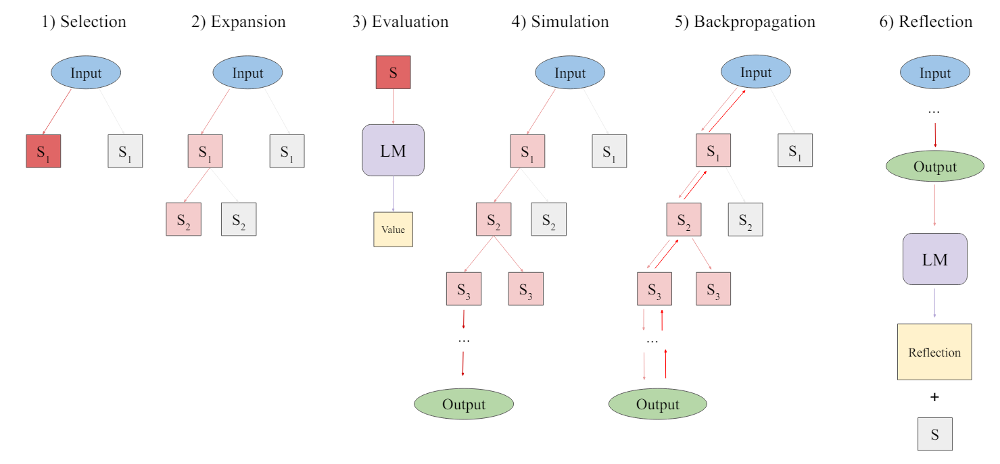
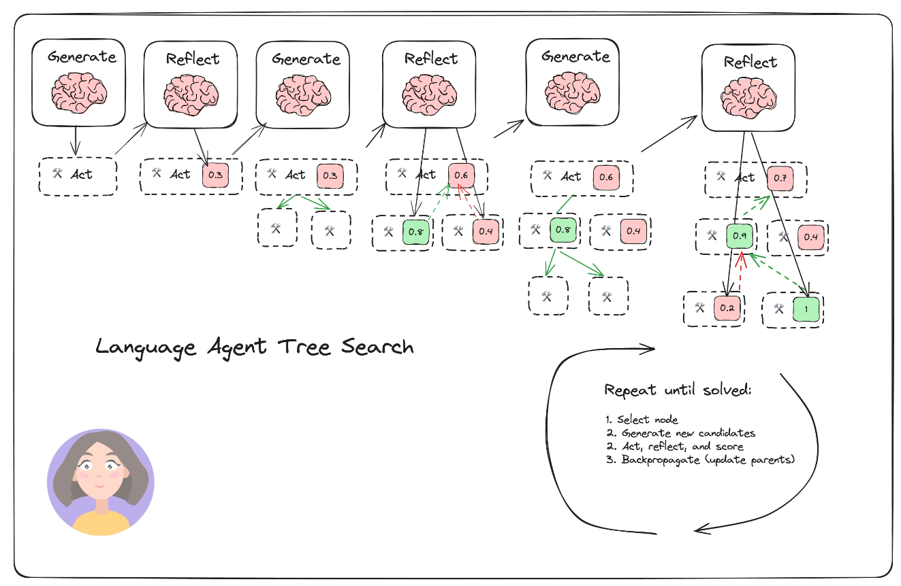
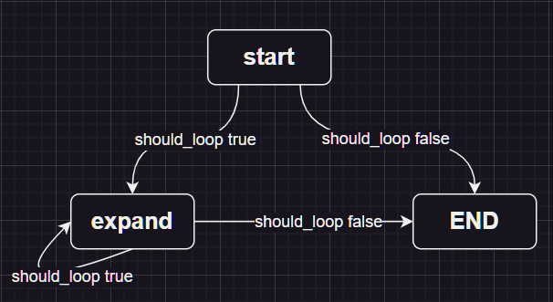
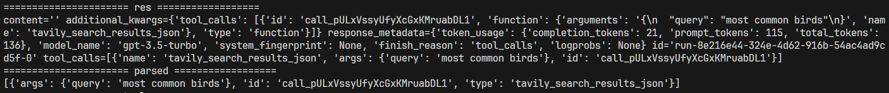
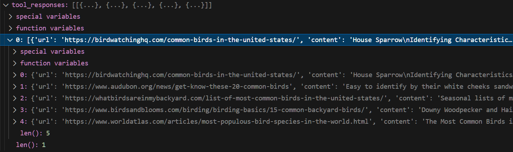
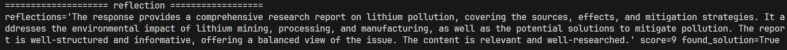
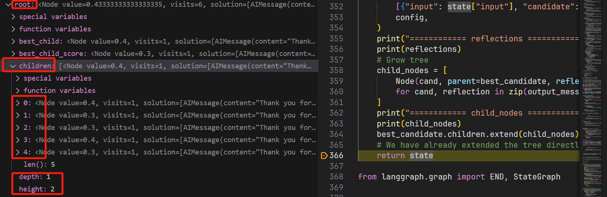
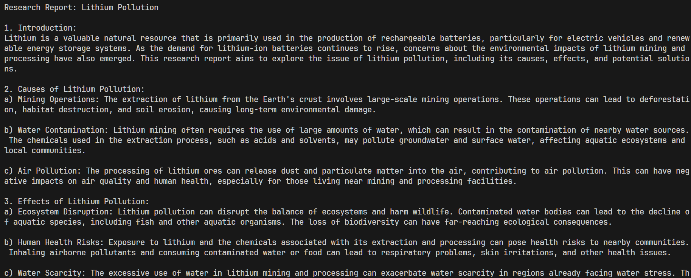
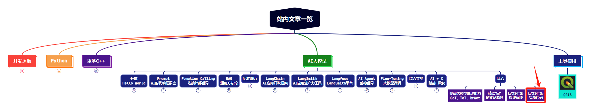

> **大家好，我是 <font color=blue>同学小张</font>，持续学习<font color=red>C++进阶知识</font>和<font color=red>AI大模型应用实战案例</font>，持续分享，欢迎大家<font color=red>点赞+关注</font>，共同学习和进步。**
---

上篇文章我们详细学习了LATS方法的原理，本文我们以LangChain中实现的LATS代码入手，看看怎么真正用代码实现出LATS。

@[toc]

# 0. 原理回顾

这是LATS论文中的步骤图：



LATS的实现需要：选择、扩展、评估、模拟、反向传播和反思的过程。

LangChain中的代码实现步骤如下：



将步骤简化为：

（1）选择

（2）扩展

（3）评估 + 反思 + 模拟 + 打分

（4）反向传播


# 1. 代码详解

下面我们一起来看下它的源码实现。

> 完整代码参考：https://github.com/langchain-ai/langgraph/blob/main/examples/lats/lats.ipynb

## 1.1 LangGraph的创建

LangGraph的创建是一个非常标准的套路：

（1）创建LangGraph对象

```python
builder = StateGraph(TreeState)
```

(2) 添加节点

```python
builder.add_node("start", generate_initial_response)
builder.add_node("expand", expand)
```

（3）设置初始进入节点

```python
builder.set_entry_point("start")
```

（4）添加边，都是条件边

```python
builder.add_conditional_edges(
    "start",
    # Either expand/rollout or finish
    should_loop,
)
builder.add_conditional_edges(
    "expand",
    # Either continue to rollout or finish
    should_loop,
)
```

（5）编译图

```python
graph = builder.compile()
```

这就定义好了一个LangGraph，图的执行路径是这样的：



其中 should_loop 函数的定义：

```python
def should_loop(state: TreeState):
    """Determine whether to continue the tree search."""
    root = state["root"]
    if root.is_solved:
        return END
    if root.height > 5:
        return END
    return "expand"
```

如果判定已经得到了最终答案（is_solved），或者搜索的最大层数超过了5层，则停止搜索答案，不再继续搜索。否则继续执行 expand 节点。

有了这个LangGraph的框架，我总结的LangGraph创建需要的三要素：节点node、边edge和状态state：边edge上面已经定义了，下面看下节点node和状态state的实现。

## 1.2 状态state的实现

```python
from typing_extensions import TypedDict
class TreeState(TypedDict):
    # The full tree
    root: Node
    # The original input
    input: str
```

自定义的状态state为```TreeState```，里面有一个Node类型的root字段，和一个str类型的input字段。


## 1.3 节点node的实现

### 1.3.1 start节点

start节点是执行 ```generate_initial_response``` 函数，构造根节点：

```python
def generate_initial_response(state: TreeState) -> dict:
    """Generate the initial candidate response."""
    res = initial_answer_chain.invoke({"input": state["input"]})
    parsed = parser.invoke(res)
    tool_responses = tool_executor.batch(
        [ToolInvocation(tool=r["type"], tool_input=r["args"]) for r in parsed]
    )
    output_messages = [res] + [
        ToolMessage(content=json.dumps(resp), tool_call_id=tool_call["id"])
        for resp, tool_call in zip(tool_responses, parsed)
    ]
    reflection = reflection_chain.invoke(
        {"input": state["input"], "candidate": output_messages}
    )
    root = Node(output_messages, reflection=reflection)
    return {
        **state,
        "root": root,
    }
```

#### 1.3.1.1 初始化信息 initial_answer_chain

initial_answer_chain 代码如下：实现的功能是将用户提问输入给大模型，大模型给出回复。从Prompt看，基本就是个直来直去的问答。

```python
prompt_template = ChatPromptTemplate.from_messages(
    [
        (
            "system",
            "You are an AI assistant.",
        ),
        ("user", "{input}"),
        MessagesPlaceholder(variable_name="messages", optional=True),
    ]
)

initial_answer_chain = prompt_template | llm.bind_tools(tools=tools).with_config(
    run_name="GenerateInitialCandidate"
)
```

#### 1.3.1.2 解析结果

回复之后，使用Json解析器解析一下：

```python
parser = JsonOutputToolsParser(return_id=True)
```

这两步的运行结果大体如下：



#### 1.3.1.3 执行工具获取执行工具结果 tool_executor

tool_executor 将上一步解析出来的工具进行并行执行，并获取结果。下面是工具的定义：

```python
search = TavilySearchAPIWrapper()
tavily_tool = TavilySearchResults(api_wrapper=search, max_results=5)
tools = [tavily_tool]
tool_executor = ToolExecutor(tools=tools)
```
执行完工具后结果类似如下：



#### 1.3.1.4 评估反思 reflection_chain

reflection_chain 用来对工具执行结果进行打分评估。

```python
@as_runnable
def reflection_chain(inputs) -> Reflection:
    tool_choices = reflection_llm_chain.invoke(inputs)
    reflection = tool_choices[0]
    if not isinstance(inputs["candidate"][-1], AIMessage):
        reflection.found_solution = False
    return reflection
```

其中的 reflection_llm_chain 定义如下：

```python
prompt = ChatPromptTemplate.from_messages(
    [
        (
            "system",
            "Reflect and grade the assistant response to the user question below.",
        ),
        ("user", "{input}"),
        MessagesPlaceholder(variable_name="candidate"),
    ]
)

reflection_llm_chain = (
    prompt
    | llm.bind_tools(tools=[Reflection], tool_choice="Reflection").with_config(
        run_name="Reflection"
    )
    | PydanticToolsParser(tools=[Reflection])
)
```

从Prompt就大体能看出来，是利用大模型进行反思和打分。输入是用户的原始问题和候选的节点```candidate```。```tool_choice="Reflection"``` 强制让大模型使用 ```Reflection``` 工具，最后将大模型返回结果使用 ```Reflection``` 进行解析。

最终，该chain返回的结果是一个 ```Reflection``` 实例。

Reflection 执行结果示例：包括一个说明、一个评分和是否是最终答案。参考 Reflection类的实现。



#### 1.3.1.5 Reflection类

```python
class Reflection(BaseModel):
    reflections: str = Field(
        description="The critique and reflections on the sufficiency, superfluency,"
        " and general quality of the response"
    )
    score: int = Field(
        description="Score from 0-10 on the quality of the candidate response.",
        gte=0,
        lte=10,
    )
    found_solution: bool = Field(
        description="Whether the response has fully solved the question or task."
    )

    def as_message(self):
        return HumanMessage(
            content=f"Reasoning: {self.reflections}\nScore: {self.score}"
        )

    @property
    def normalized_score(self) -> float:
        return self.score / 10.0
```

> 问题：这个Reflection类没有定义为tools，为什么能直接这样写： ```tools=[Reflection]```？


### 1.3.2 expand节点

这个节点执行的就是整个LATS的流程：选择、扩展、评估、模拟、反向传播和反思。

```python
def expand(state: TreeState, config: RunnableConfig) -> dict:
    """Starting from the "best" node in the tree, generate N candidates for the next step."""
    root = state["root"]
    best_candidate: Node = root.best_child if root.children else root
    messages = best_candidate.get_trajectory()
    # Generate N candidates from the single child candidate
    new_candidates = expansion_chain.invoke(
        {"input": state["input"], "messages": messages}, config
    )
    parsed = parser.batch(new_candidates)
    flattened = [
        (i, tool_call)
        for i, tool_calls in enumerate(parsed)
        for tool_call in tool_calls
    ]
    tool_responses = tool_executor.batch(
        [
            ToolInvocation(tool=tool_call["type"], tool_input=tool_call["args"])
            for _, tool_call in flattened
        ]
    )
    collected_responses = defaultdict(list)
    for (i, tool_call), resp in zip(flattened, tool_responses):
        collected_responses[i].append(
            ToolMessage(content=json.dumps(resp), tool_call_id=tool_call["id"])
        )
    output_messages = []
    for i, candidate in enumerate(new_candidates):
        output_messages.append([candidate] + collected_responses[i])

    # Reflect on each candidate
    # For tasks with external validation, you'd add that here.
    reflections = reflection_chain.batch(
        [{"input": state["input"], "candidate": msges} for msges in output_messages],
        config,
    )
    # Grow tree
    child_nodes = [
        Node(cand, parent=best_candidate, reflection=reflection)
        for cand, reflection in zip(output_messages, reflections)
    ]
    best_candidate.children.extend(child_nodes)
    # We have already extended the tree directly, so we just return the state
    return state
```

#### 1.3.2.1 选择 best_candidate

选择当前最优的节点。

以下代码从 ```best_child``` 开始看，首先是获取树的全部节点和子孙节点。取分数最高的节点。

怎么取分数最高的节点？这里调用了 ```upper_confidence_bound``` 函数。这个函数用来计算UCT分数，UCT 是一种常用于多臂赌博机问题（Multi-Armed Bandit Problem）和蒙特卡洛树搜索（Monte Carlo Tree Search, MCTS）的算法，它有助于在探索（exploration）和利用（exploitation）之间找到一个平衡。

```python
def upper_confidence_bound(self, exploration_weight=1.0):
    """Return the UCT score. This helps balance exploration vs. exploitation of a branch."""
    if self.parent is None:
        raise ValueError("Cannot obtain UCT from root node")
    if self.visits == 0:
        return self.value
    # Encourages exploitation of high-value trajectories
    average_reward = self.value / self.visits
    # Encourages exploration of less-visited trajectories
    exploration_term = math.sqrt(math.log(self.parent.visits) / self.visits)
    return average_reward + exploration_weight * exploration_term

@property
def best_child(self):
    """Select the child with the highest UCT to search next."""
    if not self.children:
        return None
    all_nodes = self._get_all_children()
    return max(all_nodes, key=lambda child: child.upper_confidence_bound())
```

#### 1.3.2.2 扩展 expansion_chain

这一步是利用大模型，对于单个输入，生成N个不同的输出。```prompt_template```与前面初始化节点中的一致，基本是直来直去的问答，只是一次生成多个结果。

```python
# This generates N candidate values for a single input to sample actions from the environment
def generate_candidates(messages: ChatPromptValue, config: RunnableConfig):
    n = config["configurable"].get("N", 5)
    bound_kwargs = llm.bind_tools(tools=tools).kwargs
    chat_result = llm.generate(
        [messages.to_messages()],
        n=n,
        callbacks=config["callbacks"],
        run_name="GenerateCandidates",
        **bound_kwargs
    )
    return [gen.message for gen in chat_result.generations[0]]

expansion_chain = prompt_template | generate_candidates
```

候选节点生成结果示例：

```python
[AIMessage(content='', additional_kwargs={'tool_calls': [{'id': 'call_5DMq9O6BIden7lLraFH0NuYZ', 'function': {'arguments': '{"query":"lithium pollution research report"}', 'name': 'tavily_search_results_json'}, 'type': 'function'}]}),
 AIMessage(content='', additional_kwargs={'tool_calls': [{'id': 'call_5DMq9O6BIden7lLraFH0NuYZ', 'function': {'arguments': '{"query":"lithium pollution research report"}', 'name': 'tavily_search_results_json'}, 'type': 'function'}]}),
 AIMessage(content='', additional_kwargs={'tool_calls': [{'id': 'call_5DMq9O6BIden7lLraFH0NuYZ', 'function': {'arguments': '{"query":"lithium pollution research report"}', 'name': 'tavily_search_results_json'}, 'type': 'function'}]}),
 AIMessage(content='', additional_kwargs={'tool_calls': [{'id': 'call_5DMq9O6BIden7lLraFH0NuYZ', 'function': {'arguments': '{"query":"lithium pollution research report"}', 'name': 'tavily_search_results_json'}, 'type': 'function'}]}),
 AIMessage(content='', additional_kwargs={'tool_calls': [{'id': 'call_5DMq9O6BIden7lLraFH0NuYZ', 'function': {'arguments': '{"query":"lithium pollution research report"}', 'name': 'tavily_search_results_json'}, 'type': 'function'}]})]
```

生成完N个候选节点之后，通过 解析结果、并行执行工具得到每个节点执行的结果。

#### 1.3.2.3 评估+反思

对每个候选节点进行评估反思 reflection_chain

#### 1.3.2.4 扩展树和反向传播

将新增的节点添加到树中

```python
# Grow tree
child_nodes = [
    Node(cand, parent=best_candidate, reflection=reflection)
    for cand, reflection in zip(output_messages, reflections)
]
best_candidate.children.extend(child_nodes)
```
添加之后，树中已经有了这些子节点：



值得注意的是，这里面也包含了反向传播步骤。当新创建一个Node实例时，会调用反向传播：

```python
class Node:
    def __init__(
        self,
        messages: List[BaseMessage],
        reflection: Reflection,
        parent: Optional[Node] = None,
    ):
        ......

        self.backpropagate(reflection.normalized_score)
```

反向传播的实际作用，就是更新这条路径上各个节点的分数：

```python
def backpropagate(self, reward: float):
    """Update the score of this node and its parents."""
    node = self
    while node:
        node.visits += 1
        node.value = (node.value * (node.visits - 1) + reward) / node.visits
        node = node.parent
```

## 1.4 执行

```python
question = "Write a research report on lithium pollution."
for step in graph.stream({"input": question}):
    step_name, step_state = next(iter(step.items()))
    print(step_name)
    print("rolled out: ", step_state["root"].height)
    print("---")
    
    # solution_node = step["__end__"]["root"].get_best_solution() ## 这一句我没运行成功，暂且不管吧
    solution_node = step["start"]["root"].get_best_solution()
    best_trajectory = solution_node.get_trajectory(include_reflections=False)
    print(best_trajectory[-1].content)
```

执行完之后最后输出结果是：最终节点的content。

```python
best_trajectory = solution_node.get_trajectory(include_reflections=False)
    print(best_trajectory[-1].content)
```

最终输出结果示例：




# 2. 总结

本文我们对LangChain中实现LATS的源码进行了详细的学习和拆解，希望能够帮助大家更好地理解LATS，给大家做一个参考。

LATS的六步：选择、扩展、评估、模拟、反向传播和反思。其中评估、模拟和反思可以合并在一起执行，模拟其实就是执行工具获取工具的执行结果，反向传播其实就是更新这条路径上各个节点的得分。

代码中细节很多，理解不到位的地方，欢迎大家批评指正。

> **如果觉得本文对你有帮助，麻烦点个赞和关注呗 ~~~**

---

> - 大家好，我是 <font color=blue>**同学小张**</font>，持续学习<font color=red>**C++进阶知识**</font>和<font color=red>**AI大模型应用实战案例**</font>
> - 欢迎 <font color=red>**点赞 + 关注**</font> 👏，**持续学习**，**持续干货输出**。
> - +v: <font color=blue>**jasper_8017**</font> 一起交流💬，一起进步💪。
> - 微信公众号也可搜<font color=blue>【**同学小张**】</font> 🙏

**==本站文章一览：==**




