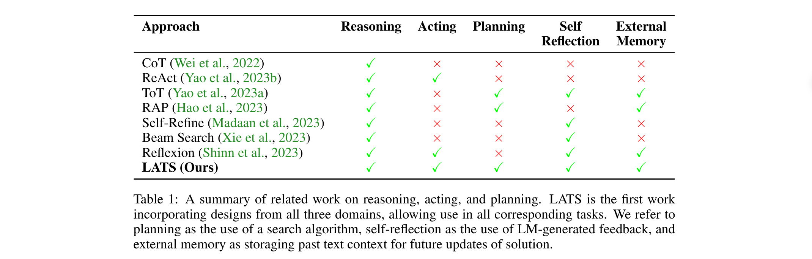

> **大家好，我是 同学小张，持续学习C++进阶知识和AI大模型应用实战案例，持续分享，欢迎大家点赞+关注，共同学习和进步。**
---

我们在大模型中常听说CoT（思维链）、ToT（思维树），还有最近比较火的Agent中常用的ReAct框架。这还不够，最近又发现了一种更高级的框架：LATS（Language Agent Tree Search），它比ToT和ReAct框架更复杂，相应的能力也更强。

> 原论文：https://arxiv.org/pdf/2310.04406

@[toc]

# 0. LATS是什么？

## 0.1 基本概念

LATS是一个通用框架，它结合了蒙特卡洛树搜索（Monte Carlo tree search，MCTS）的灵感，并利用环境提供外部反馈，从而实现更明智和适应性更强的问题解决机制。

LATS使用大模型作为**Agent**、**评估器**和**优化器**，将大模型在规划、行动和推理方面的优势结合起来，利用它们的潜在优势来增强决策能力。

## 0.2 LATS与ToT的区别

LATS与思维树ToT的区别如下图（中间的RAP我没了解过，所以先忽略）：

从图中可以直观地看到，LATS图中增加了环境和反馈。下面是一些区别的总结：

（1）搜索机制
- LATS采用蒙特卡洛树搜索（MCTS）的变种，这是一种启发式搜索算法，通过构建决策树来平衡探索和利用。LATS在树搜索中使用每个节点代表一个状态，并通过选择、扩展、评估、模拟、反向传播和反思等操作来寻找最优解。

- ToT使用深度优先搜索（DFS）或广度优先搜索（BFS）来探索多个推理路径。基于大模型评估的启发式来引导搜索，但通常不涉及树搜索中的动态规划或反向传播。

（2）外部反馈的使用

- LATS特别强调使用外部环境的反馈来改进推理和决策。LATS利用环境交互和自我反思来增强模型的合理性，并使Agent能够从经验中学习。

- ToT通过探索多个推理路径来增强语言模型的决策能力，但它主要依赖于语言模型内部的知识。

（3）自我反思

- LATS包括一个反思操作，当遇到不成功的终端节点时，会生成一个反思，总结推理或行动过程中的错误，并提出更好的替代方案。这些反思被存储并作为额外的上下文信息，以提高未来尝试的性能。

- ToT方法本身不包括自我反思的组件。它更多地关注于通过搜索算法探索不同的推理路径。

（4）灵活性和适应性

- LATS设计为灵活和适应性强，可以根据不同环境和任务调整状态设计和树的维度。

- ToT虽然能够探索多个推理路径，但它的适应性可能不如LATS，因为它不包括对外部反馈的整合。

## 0.3 LATS 与 ReAct 的区别

LATS 与 ReAct 的区别如下图示例所示：

LATS更像是ReAct的扩展，在思考时会探索不同的路径，并对答案进行反思和反向传播。其区别总结如下：

（1）搜索策略
   - LATS：前面也提到了，其采用蒙特卡洛树搜索（MCTS）作为其核心搜索算法，这允许它通过构建决策树来平衡探索和利用，从而在多个可能的行动路径中进行选择和扩展。

   - ReAct：更多地侧重于通过与环境的交互来直接映射输入到输出，而不是使用树搜索算法。ReAct通过接收环境的观察结果并采取相应的动作来增强推理和行动。

（2）外部反馈的使用
   - LATS：明确地利用外部环境的反馈来改进决策过程。它通过模拟和反向传播操作来整合这些反馈，并通过自我反思来进一步提升性能。
   - ReAct：虽然也使用环境反馈来增强模型的行动能力，但它的主要关注点是通过交互API环境来提升信息检索能力，而不是通过搜索算法来探索多个可能的解决方案。

（3）自我反思
   - LATS：包括一个自我反思的步骤，允许模型在遇到不成功的路径时生成反思，这些反思被用来作为额外的上下文信息，以改进未来的决策。
   - ReAct：不特别强调自我反思。它更多地依赖于直接从环境获得的反馈来指导行动。

（4）灵活性和适应性
   - LATS：提供了更大的灵活性和适应性，因为它可以适应不同的环境和任务需求，通过调整状态设计和树的维度来优化搜索过程。
   - ReAct：虽然ReAct也能够适应不同的任务，但它的设计更倾向于直接的行动和反应，而不是通过搜索和反思来改进决策。

（5）应用范围：
   - LATS：由于其搜索和反思机制，更适合于需要复杂决策和长期规划的任务。
   - ReAct：更适合于需要即时反应和交互的环境，特别是在信息检索和基于API的环境中。

## 0.4 CoT、ToT、ReAct、LATS等总结

如下图，论文中总结了主流的这些框架和方法的能力，LATS是唯一一个将思考、行动、规划结合起来的框架。

从这个图中，也可以看出LATS与其它框架的根本区别，以及各个框架之间的区别。

> 之前一直以为ReAct中有Planning的过程，因为它也是思考一步走一步，现在看来，ReAct更多地是强调思考加执行，一步步往下走，没有一个反馈地过程，规划能力不能说没有一点，但也不多。以现在大模型地规划和推理能力，在ReAct框架中依赖大模型进行规划有点不确定性太高了。LATS因为多分支搜索，并且有反馈和反向传播能力，所以能及时纠错，让大模型地规划更可靠一点。

# 1. LATS的原理

实现原理如下图：

一共是6个步骤：

（1）**选择**

- 在树中，你从根部（初始状态）开始，根据一定的规则（比如哪个分支最有可能通向正确答案），选择一个最有前途的分支继续前进。

（2）**扩展**

- 你探索这个分支，尝试从当前状态出发做出不同的行动，就像是在尝试不同的解题方法。

（3）**评估**

- 对每个可能的行动结果进行评估，就像是给每种解题方法打分，看看哪个更靠谱。

（4）**模拟**

- 你继续沿着选中的分支走，直到走到尽头，看看这个路径是否真的能解决问题。

（5）**反向传播**

- 如果你找到了正确的解决方案，就将这个成功的信号传回到你之前经过的每个节点上，让它们也知道“这条路走得对”。

（6）**反思**

- 如果你走错了路，没能解决问题，就停下来想一想错在哪里，怎样可以避免同样的错误。

重复这个过程多次，每次都尝试不同的路径，直到找到最好的解决方案。当你找到了一个满意的解决方案，或者尝试了很多次之后，就停止搜索。

伪代码如下：

# 2. 总结

本文主要对LATS论文进行了解读，同时，重点通过LATS与其它框架如ToT、ReAct的对比，来让大家对LATS有一个直观的认识。最后，用通俗易懂的语言替大家总结了LATS实现的步骤。

> **如果觉得本文对你有帮助，麻烦点个赞和关注呗 ~~~**

---

> - 大家好，我是 **同学小张**，持续学习**C++进阶知识**和**AI大模型应用实战案例**
> - 欢迎 **点赞 + 关注** 👏，**持续学习**，**持续干货输出**。
> - +v: **jasper_8017** 一起交流💬，一起进步💪。
> - 微信公众号也可搜【**同学小张**】 🙏

**==本站文章一览：==**

