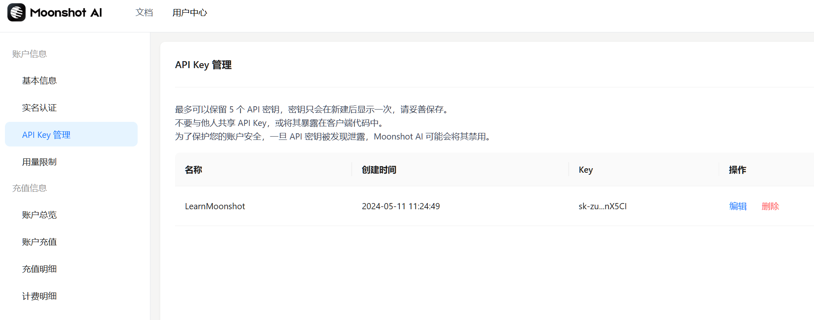
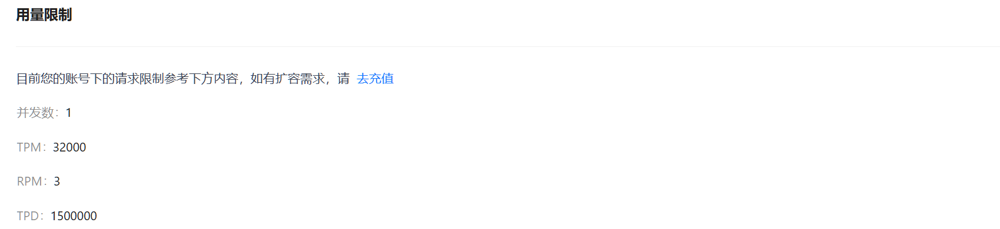
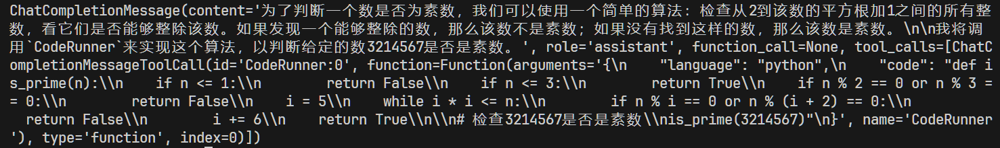
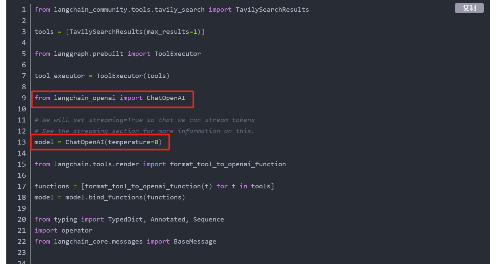
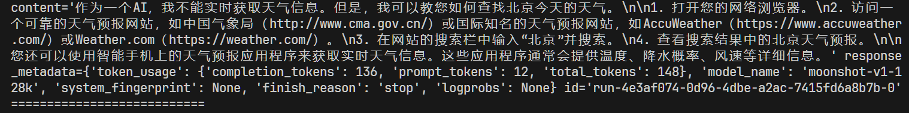
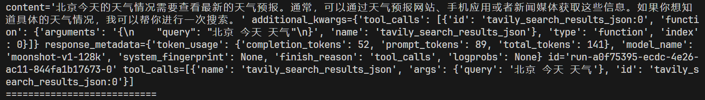
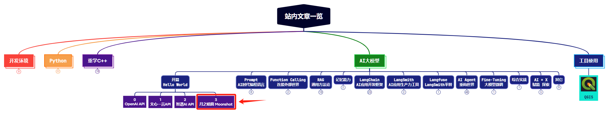
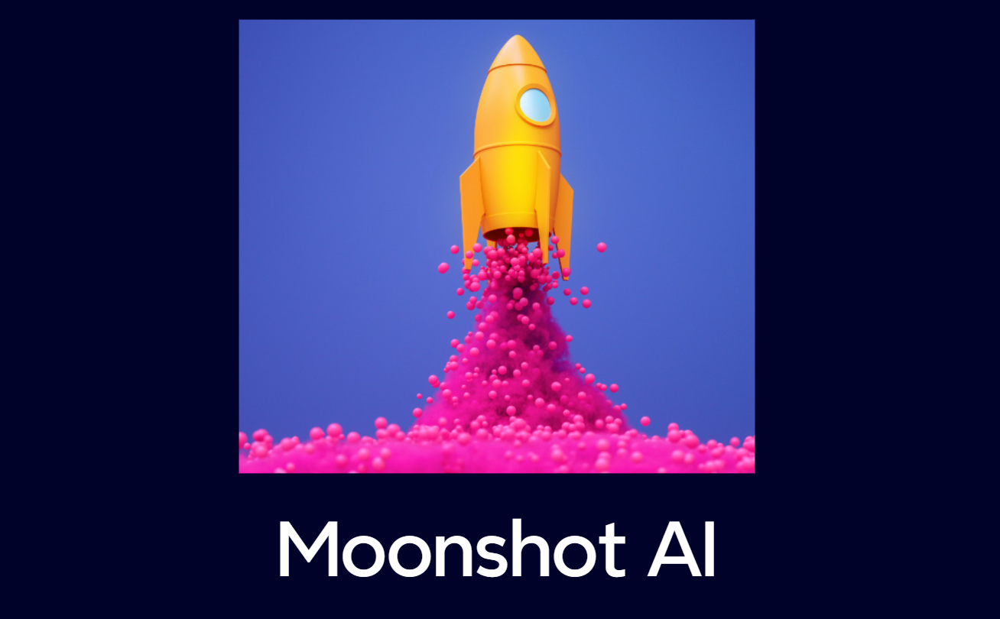

> **大家好，我是 <font color=blue>同学小张</font>，持续学习<font color=red>C++进阶知识</font>和<font color=red>AI大模型应用实战案例</font>，持续分享，欢迎大家<font color=red>点赞+关注</font>，共同学习和进步。**

---

月之暗面(moonshot)最近很火呀，本文我们紧跟一下实事，看下Moonshot AI的API调用，以及在LangChain中如何使用。

@[toc]


# 0. 前期准备

官网，注册账号，登录，申请API KEY

> 申请API KEY：https://platform.moonshot.cn/console/api-keys 



申请的Key是有一点免费额度的。又能白嫖了，真开心。




# 1. 基本使用

> 官方文档：https://platform.moonshot.cn/docs/api/chat#%E5%9F%BA%E6%9C%AC%E4%BF%A1%E6%81%AF

使用 Moonshot AI API进行简单的对话，代码如下：

```python
from openai import OpenAI
 
client = OpenAI(
    api_key = "$MOONSHOT_API_KEY",
    base_url = "https://api.moonshot.cn/v1",
)
 
completion = client.chat.completions.create(
    model = "moonshot-v1-8k",
    messages = [
        {"role": "system", "content": "你是 Kimi，由 Moonshot AI 提供的人工智能助手，你更擅长中文和英文的对话。你会为用户提供安全，有帮助，准确的回答。同时，你会拒绝一切涉及恐怖主义，种族歧视，黄色暴力等问题的回答。Moonshot AI 为专有名词，不可翻译成其他语言。"},
        {"role": "user", "content": "你好，我叫李雷，1+1等于多少？"}
    ],
    temperature = 0.3,
)
 
print(completion.choices[0].message)
```

可以看到，其接口的使用形式完全兼容OpenAI，甚至可以当作就是用的OpenAI的接口，只是将`api_key`、`base_url`、`model`三个值换成了Moonshot的。


# 2. 工具使用

工具的使用方式，示例代码如下，也与OpenAI的接口完全兼容。

```python
import os
moonshot_api_key = os.getenv('MOONSHOT_API_KEY') 
moonshot_base_url = os.getenv('MOONSHOT_BASE_URL') 
moonshot_model = "moonshot-v1-8k"

from openai import OpenAI
 
client = OpenAI(
    api_key = moonshot_api_key,
    base_url = moonshot_base_url,
)
 
completion = client.chat.completions.create(
    model = moonshot_model,
    messages = [
        {"role": "system", "content": "你是 Kimi，由 Moonshot AI 提供的人工智能助手，你更擅长中文和英文的对话。你会为用户提供安全，有帮助，准确的回答。同时，你会拒绝一切涉及恐怖主义，种族歧视，黄色暴力等问题的回答。Moonshot AI 为专有名词，不可翻译成其他语言。"},
        {"role": "user", "content": "编程判断 3214567 是否是素数。"}
    ],
    tools = [{
        "type": "function",
        "function": {
            "name": "CodeRunner",
            "description": "代码执行器，支持运行 python 和 javascript 代码",
            "parameters": {
                "properties": {
                    "language": {
                        "type": "string",
                        "enum": ["python", "javascript"]
                    },
                    "code": {
                        "type": "string",
                        "description": "代码写在这里"
                    }
                },
            "type": "object"
            }
        }
    }],
    temperature = 0.3,
)
 
print(completion.choices[0].message)
```

以上示例代码的运行结果：



# 3. LangChain中使用

LangChain中，有两种使用方式。

## 3.1 使用 MoonshotChat

LangChain对Moonshot模型进行了单独的封装，使用方式如下：

```python
from langchain_community.chat_models.moonshot import MoonshotChat
model = MoonshotChat(api_key=moonshot_api_key, base_url=moonshot_base_url, model="moonshot-v1-128k")
```

## 3.2 使用 ChatOpenAI

在1、2节中，我们看到，Moonshot的API接口与OpenAI的完全兼容，因此，在LangChain中我们也可以使用ChatOpenAI来调用Moonshot AI，使用方式如下：

```python
from langchain_openai.chat_models import ChatOpenAI
model = ChatOpenAI(api_key=moonshot_api_key, base_url=moonshot_base_url, model=moonshot_model, temperature=0)
```

这里只展示使用方法，具体的使用，在下面一起介绍。

# 4. LangChain中使用 + 使用工具

这里我们使用 [【AI Agent系列】【LangGraph】2. 再进阶：给你的LangGraph加入循环逻辑（Cycles）](https://blog.csdn.net/Attitude93/article/details/137229665) 这篇文章中的代码，进行修改。

> 为什么用这个代码？因为遇到了坑，刚好给大家避坑...

从第3节中，我们得到了Moonshot的model，那我们就把下面红框中的代码替换掉就好了。



是不是觉得很可行？理论上是可以的。

但是实操过程中，发现，大模型根本识别不了tools...无论如何都识别不了。



如何解决呢？我找到了一种解决办法：

```python
# from langchain.tools.render import format_tool_to_openai_function
# functions = [format_tool_to_openai_function(t) for t in tools]
# model = model.bind_functions(functions)

# 改为：

model = model.bind_tools(tools=tools)
```
修改后，运行结果如下：



可以看到，成功识别到了tools。

> **如果觉得本文对你有帮助，麻烦点个赞和关注呗 ~~~**

---

> - 大家好，我是 <font color=blue>**同学小张**</font>，持续学习<font color=red>**C++进阶知识**</font>和<font color=red>**AI大模型应用实战案例**</font>
> - 欢迎 <font color=red>**点赞 + 关注**</font> 👏，**持续学习**，**持续干货输出**。
> - +v: <font color=blue>**jasper_8017**</font> 一起交流💬，一起进步💪。
> - 微信公众号也可搜<font color=blue>【**同学小张**】</font> 🙏

**==本站文章一览：==**




