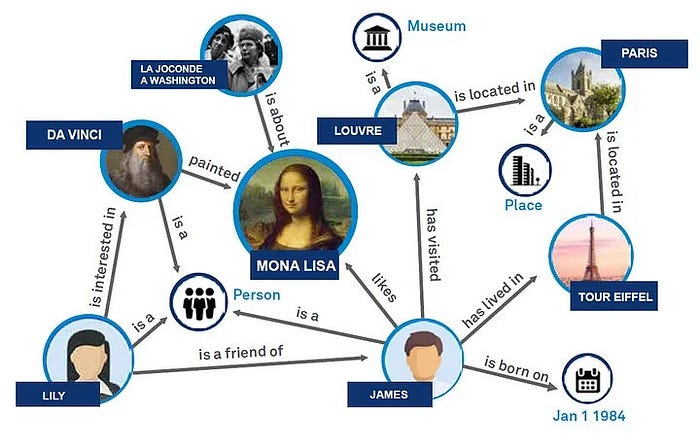
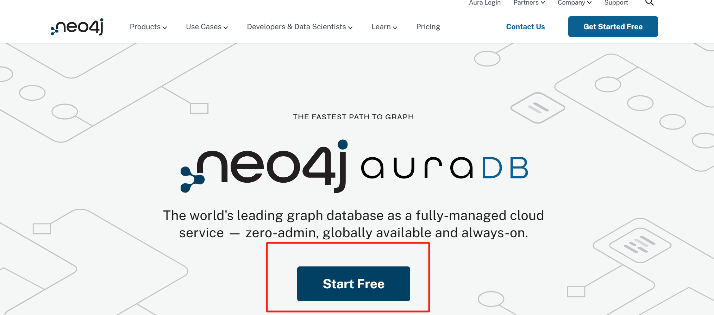
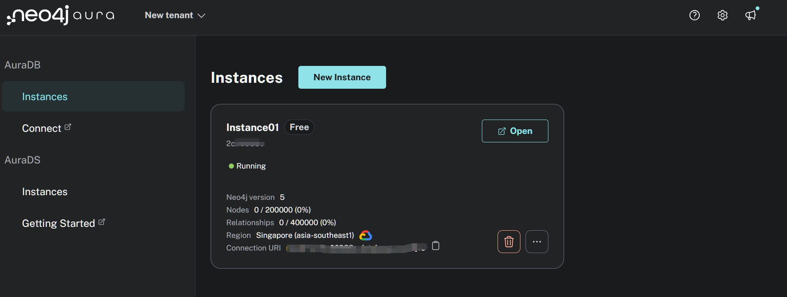
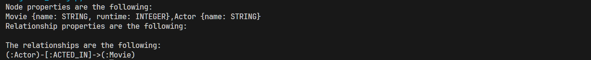
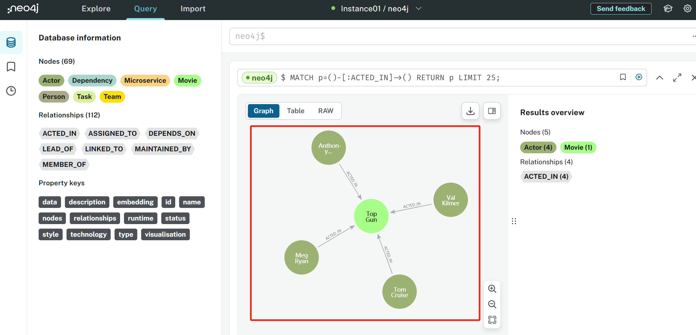
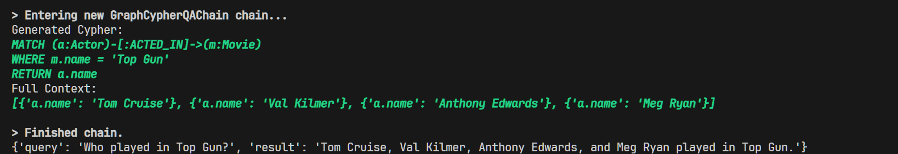
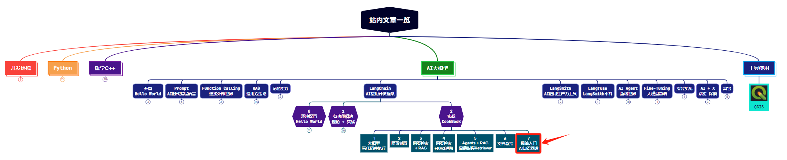

> **大家好，我是 <font color=blue>同学小张</font>，持续学习<font color=red>C++进阶知识</font>和<font color=red>AI大模型应用实战案例</font>，持续分享，欢迎大家<font color=red>点赞+关注</font>，共同学习和进步。**

---

**AI+知识图谱极简入门：手把手带你体验LangChain实现知识图谱创建和查询（附代码和源码分析）**

最近在大模型应用中使用图数据库或知识图谱越来越流行。图在表示和存储多样化且相互关联的信息方面具有天然优势，能够轻松捕捉不同数据类型间的复杂关系和属性，从而更好地给大模型提供上下文或数据支持。本文一起来看下如何在大模型应用中使用图数据库或知识图谱。

> 本文仅是简单入门和体验，**不会图数据库或neo4j也无所谓，跟着本文步骤走就可以**。本文可以帮你体会一下知识图谱在RAG中的应用方法，有了体会，后面如果需要再学图数据库的使用方法。

@[toc]

# 0. 什么是知识图谱

## 0.1 概念

知识图谱是一种结构化的语义知识库，它通过图的形式存储和表示实体（如人、地点、组织等）以及实体之间的关系（如人物关系、地理位置关系等）。知识图谱通常用于增强搜索引擎的语义理解能力，提供更丰富的信息和更准确的搜索结果。

知识图谱的主要特点包括：

1. **实体(Entity)**：知识图谱中的基本单元，代表现实世界中的一个对象或概念。

2. **关系(Relation)**：实体之间的联系，如“属于”、“位于”、“创立者”等。

3. **属性(Attribute)**：实体所具有的描述性信息，如人的年龄、地点的经纬度等。

4. **图结构(Graph Structure)**：知识图谱以图的形式组织数据，包含节点（实体）和边（关系）。

5. **语义网络(Semantic Network)**：知识图谱可以视为一种语义网络，其中的节点和边都具有语义含义。

6. **推理(Inference)**：知识图谱可以用于推理，即通过已知的实体和关系推导出新的信息。

知识图谱在搜索引擎优化(SEO)、推荐系统、自然语言处理(NLP)、数据挖掘等领域有广泛的应用。例如，Google的Knowledge Graph、Wikidata、DBpedia等都是著名的知识图谱实例。



## 0.2 知识图谱的意义

> 知识图谱作为一种数据组织形式，其意义在于提供了一种高效、直观的方式来表示和管理复杂的数据关系。它通过图结构的节点和边，将数据以结构化的形式展现，增强了数据的语义表达能力，使得实体间的关系清晰明确。知识图谱显著提升了信息检索的准确性，尤其在自然语言处理领域，它使得机器能够更好地理解和回应复杂的用户查询。知识图谱在智能应用中发挥着核心作用，如推荐系统、智能问答等。

枯燥的介绍之后，下面我们来看下RAG+知识图谱的案例，亲自动手实现一下。

> 以下案例来自LangChain的官方文档：https://python.langchain.com/v0.1/docs/integrations/graphs/neo4j_cypher/#refresh-graph-schema-information

# 1. 上手撸代码

## 1.1 前期准备

（1）首先需要安装一个图数据库，这里我们使用neo4j。

python安装命令：

```python
pip install neo4j
```

（2）去官方注册一个账号，登录，然后创建一个数据库实例。（用于学习的话选择免费的就行。）



创建完一个在线的数据库实例之后，页面如下：



现在就可以在代码中使用这个数据库了。

## 1.2 代码实战

（1）在创建完数据库实例之后，你应该会得到该数据的链接、用户名和密码，老规矩，放到环境变量中，然后通过Python加载环境变量：

```python
neo4j_url = os.getenv('NEO4J_URI')
neo4j_username = os.getenv('NEO4J_USERNAME')
neo4j_password = os.getenv('NEO4J_PASSWORD')
```
（2）链接数据库

LangChain中封装了neo4j的接口，我们只需要导入Neo4jGraph类即可使用。

```python
from langchain_community.graphs import Neo4jGraph
graph = Neo4jGraph(url=neo4j_url, username=neo4j_username, password=neo4j_password)
```

（3）查询填充数据

可以利用 query 接口进行查询，并返回结果。查询语句的语言是 Cypher 查询语言。

```python
result = graph.query(
    """
MERGE (m:Movie {name:"Top Gun", runtime: 120})
WITH m
UNWIND ["Tom Cruise", "Val Kilmer", "Anthony Edwards", "Meg Ryan"] AS actor
MERGE (a:Actor {name:actor})
MERGE (a)-[:ACTED_IN]->(m)
"""
)

print(result)

# 输出：[]
```

以上代码输出的是 `[]`。

（4）刷新图的架构信息

```python
graph.refresh_schema()
print(graph.schema)
```



从结果来看，schema包含了节点的类型、属性以及类型之间的关系等信息，是图的架构。

我们还可以登录到neo4j的web页面，查看一下图数据库中存储的数据：



（5）图数据库中有了数据，接下来我们就可以进行查询了。

LangChain中封装了GraphCypherQAChain类，可以方便地使用图数据库进行查询。如下代码：

```python
chain = GraphCypherQAChain.from_llm(
    ChatOpenAI(temperature=0), graph=graph, verbose=True
)

result = chain.invoke({"query": "Who played in Top Gun?"})
print(result)
```

执行过程和结果：



先将自然语言（Who played in Top Gun?）通过大模型转换成了图查询语句，然后通过neo4j执行查询语句，返回结果，最后通过大模型转换成自然语言输出给用户。

# 2. 拓展知识

## 2.1 GraphCypherQAChain的参数

以上代码，我们使用了LangChain的GraphCypherQAChain类，这是LangChain提供的图数据库查询和问答Chain。它有很多的参数可以设置，比如使用 `exclude_types` 来设置忽略哪些节点类型或关系：

```python
chain = GraphCypherQAChain.from_llm(
    graph=graph,
    cypher_llm=ChatOpenAI(temperature=0, model="gpt-3.5-turbo"),
    qa_llm=ChatOpenAI(temperature=0, model="gpt-3.5-turbo-16k"),
    verbose=True,
    exclude_types=["Movie"],
)
```

输出类似如下：

```python
Node properties are the following:
Actor {name: STRING}
Relationship properties are the following:

The relationships are the following:
```

类似还有很多参数可用，可以参考官方文档：https://python.langchain.com/v0.1/docs/integrations/graphs/neo4j_cypher/#use-separate-llms-for-cypher-and-answer-generation


## 2.2 GraphCypherQAChain 的执行源码

下面是GraphCypherQAChain的执行源码，简单看下其执行过程。

（1）`cypher_generation_chain`: 自然语言到图查询语句的转换。

（2）`extract_cypher`: 取出查询语句，这里是因为大模型可能返回一些额外的说明信息，需要去除。

（3）`cypher_query_corrector`: 修正查询语句。

（4）`graph.query`: 执行查询语句，查询图数据库，获取内容

（5）`self.qa_chain`: 根据原始问题和查询的内容，再次利用大模型组织答案，用自然语言输出给用户。

```python
def _call(
    self,
    inputs: Dict[str, Any],
    run_manager: Optional[CallbackManagerForChainRun] = None,
) -> Dict[str, Any]:
    """Generate Cypher statement, use it to look up in db and answer question."""
    ......

    generated_cypher = self.cypher_generation_chain.run(
        {"question": question, "schema": self.graph_schema}, callbacks=callbacks
    )

    # Extract Cypher code if it is wrapped in backticks
    generated_cypher = extract_cypher(generated_cypher)

    # Correct Cypher query if enabled
    if self.cypher_query_corrector:
        generated_cypher = self.cypher_query_corrector(generated_cypher)

    ......

    # Retrieve and limit the number of results
    # Generated Cypher be null if query corrector identifies invalid schema
    if generated_cypher:
        context = self.graph.query(generated_cypher)[: self.top_k]
    else:
        context = []

    if self.return_direct:
        final_result = context
    else:
        ......

        result = self.qa_chain(
            {"question": question, "context": context},
            callbacks=callbacks,
        )
        final_result = result[self.qa_chain.output_key]

    chain_result: Dict[str, Any] = {self.output_key: final_result}
    ......

    return chain_result
```


> **如果觉得本文对你有帮助，麻烦点个赞和关注呗 ~~~**

---

> - 大家好，我是 <font color=blue>**同学小张**</font>，持续学习<font color=red>**C++进阶知识**</font>和<font color=red>**AI大模型应用实战案例**</font>
> - 欢迎 <font color=red>**点赞 + 关注**</font> 👏，**持续学习**，**持续干货输出**。
> - +v: <font color=blue>**jasper_8017**</font> 一起交流💬，一起进步💪。
> - 微信公众号也可搜<font color=blue>【**同学小张**】</font> 🙏

**==本站文章一览：==**

