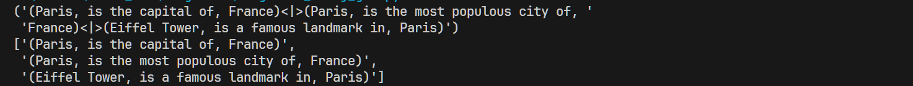
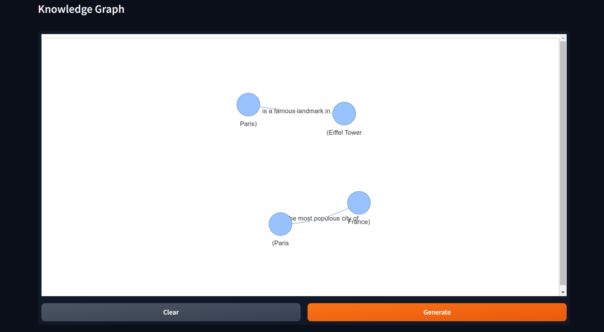
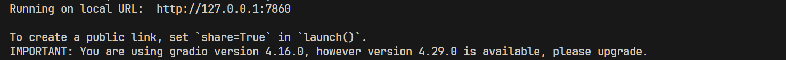
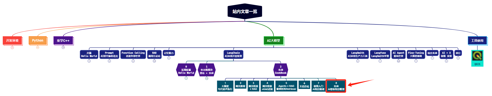

> **大家好，我是 <font color=blue>同学小张</font>，持续学习<font color=red>C++进阶知识</font>和<font color=red>AI大模型应用实战案例</font>，持续分享，欢迎大家<font color=red>点赞+关注</font>，共同学习和进步。**

---

**教你用AI轻松将你的知识库变为知识图谱（附完整代码，直接运行）**

上篇文章中我们对AI+知识图谱进行了极简入门：带领大家使用LangChain实现了一个知识图谱的创建和查询。但是当时的创建是直接写死的实例数据，仅仅是展示功能，并没有实际意义。本文我们来介绍如何使用AI，将自己的知识库自动转换为知识图谱。

@[toc]

> 代码参考：https://colab.research.google.com/drive/1OpoLyKAWTVpkhy0VgVduprYypIFTSIrL#scrollTo=TtlKi-4r8grL

# 0. 实现效果

先来看下最终的实现效果：输入知识，大模型自动将知识中的实体、关系、属性等提取出来，并自动生成知识图谱。为了方便查看，代码中还对创建的知识谱图进行了可视化展示。

（1）对于某个知识提取出的知识图谱结构：



（2）可视化知识谱图的展示：




# 1. 代码实现过程

## 1.1 知识图谱结构的识别

将知识转化为知识图谱，最重要的步骤是将知识中的实体、关系、属性等提取出来。这也是代码的主要部分。这部分是通过Prompt来实现的。

（1）Prompt部分

```python
# Prompt template for knowledge triple extraction
_DEFAULT_KNOWLEDGE_TRIPLE_EXTRACTION_TEMPLATE = (
    "You are a networked intelligence helping a human track knowledge triples"
    " about all relevant people, things, concepts, etc. and integrating"
    " them with your knowledge stored within your weights"
    " as well as that stored in a knowledge graph."
    " Extract all of the knowledge triples from the text."
    " A knowledge triple is a clause that contains a subject, a predicate,"
    " and an object. The subject is the entity being described,"
    " the predicate is the property of the subject that is being"
    " described, and the object is the value of the property.\n\n"
    "EXAMPLE\n"
    "It's a state in the US. It's also the number 1 producer of gold in the US.\n\n"
    f"Output: (Nevada, is a, state){KG_TRIPLE_DELIMITER}(Nevada, is in, US)"
    f"{KG_TRIPLE_DELIMITER}(Nevada, is the number 1 producer of, gold)\n"
    "END OF EXAMPLE\n\n"
    "EXAMPLE\n"
    "I'm going to the store.\n\n"
    "Output: NONE\n"
    "END OF EXAMPLE\n\n"
    "EXAMPLE\n"
    "Oh huh. I know Descartes likes to drive antique scooters and play the mandolin.\n"
    f"Output: (Descartes, likes to drive, antique scooters){KG_TRIPLE_DELIMITER}(Descartes, plays, mandolin)\n"
    "END OF EXAMPLE\n\n"
    "EXAMPLE\n"
    "{text}"
    "Output:"
)
```

这个Prompt主要的任务是让大模型从语句中提取出知识三元组，即实体、关系、属性。看着有点像识别句子中的主谓宾。Prompt中给了几个示例，Few-shot的方式可以让大模型更好地理解用户的需求。

（2）调用大模型的基本流程

```python
KNOWLEDGE_TRIPLE_EXTRACTION_PROMPT = PromptTemplate(
    input_variables=["text"],
    template=_DEFAULT_KNOWLEDGE_TRIPLE_EXTRACTION_TEMPLATE,
)

llm = ChatOpenAI(temperature=0.9)

# Create an LLMChain using the knowledge triple extraction prompt
chain = LLMChain(llm=llm, prompt=KNOWLEDGE_TRIPLE_EXTRACTION_PROMPT)

# Run the chain with the specified text
text = "The city of Paris is the capital and most populous city of France. The Eiffel Tower is a famous landmark in Paris."
triples = chain.invoke(
    {'text' : text}
).get('text')
```
（3）结果的解析

```python
def parse_triples(response, delimiter=KG_TRIPLE_DELIMITER):
    if not response:
        return []
    return response.split(delimiter)

triples_list = parse_triples(triples)

pprint(triples_list)
```
（4）执行结果示例：


## 1.2 知识图谱的可视化

示例代码中使用gradio框架进行了可视化界面的搭建。可视化不是本文重点，这里就不详细介绍了。可以看完整代码里的实现。大体是使用了 pyvis 和 networkx 来使用前面提取的三元组进行图结构的构建。

运行之后，打开提示中的链接，就可以看到可视化界面了。



> 这里有小小的疑问：为什么要同时使用pyvis和networkx？看代码中是先用三元组构建了networkx的图结构，然后将networkx结构转化成了pyvis结构，然后再使用pyvis进行可视化。这个过程有必要？不能直接利用三元组构建pyvis结构吗？期待各位大佬的解答！

# 2. 完整代码

下面将可直接运行的完整代码奉上（当然，缺依赖库的话还是要自己装一装的了）：

```python
from langchain.prompts import PromptTemplate
from langchain_openai import ChatOpenAI
from langchain.chains import LLMChain
from langchain.graphs.networkx_graph import KG_TRIPLE_DELIMITER
from pprint import pprint

# Prompt template for knowledge triple extraction
_DEFAULT_KNOWLEDGE_TRIPLE_EXTRACTION_TEMPLATE = (
    "You are a networked intelligence helping a human track knowledge triples"
    " about all relevant people, things, concepts, etc. and integrating"
    " them with your knowledge stored within your weights"
    " as well as that stored in a knowledge graph."
    " Extract all of the knowledge triples from the text."
    " A knowledge triple is a clause that contains a subject, a predicate,"
    " and an object. The subject is the entity being described,"
    " the predicate is the property of the subject that is being"
    " described, and the object is the value of the property.\n\n"
    "EXAMPLE\n"
    "It's a state in the US. It's also the number 1 producer of gold in the US.\n\n"
    f"Output: (Nevada, is a, state){KG_TRIPLE_DELIMITER}(Nevada, is in, US)"
    f"{KG_TRIPLE_DELIMITER}(Nevada, is the number 1 producer of, gold)\n"
    "END OF EXAMPLE\n\n"
    "EXAMPLE\n"
    "I'm going to the store.\n\n"
    "Output: NONE\n"
    "END OF EXAMPLE\n\n"
    "EXAMPLE\n"
    "Oh huh. I know Descartes likes to drive antique scooters and play the mandolin.\n"
    f"Output: (Descartes, likes to drive, antique scooters){KG_TRIPLE_DELIMITER}(Descartes, plays, mandolin)\n"
    "END OF EXAMPLE\n\n"
    "EXAMPLE\n"
    "{text}"
    "Output:"
)

KNOWLEDGE_TRIPLE_EXTRACTION_PROMPT = PromptTemplate(
    input_variables=["text"],
    template=_DEFAULT_KNOWLEDGE_TRIPLE_EXTRACTION_TEMPLATE,
)

llm = ChatOpenAI(temperature=0.9)

# Create an LLMChain using the knowledge triple extraction prompt
chain = LLMChain(llm=llm, prompt=KNOWLEDGE_TRIPLE_EXTRACTION_PROMPT)

# Run the chain with the specified text
text = "The city of Paris is the capital and most populous city of France. The Eiffel Tower is a famous landmark in Paris."
triples = chain.invoke(
    {'text' : text}
).get('text')

pprint(triples)

def parse_triples(response, delimiter=KG_TRIPLE_DELIMITER):
    if not response:
        return []
    return response.split(delimiter)

triples_list = parse_triples(triples)

pprint(triples_list)

from pyvis.network import Network
import networkx as nx


def create_graph_from_triplets(triplets):
    G = nx.DiGraph()
    for triplet in triplets:
        subject, predicate, obj = triplet.strip().split(',')
        G.add_edge(subject.strip(), obj.strip(), label=predicate.strip())
    return G

def nx_to_pyvis(networkx_graph):
    pyvis_graph = Network(notebook=True, cdn_resources='remote')
    for node in networkx_graph.nodes():
        pyvis_graph.add_node(node)
    for edge in networkx_graph.edges(data=True):
        pyvis_graph.add_edge(edge[0], edge[1], label=edge[2]["label"])
    return pyvis_graph

def generateGraph():
    triplets = [t.strip() for t in triples_list if t.strip()]
    graph = create_graph_from_triplets(triplets)
    pyvis_network = nx_to_pyvis(graph)

    pyvis_network.toggle_hide_edges_on_drag(True)
    pyvis_network.toggle_physics(False)
    pyvis_network.set_edge_smooth('discrete')

    html = pyvis_network.generate_html()
    html = html.replace("'", "\"")

    return f"""<iframe style="width: 100%; height: 600px;margin:0 auto" name="result" allow="midi; geolocation; microphone; camera;
    display-capture; encrypted-media;" sandbox="allow-modals allow-forms
    allow-scripts allow-same-origin allow-popups
    allow-top-navigation-by-user-activation allow-downloads" allowfullscreen=""
    allowpaymentrequest="" frameborder="0" srcdoc='{html}'></iframe>"""
    
import gradio as gr

demo = gr.Interface(
    generateGraph,
    inputs=None,
    outputs='html',
    title="Knowledge Graph",
    allow_flagging='never',
    live=True,
)

demo.launch(
    height=800,
    width="100%"
)
```


# 3. 可能遇到的坑

> 如果你使用的是参考链接中的原代码，则很可能会遇到下面的问题。

（1）报错：module gradio has no attribute outputs. gradio版本4.16

解决：`outputs=gr.outputs.HTML` 改为 `outputs='html'`


# 4. 总结

本文我们主要是学习了如何利用AI将知识转化为知识图谱的结构。其中最主要的，就是从知识中提取出三元组，这就强依赖Prompt和大模型的能力了。然后，锦上添花的，代码实现了知识图谱结构的可视化。尽管简单，但思路绝对值得借鉴。


> **如果觉得本文对你有帮助，麻烦点个赞和关注呗 ~~~**

---

> - 大家好，我是 <font color=blue>**同学小张**</font>，持续学习<font color=red>**C++进阶知识**</font>和<font color=red>**AI大模型应用实战案例**</font>
> - 欢迎 <font color=red>**点赞 + 关注**</font> 👏，**持续学习**，**持续干货输出**。
> - +v: <font color=blue>**jasper_8017**</font> 一起交流💬，一起进步💪。
> - 微信公众号也可搜<font color=blue>【**同学小张**】</font> 🙏

**==本站文章一览：==**


