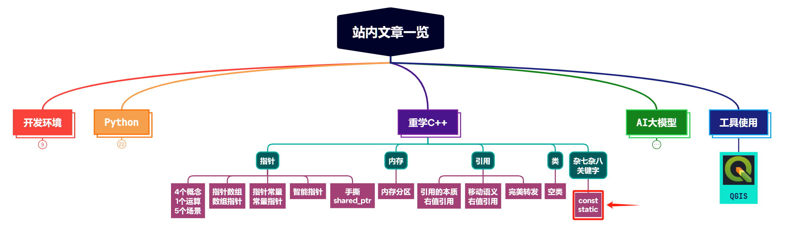

# 0. const相关

参考：https://github.com/Light-City/CPlusPlusThings/blob/master/basic_content/const/README.md

## 0.1 const常量与#define宏定义常量的区别

（1）**类型安全（类型检查），防止修改，增加程序健壮性**

   - `const` 常量具有类型信息，编译器会在编译时检查其类型正确性。并且其修饰的内容防止修改，起保护作用，增加程序健壮性。
   - `#define` 是预处理器指令，它不涉及类型检查，只是简单的文本替换。

（2）**作用域**

   - `const` 常量具有块作用域，遵循C++的作用域规则。
   - `#define` 宏没有作用域概念，一旦定义，它将在定义点之后的整个文件中有效，直到遇到相应的取消宏定义（如 `#undef`）。

（3）**存储**

   - `const` 常量被存储在内存里，在程序运行过程中只有一份拷贝。节省空间，避免不必要的内存分配。
   - `#define` 宏在预处理阶段被替换，有若干个拷贝，代码会膨胀。

（4）**编译器优化**

   - `const` 常量可以被编译器优化，比如常量折叠（constant folding）。
   - `#define` 宏在预处理阶段替换，编译器优化的机会较少。

（5）**链接**：
   - `const` 常量与链接相关，如果它们是 `extern` 的，那么它们在不同的编译单元中可以共享。
   - `#define` 宏与链接无关，它们仅在编译时有效。

（6）**跨文件使用**：

   - 如果需要在多个文件中使用相同的常量，使用 `const` 常量需要在头文件中声明，并在源文件中定义。
    
   - 使用 `#define` 宏可以在一个文件中定义，然后在其他文件中包含这个文件来共享宏定义。

## 0.2 const对象默认为文件局部变量

普通变量在不同文件中访问时，定义时不需要加extern，而const变量在不同文件中访问时，定义时需要加extern。

### 0.2.1 普通变量不需要加 extern

```c++
// test_1.cpp
int g_test_1;

// test_2.cpp
#include <iostream>

extern int g_test_1;
int main()
{
    std::cout << g_test_1 << std::endl;
}
```

### 0.2.2 const变量需要加 extern

```c++
// test_1.cpp
extern const int g_test_2 = 20;

// g_test_2.cpp
#include <iostream>
extern const int g_test_2;
int main()
{
    std::cout << g_test_2 << std::endl;
}
```

## 0.3 指针与const

详细内容前面已经专门讲过，可以去看下我这篇文章：[【重学C++】【指针】轻松理解常量指针和指针常量](https://blog.csdn.net/Attitude93/article/details/137592758)


## 0.4 函数中使用const

这里面涉及两个面试问题：

（1）如果函数需要传入一个指针，是否需要为该指针加上const，把const加在指针不同的位置有什么区别？

大家可以自己思考下这个问题。

下面是一点思考:


```python
void func(const int var); // 传递过来的参数不可变
void func(int *const var); // 指针本身不可变
```

第一行，var为int型，传递过来的是原变量的复制值，无论在函数中怎么改var的值，也不会影响原变量。所以无需const。

第二行，var为指针，指针地址不可变，限制不住指针指向的内容，所以这里给指针加const无意义。在函数中指针变了，也不影响原指针。


（2）如果写的函数需要传入的参数是一个复杂类型的实例，传入值参数或者引用参数有什么区别，什么时候需要为传入的引用参数加上const。

传入值参数，实参到形参会有一次拷贝动作，如果复杂类型拷贝，可能会消耗不必要的性能。引用传递时，函数中修改的是原对象，为了防止原对象被更改，需要给引用加上const。


## 0.5 类中使用const

这里只说明一下 常成员函数。例如下面的类成员函数：

```c++
int getCount() const;
```

在成员函数后面加上 const，表明此成员函数为常函数，不能修改类的数据成员。**只有常成员函数才有资格操作常量或常对象**。

# 1. static相关

参考：https://github.com/Light-City/CPlusPlusThings/blob/master/basic_content/static/README.md

## 1.1 静态变量存储位置和生命周期

当变量声明为static时，变量的存储位置在内存的全局区，空间将在程序的生命周期内分配。即使多次调用该函数，静态变量的空间也只分配一次，前一次调用中的变量值通过下一次函数调用传递。


## 1.2 声明和初始化的位置

### 1.2.1 普通静态变量

静态变量在第一次使用时初始化，声明和定义在一起。

```c++
void function() {
    // 静态变量在第一次使用时初始化
    static int staticVar = 10;  // 初始化仅在首次创建时发生
    staticVar++;  // 每次函数调用时，staticVar的值都会增加
}
```

### 1.2.2 类中的静态变量与静态函数

静态成员变量属于类，而不是类的某个特定对象。所有该类的实例共享同一个静态成员变量。

静态成员函数也属于类，但它们不涉及类的特定对象。它们不能访问类的非静态成员。

静态成员变量的初始化通常在类的外部进行，并且必须使用类名作为限定符。

```c++
class MyClass {
public:
    // 声明静态成员变量，并在类内初始化默认值
    static int staticMemberVar;

    // 定义静态成员函数
    static void staticMemberFunction() {
        // 可以直接访问静态成员变量
        staticMemberVar++;
    }
};

// 定义静态成员变量
int MyClass::staticMemberVar = 0;

int main() {
    MyClass::staticMemberFunction();  // 直接通过类名调用静态成员函数
    MyClass obj;
    int value = obj.staticMemberVar;  // 访问静态成员变量
}
```

#### 1.2.2.1 相关面试题

（1）静态变量为什么不能使用构造函数初始化

static变量只被初始化一次，存储在内存的全局区中。对于不同的对象，不能有相同static变量的多个副本。因此，静态变量不能使用构造函数初始化。




