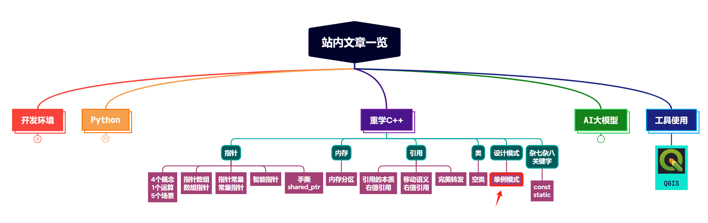

> **大家好，我是 <font color=blue>同学小张</font>，持续学习<font color=red>C++进阶知识</font>和<font color=red>AI大模型应用实战案例</font>，持续分享，欢迎大家<font color=red>点赞+关注</font>，共同学习和进步。**

> 重学C++系列文章，在会用的基础上深入探讨底层原理和实现，适合有一定C++基础，想在C++方向上持续学习和进阶的同学。**<font color=red>争取让你每天用5-10分钟，了解一些以前没有注意到的细节。</font>**

---

单例模式是最简单的设计模式之一，也是项目中最常用的模式之一，一定要会！本文我们就来学习下单例模式。

@[toc]

# 0. 什么是单例模式、使用场景

单例模式核心思想是确保一个类只有一个实例，并提供一个全局访问点来获取这个实例。

使用场景：

（1）共享资源：当需要在多个组件或模块间共享资源时，如共享数据库连接、共享配置文件等。

（2）控制资源数量：当需要严格限制资源数量时，如线程池、缓存、日志记录器等。

（3）独立配置：需要全局配置时，如应用程序的全局设置。

（4）系统状态：表示整个系统的状态，如用户会话管理。

（5）资源池：如数据库连接池、线程池等，需要限制数量并进行统一管理。

# 1. 单例模式的实现方式

在C++中，实现单例模式有多种方法，每种方法都有其特定的使用场景和优缺点。

## 1.1 懒汉式

### 1.1.1 实现代码

```cpp
class Singleton {
private:
    static Singleton* instance;

public:
    static Singleton* getInstance() {
        if (instance == nullptr) {
            instance = new Singleton();
        }
        return instance;
    }

    Singleton(Singleton const&) = delete;
    void operator=(Singleton const&) = delete;

private:
    Singleton() {}
};
// 初始化静态成员变量
Singleton* Singleton::instance = nullptr;
```

### 1.1.2 优点

* 实现简单，延迟初始化，只有在第一次调用getInstance时才创建实例。

### 1.1.3 缺点

* 线程不安全，多线程环境下可能产生多个实例。

### 1.1.4 改进

上面的懒汉式实现存在线程不安全的问题，我们可以使用锁来保证线程安全。

```cpp
#include <mutex>

class Singleton {
private:
    static Singleton* instance;
    static std::mutex mutex;

public:
    static Singleton* getInstance() {
        std::lock_guard<std::mutex> lock(mutex);
        if (instance == nullptr) {
            instance = new Singleton();
        }
        return instance;
    }

    Singleton(Singleton const&) = delete;
    void operator=(Singleton const&) = delete;

private:
    Singleton() {}
};

// 初始化静态成员变量
Singleton* Singleton::instance = nullptr;
std::mutex Singleton::mutex;
```

这样就实现了线程安全，通过互斥锁保证了只有一个线程可以创建实例。但是由于互斥锁的存在，可能会影响性能，尤其是在高并发场景下。


## 1.2 饿汉式

因为静态变量在类加载时就被初始化，所以饿汉式在程序启动时就创建了实例。

### 1.2.1 实现代码

```cpp
class Singleton {
private:
    static Singleton instance;

public:
    static Singleton& getInstance() {
        return instance;
    }

    Singleton(const Singleton&) = delete;
    void operator=(const Singleton&) = delete;

private:
    Singleton() {}
};
```

### 1.2.2 优点

* 线程安全，因为实例在程序启动时就已经创建。
  
* 避免了懒汉式中的延迟初始化问题。

### 1.2.3 缺点

* 实例在程序启动时就创建，不管是否被使用，可能导致资源浪费，拖慢启动速度。

## 1.3 局部静态变量

### 1.3.1 实现代码

```cpp
#include <iostream>

class Singleton {
public:
    // 提供全局访问点
    static Singleton& getInstance() {
        static Singleton instance; // 局部静态变量
        return instance;
    }

    // 私有化拷贝构造函数和赋值操作符
    Singleton(const Singleton&) = delete;
    Singleton& operator=(const Singleton&) = delete;

    // 如果需要，可以添加一个销毁单例的静态方法
    static void destroyInstance() {
        delete &getInstance();
    }

    // 如果需要序列化，可以添加相应的方法
    // ...

private:
    // 私有化构造函数
    Singleton() {}

private:
    // 其他私有成员和方法
};
```

### 1.3.2 优点

* 线程安全，局部静态变量的初始化是线程安全的。

* 延迟初始化，只有在第一次调用getInstance时才创建实例。

### 1.3.3 缺点

* 相对于饿汉式，代码稍微复杂一些。

## 1.4 使用C++11标准库中的std::call_once和std::once_flag

### 1.4.1 实现代码

```cpp
#include <mutex>

class Singleton {
private:
    static std::once_flag once;
    static Singleton* instance;

public:
    static Singleton& getInstance() {
        std::call_once(once, []() {
            instance = new Singleton();
        });
        return *instance;
    }

    Singleton(Singleton const&) = delete;
    void operator=(Singleton const&) = delete;

private:
    Singleton() {}
};

std::once_flag Singleton::once;
Singleton* Singleton::instance = nullptr;
```

### 1.4.2 优点

线程安全，使用C++11标准库中的互斥机制。
性能可能比使用std::mutex更好，因为std::call_once只在第一次调用时锁定。

### 1.4.3 缺点

需要C++11支持。

> 如果不需要考虑多线程，可以选择懒汉式。

# 2. 跨so的单例模式

**<font color=red>在跨动态链接库的情况下，以上有些方法实现不了单例模式。</font>** 这是非常容易忽略和犯错的地方。一旦出现，很难排查。

动态链接库（SO）是允许程序在运行时加载和卸载的模块，它们可以被多个程序共享。在这种情况下，每个SO都可能尝试创建单例，从而导致多个实例的存在。

## 2.1 上述创建方式在跨SO场景下的可行性

1. **懒汉式（线程不安全）**：在跨SO的情况下，这种方法不适用，因为每个SO中的`getInstance`方法都可能独立地创建一个实例。

2. **懒汉式（线程安全，加锁的改进版）**：虽然使用互斥锁可以确保线程安全，但它并不能保证在跨SO的情况下只创建一个实例。每个SO中的`getInstance`方法仍然可能创建自己的实例。

3. **饿汉式**：这种方法在理论上可以工作，因为如果实例在程序启动时就已经创建，那么所有SO共享的是同一个实例。但是，这要求所有SO都必须链接到同一个饿汉式单例的实现，否则每个SO中都会有自己的实例。

4. **局部静态变量**：这是在跨SO情况下实现单例模式的常用方法。局部静态变量的初始化在C++中是线程安全的，并且只会在首次访问时进行。因此，只要所有SO都使用相同的`getInstance`方法，就可以保证只创建一个实例。

5. **使用C++11标准库中的`std::call_once`和`std::once_flag`**：这种方法也可以在跨SO的情况下工作，原理与局部静态变量类似。它利用了C++11标准库中的线程安全机制来确保只创建一个实例。

# 3. 总结

本文我们介绍了单例模式，以及多种方式在C++中实现单例模式。此外，我们重点介绍了跨SO单例模式，以及如何解决这个问题。

最后，再总结下实现单例模式的几个重点步骤（注意事项）：

（1）私有化构造函数：确保单例类的构造函数是私有的，防止外部通过new操作符直接创建实例。

（2）私有化拷贝控制：将拷贝构造函数和赋值操作符声明为私有或删除，防止复制或赋值单例实例。

（3）提供一个全局访问点：提供一个公有的静态方法（如getInstance），用于返回类的唯一实例。

（4）实现延迟加载：在getInstance方法中实现延迟加载逻辑，确保单例对象在首次调用getInstance时才被创建。

（5）线程安全：在多线程环境中，确保getInstance方法的线程安全性，避免多个线程同时创建多个实例。

（6）内存泄漏处理：考虑单例对象的销毁时机，避免内存泄漏。通常单例对象的生命周期与程序相同，但有时需要手动管理销毁。

（7）实现序列化和反序列化：如果单例对象需要被序列化，确保序列化和反序列化过程不会破坏单例的约束。

（8）考虑子类化：如果单例类需要被继承，考虑如何保持单例性质，避免通过继承破坏单例模式。

（9）考虑跨so的场景

# 4. 扩展阅读

（1）单例模式为何不只使用static而需要实例化对象？- https://mp.weixin.qq.com/s/VjltGDaOVV_v5a_JLp2_jg


> **如果觉得本文对你有帮助，麻烦点个赞和关注呗 ~~~**

---

> - 大家好，我是 <font color=blue>**同学小张**</font>，持续学习<font color=red>**C++进阶知识**</font>和<font color=red>**AI大模型应用实战案例**</font>
> - 欢迎 <font color=red>**点赞 + 关注**</font> 👏，**持续学习**，**持续干货输出**。
> - +v: <font color=blue>**jasper_8017**</font> 一起交流💬，一起进步💪。
> - 微信公众号也可搜<font color=blue>【**同学小张**】</font> 🙏

**==本站文章一览：==**




