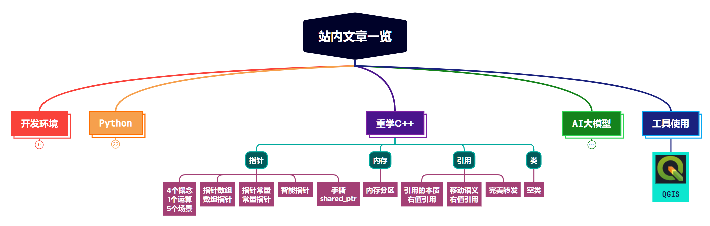

# 1. shared_ptr源码略读

```cpp
// 源码中的 shared_ptr 类定义，继承自 __shared_ptr 类
class shared_ptr : public __shared_ptr<_Tp>
```

shared_ptr的源码基本都在 __shared_ptr 类中，这是 shared_ptr 的基本实现。

## 1.0 成员变量

两个成员变量，一个是原始指针，一个是引用计数。

```cpp
element_type *_M_ptr;            // Contained pointer.
__shared_count<_Lp> _M_refcount; // Reference counter.
```


## 1.1 构造函数

以默认构造函数为例展示，代码很简单，不过多解释。

```cpp
constexpr __shared_ptr() noexcept
        : _M_ptr(0), _M_refcount()
{
}
```

## 1.2 赋值运算符重载

复制赋值：

```cpp
template<typename _Yp>
_Assignable<_Yp> operator=(const __shared_ptr<_Yp, _Lp>& __r) noexcept
{
    _M_ptr = __r._M_ptr;
    _M_refcount = __r._M_refcount; // __shared_count::op= doesn't throw
    return *this;
}
```

移动赋值：

```cpp
__shared_ptr&
operator=(__shared_ptr&& __r) noexcept
{
    __shared_ptr(std::move(__r)).swap(*this);
    return *this;
}
```

## 1.3 其它成员函数

### 1.3.1 reset函数

多种reset方法，最常用的是下面这两种，一种直接reset到空，一种reset到指定原始指针。

```cpp
void reset() noexcept
{ __shared_ptr().swap(*this); }

template<typename _Yp>
_SafeConv<_Yp> reset(_Yp* __p) // _Yp must be complete.
{
    // Catch self-reset errors.
    __glibcxx_assert(__p == nullptr || __p != _M_ptr);
    __shared_ptr(__p).swap(*this);
}
```

### 1.3.2 get函数


```cpp
element_type* get() const noexcept
{ return _M_ptr; }
```

## 1.4 引用计数的实现

可能大家看上面的源码也发现了，拷贝构造和复制赋值运算时，引用计数都是直接拷贝的，并没有看到引用计数的增加。其实，增加是在引用计数类里面实现的。

增加引用计数的实现如下：

```cpp
void _M_add_ref_copy()
      { __gnu_cxx::__atomic_add_dispatch(&_M_use_count, 1); }
```

> **这里注意 ```atomic``` 方式增加，原子操作，所以对于智能指针的引用计数来说，是线程安全的。**


看下它什么时候会被调用，即什么情况下会增加引用计数：

```cpp
 __shared_count(const __shared_count& __r) noexcept
    : _M_pi(__r._M_pi)
{
    if (_M_pi != nullptr)
        _M_pi->_M_add_ref_copy();
}

__shared_count& operator=(const __shared_count& __r) noexcept
{
    _Sp_counted_base<_Lp>* __tmp = __r._M_pi;
    if (__tmp != _M_pi)
        {
        if (__tmp != nullptr)
            __tmp->_M_add_ref_copy();
        if (_M_pi != nullptr)
            _M_pi->_M_release();
        _M_pi = __tmp;
        }
    return *this;
}
```

所以，在拷贝构造和复制赋值运算时，引用计数会加1。

那什么时候减少引用计数和销毁这块内存呢？

先看一下其构造函数，可以接收一个原始指针。所以这块内存，在引用计数类中是知道的。

```cpp
template<typename _Ptr> explicit
__shared_count(_Ptr __p) : _M_pi(0)
{
    ...
}
```

释放和减少引用计数在这：

```cpp
~__shared_count() noexcept
{
	if (_M_pi != nullptr)
	  _M_pi->_M_release();
}

template<>
inline void _Sp_counted_base<_S_single>::_M_release() noexcept
{
    if (--_M_use_count == 0)
    {
        _M_dispose();
        if (--_M_weak_count == 0)
            _M_destroy();
    }
}
```

析构时，原始指针调用 ```_M_release``` 函数，减少引用计数。如果引用计数为0，则调用 ```_M_dispose``` 函数，释放引用计数。

> 思考：这里为什么要在引用计数里面实现加减和释放原始内存的操作？为什么不在智能指针的类里面实现？


好了，源码大体看到这，主要看了下部分构造函数，以及引用计数的增加、减少以及原始内存的销毁。这也是智能指针中最核心的部分。下面按我们自己的思路，实现一个智能指针。


# 2. 手撕shared_ptr

## 2.0 成员变量

先把成员变量定义了。我们都知道，shared_ptr的成员变量有2个，一个用来保存原始指针，一个用来保存引用计数。

```cpp
template<typename T>
class MySharedPtr
{

private:
    T* m_ptr;
    SharedCount* m_ref_count;
};
```

其中引用计数，我们也按照源码那样，定义一个类：

```cpp
class SharedCount
{
public:
    SharedCount() : m_count(1) {}
    ~SharedCount() {}
    void addCount() { ++m_count; }
    long getCount() { return m_count; }
    long reduceCount() { return --m_count; }

private:
    long m_count;
};
```

SharedCount初始值应该为1。


## 2.1 构造函数

### 2.1.1 默认/有值构造函数

默认构造或从原始指针构造一个智能指针。使用原始指针构造时，需要初始化一个引用计数。

```cpp
MySharedPtr(T* ptr = nullptr)
{
    m_ptr = ptr;
    if (m_ptr) // 如果初始化指向了一块内存，则需要初始化一个引用计数，刚开始是1
    {
        m_ref_count = new SharedCount();
    }
}
```

### 2.1.2 拷贝构造函数

拷贝构造函数，要考虑两个成员变量：原始指针和引用计数的拷贝过程。

首先，原始指针直接拷贝即可。

然后，需要判断下原始指针是否有效，如果无效，也没必要有引用计数。

如果有效，则拷贝引用计数，同时，因为这块内存区域多了一个指针，所以要增加一下引用计数。


```cpp
MySharedPtr(MySharedPtr<T>& ptr)
{
    m_ptr = ptr.m_ptr;
    if (m_ptr)
    {
        m_ref_count = ptr.m_ref_count;
        m_ref_count->addCount();
    }
}
```


### 2.1.3 移动构造函数

移动构造函数，是与原指针交换资源的所有权。首先将原始指针拷贝下来，然后将引用计数也拷贝下来。

然后，因为交换所有权，所以传进来的智能指针的原始指针和引用计数都要置为空。

并不存在增加指向内存的指针，所以引用计数不变。


```cpp
MySharedPtr(MySharedPtr<T>&& ptr) noexcept
{
    m_ptr = ptr.m_ptr;
    if (m_ptr)
    {
        m_ref_count = ptr.m_ref_count;
        ptr.m_ptr = nullptr;
        ptr.m_ref_count = nullptr;
    }
}
```

## 2.2 赋值运算符重载

赋值运算符重载，与拷贝构造函数类似，都是将传入的智能指针中的原始指针和引用计数拷贝过来。同时引用计数需要增加。

### 2.2.1 拷贝赋值

```cpp
MySharedPtr& operator=(MySharedPtr<T>& ptr)
{
    m_ptr = ptr.m_ptr;
    if (m_ptr)
    {
        m_ref_count = ptr.m_ref_count;
        m_ref_count->addCount();
    }
    return *this;
}
```

### 2.2.2 移动赋值

```cpp
MySharedPtr& operator=(MySharedPtr<T>&& ptr) noexcept
{
    m_ptr = ptr.m_ptr;
    if (m_ptr)
    {
        m_ref_count = ptr.m_ref_count;
        ptr.m_ptr = nullptr;
        ptr.m_ref_count = nullptr;
    }
    return *this;
}
```

## 2.3 析构函数

析构函数，关注两个成员变量都是原始指针类型，内存都是在堆上new出来的，都需要手动释放。

在销毁这个智能指针时，判断下引用计数是否是0，```!m_ref_count->reduceCount()```，如果是0，则说明这块内存区域已经没有指针指向了，可以释放掉。


```cpp
~MySharedPtr()
{
    if (m_ptr && m_ref_count && !m_ref_count->reduceCount())
    {
        delete m_ptr;
        delete m_ref_count;
    }
}
```


## 2.4 指针特性运算符重载

```cpp

// -> 运算符重载
T* operator->()
{
    return m_ptr;
}

// * 运算符重载
T& operator*()
{
    return *m_ptr;
}
```


## 2.5 其它成员函数

### 2.5.1 get函数

获取原始指针

```cpp
T* get()
{
    return m_ptr;
}
```

### 2.5.2 uinque函数

判断是否是独占的，也就是引用计数是否为1。

```cpp
bool unique()
{
    return m_ptr && m_ref_count && (m_ref_count->getCount() == 1);
}
```

### 2.5.3 swap函数

交换两个智能指针的原始指针和引用计数。

```cpp
void swap(MySharedPtr<T>& sptr){
    std::swap(m_ptr, sptr.m_ptr);
    std::swap(m_ref_count, sptr.ref_count);
}
```


### 2.5.4 use_count函数

获取引用计数。

```cpp
long use_count()
{
    if (m_ptr && m_ref_count)
    {
        return m_ref_count->getCount();
    }
    return 0;
}
```


### 2.5.5 reset函数

```cpp
void reset(T* ptr = nullptr)
{
    MySharedPtr<T>(ptr).swap(*this);
}
```

## 2.6 测试

测试代码：

```cpp
MySharedPtr<int> p1 = MySharedPtr<int>(new int(10));
std::printf("p1 use count = %d\n", p1.use_count());
MySharedPtr<int> p2 = p1;
std::printf("p2 use count = %d\n", p2.use_count());
std::printf("p2 = %d\n", *p2);

int *p4 = new int(30);
p2.reset(p4);
std::printf("p2 use count = %d\n", p2.use_count());
std::printf("p2 = %d\n", *p2);
```

## 2.7 完整代码

```cpp
#include <iostream>

class SharedCount
{
public:
    SharedCount() : m_count(1) {}
    ~SharedCount() {}
    void addCount() { ++m_count; }
    long getCount() { return m_count; }
    long reduceCount() { return --m_count; }

private:
    long m_count;
};

template<typename T>
class MySharedPtr
{
public:
    // 构造函数
    MySharedPtr(T* ptr = nullptr) : m_ptr(ptr), m_ref_count(nullptr)
    {
        std::printf("MySharedPtr 构造函数 is called\n");
        if (m_ptr) // 如果初始化指向了一块内存，则需要初始化一个引用计数，刚开始是1
        {
            m_ref_count = new SharedCount();
        }
    }

    // 拷贝构造函数
    MySharedPtr(MySharedPtr<T>& ptr)
    {
        std::printf("MySharedPtr 拷贝构造函数 is called\n");
        m_ptr = ptr.m_ptr;
        if (m_ptr)
        {
            m_ref_count = ptr.m_ref_count;
            m_ref_count->addCount();
        }
    }

    MySharedPtr(MySharedPtr<T>&& ptr) noexcept
    {
        std::printf("MySharedPtr 移动构造函数 is called\n");
        m_ptr = ptr.m_ptr;
        if (m_ptr)
        {
            m_ref_count = ptr.m_ref_count;
            ptr.m_ptr = nullptr;
            ptr.m_ref_count = nullptr;
        }
    }

    // 赋值运算符
    MySharedPtr& operator=(MySharedPtr<T>& ptr)
    {
        std::printf("MySharedPtr 拷贝赋值 is called\n");
        m_ptr = ptr.m_ptr;
        if (m_ptr)
        {
            m_ref_count = ptr.m_ref_count;
            m_ref_count->addCount();
        }
        return *this;
    }

    MySharedPtr& operator=(MySharedPtr<T>&& ptr) noexcept
    {
        std::printf("MySharedPtr 移动赋值 is called\n");
        m_ptr = ptr.m_ptr;
        if (m_ptr)
        {
            m_ref_count = ptr.m_ref_count;
            ptr.m_ptr = nullptr;
            ptr.m_ref_count = nullptr;
        }
        return *this;
    }

    ~MySharedPtr()
    {
        std::printf("MySharedPtr 析构函数 is called\n");
        if (m_ptr && m_ref_count && !m_ref_count->reduceCount())
        {
            delete m_ptr;
            delete m_ref_count;
        }
    }

    T* operator->()
    {
        std::printf("MySharedPtr -> is called\n");
        return m_ptr;
    }
    T& operator*()
    {
        std::printf("MySharedPtr * is called\n");
        return *m_ptr;
    }

    T* get()
    {
        std::printf("MySharedPtr get is called\n");
        return m_ptr;
    }

    long use_count()
    {
        std::printf("MySharedPtr use_count is called\n");
        if (m_ptr && m_ref_count)
        {
            return m_ref_count->getCount();
        }
        return 0;
    }

    bool unique()
    {
        std::printf("MySharedPtr unique is called\n");
        return m_ptr && m_ref_count && (m_ref_count->getCount() == 1);
    }

    void swap(MySharedPtr<T>& sptr){
        std::printf("MySharedPtr swap is called\n");
        std::swap(m_ptr, sptr.m_ptr);
        std::swap(m_ref_count, sptr.m_ref_count);
    }

    void reset(T* ptr = nullptr)
    {
        std::printf("MySharedPtr reset is called\n");
        MySharedPtr<T>(ptr).swap(*this);
    }

private:
    T* m_ptr;
    SharedCount* m_ref_count;
};

int main(int argc, char *argv[])
{
    MySharedPtr<int> p1 = MySharedPtr<int>(new int(10));
    std::printf("p1 use count = %d\n", p1.use_count());
    MySharedPtr<int> p2 = p1;
    std::printf("p2 use count = %d\n", p2.use_count());
    std::printf("p2 = %d\n", *p2);

    int *p4 = new int(30);
    p2.reset(p4);
    std::printf("p2 use count = %d\n", p2.use_count());
    std::printf("p2 = %d\n", *p2);
    
    return 0;
}

```


运行结果：

```cpp
MySharedPtr 构造函数 is called
MySharedPtr use_count is called
p1 use count = 1
MySharedPtr 拷贝构造函数 is called
MySharedPtr use_count is called
p2 use count = 2
MySharedPtr * is called
p2 = 10
MySharedPtr 构造函数 is called
MySharedPtr reset is called
MySharedPtr 构造函数 is called
MySharedPtr swap is called
MySharedPtr 析构函数 is called
MySharedPtr use_count is called
p2 use count = 1
MySharedPtr * is called
p2 = 30
MySharedPtr 析构函数 is called
MySharedPtr 析构函数 is called
MySharedPtr 析构函数 is called
```

# 3. 总结

本文我们首先阅读了shared_ptr的源码，然后重点解释了其引用计数和内存释放等部分的实现。然后按照我们自己的理解，亲自动手从零实现了一个智能指针，从而对智能指针shared_ptr有了更深入的理解。




