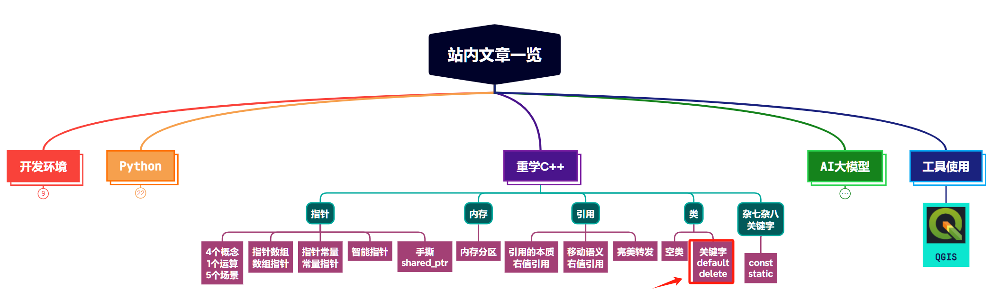

> **大家好，我是 <font color=blue>同学小张</font>，持续学习<font color=red>C++进阶知识</font>和<font color=red>AI大模型应用实战案例</font>，持续分享，欢迎大家<font color=red>点赞+关注</font>，共同学习和进步。**

> 重学C++系列文章，在会用的基础上深入探讨底层原理和实现，适合有一定C++基础，想在C++方向上持续学习和进阶的同学。**<font color=red>争取让你每天用5-10分钟，了解一些以前没有注意到的细节。</font>**

---

本文我们学习下现代C++中允许开发者更精确控制类的行为的两个特性：默认函数和删除函数，涉及两个关键字：```default``` 和 ```delete```。很简单，但很实用。

@[toc]

# 0. default关键字

`default`关键字用来告诉编译器，对于类的一些特殊函数（如创建、复制、赋值和销毁对象时的函数），我们不需要自定义，让编译器提供标准的默认行为。

在前面的文章（【重学C++】【类】详细谈谈C++中的空类（面试常问））中，我们谈到了空类中的默认内容，编译器会默认生成默认构造函数、析构函数等一系列函数。但是显然开发者如果对此不了解，是不知道的。使用default关键字，显式地让编译器提供默认函数，可以提高程序的可读性和可维护性。

例如下面的示例代码，使用default关键字来指示编译器为MyClass提供默认的特殊成员函数实现。

```cpp
class MyClass {
public:
    MyClass() = default;  // 默认构造函数
    MyClass(const MyClass&) = default;  // 默认拷贝构造函数
    MyClass& operator=(const MyClass&) = default;  // 默认赋值操作符
    ~MyClass() = default;  // 默认析构函数
};
```

# 1. delete关键字

`delete`关键字用于删除函数或特殊成员函数（如构造函数、拷贝构造函数、赋值操作符、析构函数）的定义，**使得这些函数在程序中不可用**。

## 1.1 应用场景

`delete`关键字通常用于以下几种情况：

1. **防止资源泄露**：当类的实例管理着资源（如动态分配的内存）时，删除拷贝或赋值操作符可以防止资源被错误地共享或多次释放。

2. **实现单例模式**：确保一个类只能有一个实例，可以删除拷贝构造函数和赋值操作符。

3. **保证对象的移动语义**：在现代C++中，为了支持移动语义，开发者可能会删除拷贝或赋值操作符，而提供移动构造函数和移动赋值操作符。

4. **私有化特殊成员函数**：将默认的特殊成员函数设为`delete`，可以防止编译器自动生成它们，这在某些需要完全控制对象生命周期的情况下很有用。

## 1.2 示例

### 1.2.1 删除拷贝构造函数和赋值操作符

```cpp
class NoCopy {
public:
    NoCopy(int value) : val(value) {}
    ~NoCopy() {}

    // 删除拷贝构造函数
    NoCopy(const NoCopy&) = delete;

    // 删除赋值操作符
    NoCopy& operator=(const NoCopy&) = delete;
private:
    int val;
};
```

上述代码中创建了一个不允许拷贝和赋值的类`NoCopy`。尝试拷贝或赋值`NoCopy`的实例将会导致编译错误。

```cpp
NoCopy a;
// NoCopy b = a;  // 编译错误：拷贝构造函数已删除
// a = b;  // 编译错误：拷贝赋值运算符已删除
```

### 1.2.2 删除默认构造函数

```cpp
class Singleton {
private:
    static Singleton* instance;

    Singleton() {}  // 私有的默认构造函数

public:
    static Singleton* getInstance() {
        if (instance == nullptr) {
            instance = new Singleton();
        }
        return instance;
    }

    // 删除默认构造函数
    Singleton() = delete;
};
```

在这个例子中，实现了一个单例模式的类`Singleton`。我们删除了默认构造函数，确保不能通过`Singleton()`这样的表达式来创建类的实例，只能通过`Singleton::getInstance()`来获取单例对象。

# 2. 总结

本文我们主要学习了现代C++中的两个特性：`default`关键字和`delete`关键字，用来精准控制类的行为。内容很简单，但是在现实项目中，很实用，一定要会。C++标准库中很多类都使用了这些特性，例如`std::mutex`不允许拷贝等。

> **如果觉得本文对你有帮助，麻烦点个赞和关注呗 ~~~**

---

> - 大家好，我是 <font color=blue>**同学小张**</font>，持续学习<font color=red>**C++进阶知识**</font>和<font color=red>**AI大模型应用实战案例**</font>
> - 欢迎 <font color=red>**点赞 + 关注**</font> 👏，**持续学习**，**持续干货输出**。
> - +v: <font color=blue>**jasper_8017**</font> 一起交流💬，一起进步💪。
> - 微信公众号也可搜<font color=blue>【**同学小张**】</font> 🙏

**==本站文章一览：==**




