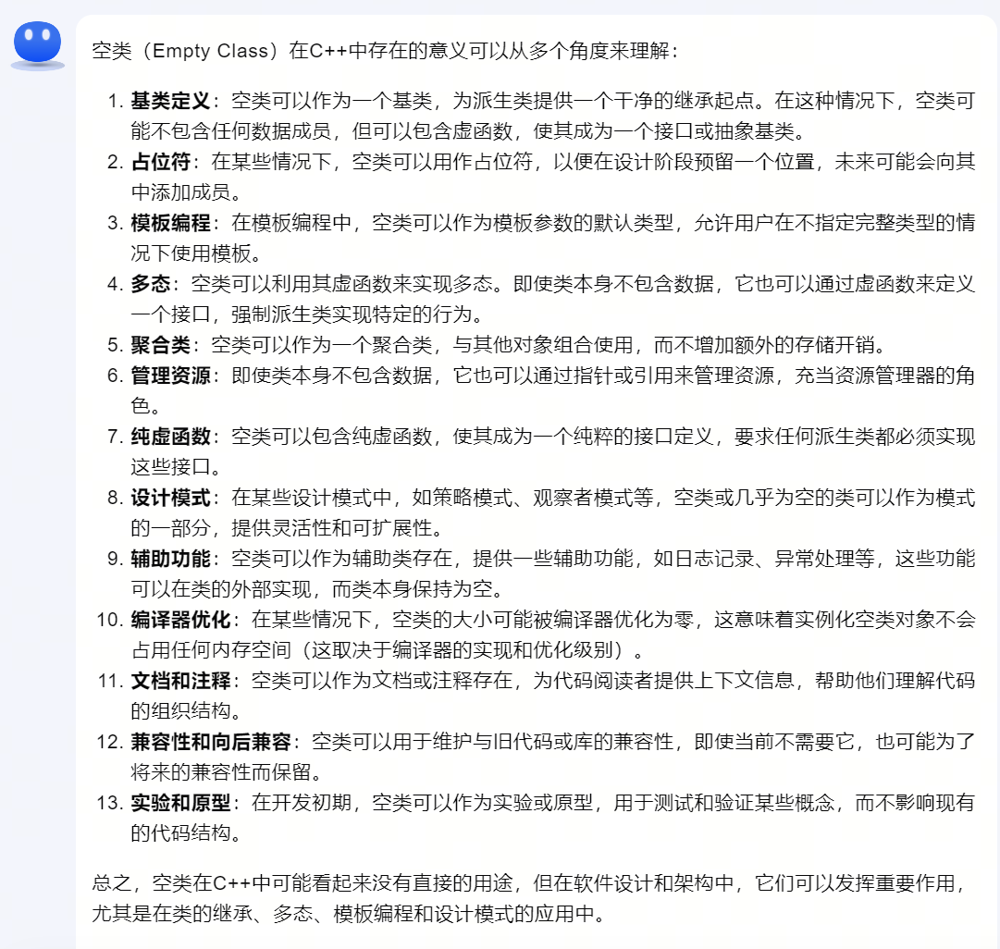
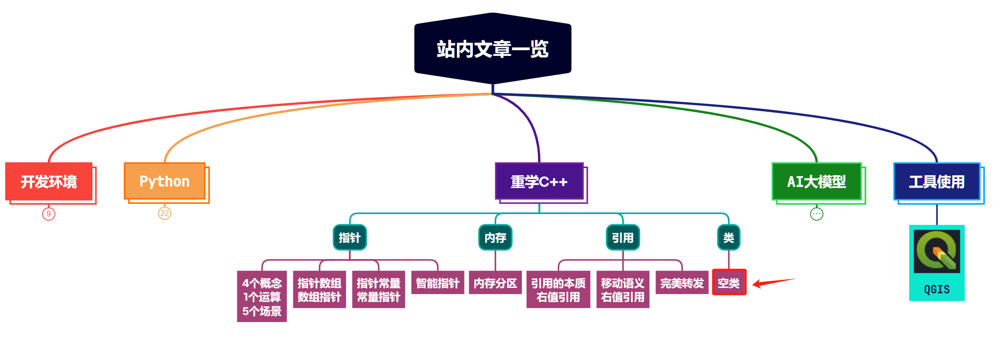

实际工作中使用C++时，或多或少都会见过空类，面试时也经常会被问到空类的相关问题。今天我们就来深入学习一下：空类里面有什么？大小是多少？存在的意义是什么？等等。

@[toc]

# 0. 什么是空类？

用C++定义一个类如下：

```cpp
class EmptyClass
{

};
```

类中我们什么都没有定义，那这个类就是空类。

对于空类的定义，简单来说，当类中一个成员变量也没有时，则为空类。注意这里是说的 **成员变量**。

以下几种情况，也为空类：

- 如果类中有成员函数，但不涉及成员变量。

- 类中有静态成员变量、静态函数

- 类中有typedef语句

- 类中显示写出了默认构造函数等类中默认存在的函数（后面详说）


例如下面这个例子，也算是空类：

```cpp
class EmptyClass
{
public:
    // 构造函数
    EmptyClass(){

    }
    // 析构函数
    ~EmptyClass(){

    }
    // typedef并没有给类增加成员或者函数
    typedef int INT_NUM;

    // 不涉及到内部成员变量的内部函数
    void set(int a){

    }
    // 静态函数
    static void setStr(const std::string& s){

    }

    // 静态变量
    static std::string str;
};
```

在C++11之后，可以通过 ```is_empty``` 来检测一个类是否为空类。

```cpp
auto is_empty = std::is_empty<EmptyClass>::value;
std::cout << "是否是空类：" << is_empty << std::endl;

// 输出 是否是空类：1
```


所以，空类里面并不是什么都没有。即使我们不在空类里手动添加任何信息，它里面默认也是有一些东西的。


# 1. 空类里面默认有什么？

## 1.1 默认的6个成员函数

任何一个类在我们不写任何东西的情况下，都会生成六个默认成员函数。

（1）默认构造函数

（2）析构函数

（3）拷贝构造函数

（4）赋值运算符

（5）取址运算符

（6）const取址运算符

类似下面这些：

```cpp
// EmptyClass
EmptyClass();
// 析构函数
~EmptyClass();

EmptyClass(EmptyClass& h);  //拷贝构造函数

EmptyClass& operator=(const EmptyClass& a);  //赋值运算符

EmptyClass* operator&(); // 取址运算符

const EmptyClass* operator&() const; // 取址运算符 const
```

其中后两个取址运算符跟具体的编译器有关，有的编译器可能没有这两个函数。

## 1.2 注意事项

- 这些函数只有在需要调用的时候，编译器才会生成。
- 函数都是public的。

## 1.3 拷贝构造函数和赋值操作符的区别

（1）拷贝构造函数是一个对象初始化一块内存区域，这块内存就是新对象的内存区，而赋值运算符是对于一个已经被初始化的对象来进行赋值操作。

（2）拷贝构造函数首先是一个构造函数，它调用时候是通过参数的对象初始化产生一个对象。赋值函数则是把一个新的对象赋值给一个原有的对象，所以如果原来的对象中有内存分配要先把内存释放掉，而且还要检查一下两个对象是不是同一个对象，如果是，不做任何操作，直接返回。


# 2. 空类的大小

## 2.1 空类的大小为多少？

用sizeof看一下空类的大小，结果为1。所以，空类也是有大小的，不为0。

```cpp
std::printf("EmptyClass size: %llu\n", sizeof(EmptyClass)); 

// 输出 EmptyClass size: 1
```

## 2.2 为什么空类的大小不为0？

因为编译器需要区分空类的实例，而我们区分两个实例是不是同一个的方法，就是看其在内存中的地址是不是相同的。所以编译器强制给它分配了冗余的空间，这样创建空类实例时返回的地址才会不一样。


```cpp
EmptyClass a;
EmptyClass b;
std::printf("EmptyClass 地址: a=%p, b=%p\n", &a, &b);

// 输出 EmptyClass 地址: a=00000000005ffe5f, b=00000000005ffe5e
```

## 2.3 继承空类，子类的大小是多少？

先看单继承：

```cpp
class EmptyClassSon1 :public EmptyClass
{

};

class EmptyClassSon2 :public EmptyClass
{

};

// 输出 EmptyClassSon1 size: 1
//     EmptyClassSon2 size: 1
```

单继承时，子类的大小也为1。

再看下多继承：

```cpp
class EmptyClassSon3 :public EmptyClassSon1, public EmptyClassSon2
{

};

// 输出 EmptyClassSon3 size: 2
```

这是因为： EmptyClassSon3 的基类 EmptyClassSon1 和 EmptyClassSon2 不能分配到同一地址空间，否则 EmptyClassSon3 的基类会撞在同一地址空间上，违背了要能够区分不同类型实例地址的原则。


## 2.4 补充知识 - 类的实例大小计算

大小计算的主要规则：

- 基本数据类型大小：类的实例大小**至少**等于其所有非静态成员变量的大小之和。例如，如果一个类有一个 int 成员和一个 double 成员，那么该类的大小至少是 sizeof(int) + sizeof(double)（还没做内存对齐）。**这不包括静态成员，因为静态成员不是类的每个实例的一部分，但是在全局范围内只存在一份。**

- 继承：在C++中，如果一个类B继承自另一个类A，那么类B的实例大小至少是 sizeof(A) + sizeof(B中新增的成员)。

- 对齐规则：C++编译器可能会调整成员的布局以满足硬件的对齐要求，这可能会增加类的大小。例如，如果一个类有一个 char 成员和一个 double 成员，在某些硬件上 double 必须在8字节的边界上对齐，所以编译器可能会在 char 和 double 之间插入7个填充字节。

- 虚函数：如果一个类有虚函数，那么它的大小至少还包括一个指向虚函数表（vtable）的指针。


# 3. 空类存在的意义

直接上大模型回复的答案，总结的比很多文章都要全：



# 4. 总结

本文主要是对C++中的空类进行了总结，包括：空类的概念、空类的大小，空类中默认存在的成员函数已经空类存在的意义等。希望能够帮大家更加深入地理解C++中的类。





